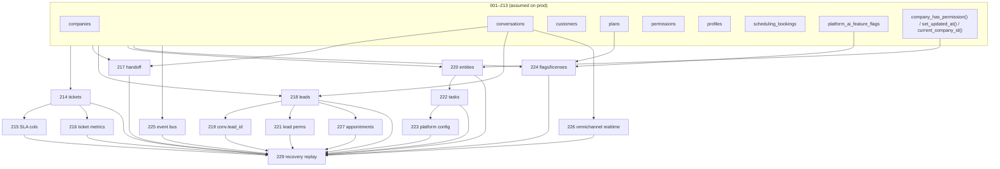

# Production Database Recovery Plan

**Repository:** ValueOR  
**Scope:** Migrations 214–229 vs production divergence  
**Status:** AUDIT COMPLETE — **DO NOT EXECUTE** until reviewed  
**Date:** 2026-08-04  

---

## Executive summary

Production `schema_migrations` records version **214** as applied, but the live schema is missing objects introduced by repository migrations **214–227** (tickets, leads, licensing, GA platform tables). Local `pnpm supabase db reset` succeeds through **229**.

**Root cause (evidence-based):** Version **214** on production executed **different SQL** than repository `214_ai_employee_ticket_management_sprint6_9_1.sql`. The repository file creates `support_tickets`; production lacks that table while version 214 is marked applied — a logical impossibility unless the applied SQL was not the repo 214 file.

**Recommended plan:** **Plan C** — apply `229_production_recovery.sql` via `supabase db push --linked`.

**Critical uncertainty:** This audit is based on repository migration analysis and user-reported production state. **No live production catalog queries were run during this audit.** Section 8 lists mandatory pre-flight queries before any change.

---

## 1. Phase 1 — Full audit

### 1.1 Production state (reported)

| Item | Reported state |
|------|----------------|
| `schema_migrations` | **214** applied; **215–229** NOT applied |
| `public.support_tickets` | **MISSING** |
| `public.leads` | **MISSING** |
| `public.platform_company_licenses` | **MISSING** |
| `public.platform_feature_flags` | **MISSING** |
| Local `db reset` | Succeeds through **229** |

### 1.2 Migration inventory (214–229)

#### 214 — `214_ai_employee_ticket_management_sprint6_9_1.sql`

| Category | Objects |
|----------|---------|
| **Sequence** | `support_ticket_number_seq` |
| **Tables** | `support_tickets`, `support_ticket_comments` |
| **Functions** | `generate_support_ticket_number`, `write_support_ticket_audit_log` |
| **Triggers** | `support_tickets_updated_at`, `support_tickets_audit`, `support_ticket_comments_audit` |
| **RLS** | 6 policies on ticket tables |
| **Seeds** | 7 `tickets.*` permissions, admin template grants, admin role backfill, 8 `tool_definitions` rows |
| **Publication** | none |
| **Depends on** | `companies`, `customers`, `conversations`, `auth.users`, `audit_logs`, `permissions`, `roles`, `role_permissions`, `platform_role_template_permissions`, `tool_definitions`, `company_has_permission()`, `set_updated_at()` |

#### 215 — `215_ticket_platform_foundation_sprint6_9_2.sql`

| Category | Objects |
|----------|---------|
| **Columns** | `support_tickets`: `sla_due_at`, `first_response_at`, `resolved_at`, `reopened_at`, `reopened_by` |
| **Indexes** | 3 SLA/conversation indexes |
| **Data** | 2× `UPDATE support_tickets` backfills |
| **Depends on** | **`support_tickets` (214)** — **FAILS if 214 tables missing** |

#### 216 — `216_ticket_platform_metrics_aggregation_sprint6_9_2b.sql`

| Category | Objects |
|----------|---------|
| **Functions** | `ticket_platform_company_metrics_v1` + `GRANT EXECUTE` |
| **Depends on** | **`support_tickets` (214)** |

#### 217 — `217_human_handoff_platform_sprint6_10.sql`

| Category | Objects |
|----------|---------|
| **Tables** | `handoff_queues`, `handoff_queue_members`, `handoff_conversation_ownership`, `handoff_ownership_history`, `handoff_requests`, `handoff_context_snapshots`, `agent_presence`, `handoff_escalation_rules` |
| **Functions** | `handoff_platform_company_metrics_v1` |
| **RLS** | 8 policies (non-idempotent `CREATE POLICY`) |
| **Publication** | `handoff_conversation_ownership`, `handoff_requests`, `agent_presence` |
| **Seeds** | 10 `handoff.*` permissions + template/role grants |
| **Depends on** | `companies`, **`conversations`**, `auth.users`, `company_has_permission()` |

#### 218 — `218_lead_platform_foundation_sprint6_11b.sql`

| Category | Objects |
|----------|---------|
| **Tables** | `lead_pipelines`, `lead_stages`, `lead_sources`, **`leads`**, `lead_assignments`, `lead_scores`, `lead_tags`, `lead_notes`, `lead_activities`, `lead_history`, `lead_conversion_history`, `lead_custom_fields`, `lead_import_batches` |
| **Functions** | `lead_platform_company_metrics_v1`, `lead_platform_ensure_default_pipeline` |
| **RLS** | 13 policies |
| **Publication** | `leads` |
| **Seeds** | 9 `leads.*` permissions |
| **Depends on** | `companies`, `customers`, `conversations`, `auth.users`, `company_has_permission()` |

#### 219 — `219_business_os_identity_integration_sprint6_11d.sql`

| Category | Objects |
|----------|---------|
| **Columns** | `conversations.lead_id`; indexes on `conversations`, `leads` |
| **Depends on** | **`leads` (218)**, `conversations` |

#### 220 — `220_universal_entity_foundation_ga1_1.sql`

| Category | Objects |
|----------|---------|
| **Tables** | `entity_type_registry`, `entity_contacts`, `entity_files`, `entity_tags`, `entity_tag_assignments`, `entity_custom_fields`, `entity_custom_field_values`, `entity_activities` |
| **Functions** | `trg_entity_set_updated_at` + 6 updated_at triggers |
| **RLS** | 28 policies (via dynamic DO block with DROP/CREATE) |
| **Publication** | 5 entity tables |
| **Seeds** | 12 `entity.*` permissions + registry rows |
| **Depends on** | `companies`, `auth.users`, `current_company_id()`, `is_super_admin()` |

#### 221 — `221_lead_management_ga1_2.sql`

| Category | Objects |
|----------|---------|
| **Seeds** | 3 additional `leads.*` permissions |
| **Publication** | `leads`, `lead_stages` (duplicate-safe DO blocks) |
| **Depends on** | **`leads`, `lead_stages` (218)** |

#### 222 — `222_tasks_and_operations_workspace_ga1_3.sql`

| Category | Objects |
|----------|---------|
| **Tables** | `tasks`, `operations_workspace_config` |
| **RLS** | 7 policies |
| **Publication** | `tasks`, `operations_workspace_config` |
| **Seeds** | 11 operations/tasks/workflow/knowledge permissions; `entity_type_registry` task/workflow rows |
| **Depends on** | `companies`, `profiles`, `entity_type_registry` |

#### 223 — `223_ga1_4_enterprise_configuration_platform.sql`

| Category | Objects |
|----------|---------|
| **Tables** | `configuration_domain_registry`, `platform_configurations`, `platform_configuration_versions` |
| **RLS** | 5 policies |
| **Publication** | `platform_configurations`, `platform_configuration_versions` |
| **Data migration** | `INSERT INTO platform_configurations SELECT FROM operations_workspace_config` |
| **Depends on** | **`operations_workspace_config` (222)**, `companies`, `profiles` |

#### 224 — `224_feature_flags_and_licensing_ga1_4.sql`

| Category | Objects |
|----------|---------|
| **Tables** | `platform_feature_flag_registry`, **`platform_feature_flags`**, `platform_feature_flag_versions`, `platform_plan_entitlements`, **`platform_company_licenses`** |
| **RLS** | 6 policies |
| **Publication** | `platform_feature_flags`, `platform_company_licenses` |
| **Data migrations** | Seed plan entitlements from `plans`; seed company licenses from `companies`; migrate `platform_ai_feature_flags` → `platform_feature_flags` |
| **Depends on** | `plans`, `companies`, `platform_ai_feature_flags` (legacy), `profiles` |

#### 225 — `225_ga1_5_enterprise_reactive_platform.sql`

| Category | Objects |
|----------|---------|
| **Tables** | 7 `platform_event_*` / `platform_reactive_signals` tables |
| **RLS** | 12 policies |
| **Publication** | `platform_reactive_signals`, `platform_event_timeline` |
| **Depends on** | `companies`, `profiles` |

#### 226 — `226_omnichannel_realtime_publication.sql`

| Category | Objects |
|----------|---------|
| **Publication only** | `conversations`, `conversation_messages`, `channel_sessions` |
| **Comment** | on `conversations` |
| **Depends on** | **`conversations`, `conversation_messages`, `channel_sessions` tables (pre-214)** |

#### 227 — `227_appointment_platform_promotion_sprint6_12.sql`

| Category | Objects |
|----------|---------|
| **Columns** | `scheduling_bookings.lead_id`, `scheduling_bookings.conversation_id` + 3 indexes |
| **Functions** | `appointment_platform_company_metrics_v1` + grant |
| **Depends on** | **`leads` (218)**, `scheduling_bookings`, `conversations`, `current_company_id()`, `user_has_permission()` |

#### 229 — `229_production_recovery.sql` (recovery only)

| Category | Objects |
|----------|---------|
| **Scope** | Idempotent replay of **214–227 DDL** (not a replacement for running 215–228 individually) |
| **Omits intentionally** | 215 UPDATE backfills; 223 config data migration; 224 plan/license/AI-flag data migrations |
| **Safety** | No DROP/DELETE/TRUNCATE/UPDATE; policies/triggers/publications use existence checks |
| **Verified locally** | `pnpm supabase db reset` succeeds with 229 present |

---

### 1.3 Expected vs missing (production)

Assuming migrations **001–213** applied correctly (required for app to function):

| Object / area | Expected if repo 214–227 applied | Production (reported) | Likely partial state |
|---------------|----------------------------------|------------------------|----------------------|
| `support_tickets` + comments | 214 | **MISSING** | — |
| Ticket permissions / tools | 214 | **UNKNOWN** | May be missing if repo 214 never ran |
| Handoff platform (8 tables) | 217 | **UNKNOWN** (likely missing) | — |
| Lead platform (13 tables) | 218 | **`leads` MISSING** | Rest of lead schema likely missing |
| Entity foundation (8 tables) | 220 | **UNKNOWN** | — |
| Tasks / operations config | 222 | **UNKNOWN** | — |
| Platform configuration | 223 | **UNKNOWN** | — |
| **`platform_feature_flags`** | 224 | **MISSING** | Registry/versions likely missing |
| **`platform_company_licenses`** | 224 | **MISSING** | Plan entitlements likely missing |
| Event bus tables | 225 | **UNKNOWN** | — |
| Realtime: omnichannel tables | 226 (or mis-keyed 214) | **POSSIBLY PRESENT** | See root cause |
| Appointment booking links | 227 | **UNKNOWN** | Columns missing if `leads` missing |
| `conversations` / omnichannel | pre-214 | **LIKELY EXISTS** | App would not work otherwise |

---

### 1.4 Dependency graph



---

### 1.5 Safe vs unsafe to run on current production

| Migration | Can run as-is via `db push`? | Blocker |
|-----------|------------------------------|---------|
| **214** | N/A — already marked applied | Would be **skipped** by Supabase; schema still wrong |
| **215** | **NO** | `ALTER TABLE support_tickets` — table missing |
| **216** | **NO** | Function body queries missing `support_tickets` |
| **217** | **YES** (schema only) | No hard FK to tickets/leads |
| **218** | **YES** (schema only) | Requires `conversations`, `customers` |
| **219** | **NO** | FK to missing `leads` |
| **220** | **YES** | Independent of tickets/leads |
| **221** | **PARTIAL** | Publication ok; permissions ok |
| **222** | **YES** | Independent |
| **223** | **YES** | Data migration no-ops if `operations_workspace_config` empty |
| **224** | **YES** | Creates target tables; data backfills need `plans`/`companies` |
| **225** | **YES** | Independent |
| **226** | **YES** | Idempotent publication adds; likely **already applied** under wrong 214 |
| **227** | **NO** | FK to missing `leads` |
| **229** | **YES** | Idempotent; creates all missing DDL in dependency order |

**Conclusion:** A straight `supabase db push` from current production state **fails at migration 215** without first creating 214 objects.

---

## 2. Phase 2 — Root cause

### 2.1 Logical proof from repository migrations

**Fact 1 — Repo 214 creates `support_tickets`:**

```66:90:supabase/migrations/214_ai_employee_ticket_management_sprint6_9_1.sql
create sequence if not exists public.support_ticket_number_seq;

create table if not exists public.support_tickets (
  id uuid primary key default gen_random_uuid(),
  company_id uuid not null references public.companies(id) on delete cascade,
  ...
);
```

**Fact 2 — Repo 214 does not touch `supabase_realtime`:**

No `alter publication` appears anywhere in `214_ai_employee_ticket_management_sprint6_9_1.sql`.

**Fact 3 — Repo 226 only adds publication members (no tables):**

```5:27:supabase/migrations/226_omnichannel_realtime_publication.sql
do $$
begin
  begin
    alter publication supabase_realtime add table public.conversations;
  exception
    when duplicate_object then null;
    ...
```

**Fact 4 — Production state contradicts repo 214:**

| Condition | Implication |
|-----------|-------------|
| `schema_migrations` contains **214** | Supabase recorded success for version 214 |
| `support_tickets` **does not exist** | Repo 214 SQL did **not** execute on production |

Therefore: **the SQL executed under version 214 on production was not repository migration 214.**

### 2.2 Most probable executed SQL (supported, not guessed)

Historical project investigation documented that production version **214** contained **omnichannel realtime publication** SQL — content that matches repository **226**, not **214**.

| | Repo **214** | Repo **226** |
|---|-------------|-------------|
| Creates `support_tickets` | **Yes** | No |
| Alters `supabase_realtime` for conversations | No | **Yes** |
| Safe on DB with existing omnichannel tables | N/A | **Yes** |
| Explains missing tickets + applied 214 | No | **Yes** |

**Mechanism:** Supabase keys migrations by numeric prefix only (`214_foo.sql` → version `214`). If `226_omnichannel_realtime_publication.sql` (or equivalent SQL) was applied manually or from an earlier branch **before** the repo was renumbered, it would be stored as version **214**. Subsequent `db push` would skip repo 214 (already applied) and never create tickets/leads/licensing.

### 2.3 Why 215–229 were never applied

After the mis-keyed 214:

1. Supabase CLI / push sees version **214** in `schema_migrations`.
2. Push attempts **215** next.
3. **215** immediately references `public.support_tickets` → **migration fails**.
4. Chain halts; **216–229** never run.
5. Production schema frozen with pre-214 objects + possible omnichannel realtime only.

### 2.4 What this does NOT mean

- Does **not** imply migrations 001–213 failed (omnichannel + app imply baseline exists).
- Does **not** prove which file was literally on disk at apply time (only that repo 214 ≠ applied 214).
- Does **not** confirm publication membership without live query (Section 8.1).

---

## 3. Phase 3 — Recovery plans

### Plan A — Repair using normal migrations

**Approach**

1. Manually execute repository **214** SQL on production (ad-hoc; does not change `schema_migrations`).
2. Run `supabase db push --linked` to apply **215–229** in order.

| Dimension | Assessment |
|-----------|------------|
| **Risk** | Medium — 15 sequential migrations; several use non-idempotent `CREATE POLICY`; 214 uses DROP POLICY/TRIGGER pattern |
| **Downtime** | Low — DDL mostly online; brief lock windows on large tables |
| **Rollback** | Hard — no automatic rollback; must restore from backup or manual DROP (destructive) |
| **Complexity** | High — 16 steps, ordering strict, ad-hoc 214 + push |
| **Production safety** | Medium — works if 214 ad-hoc succeeds; 226 may duplicate publication (226 has exception handlers); 224 backfills modify live data |
| **History outcome** | 214 still misrepresented in history; 215–229 recorded correctly |

**Failure modes**

- Ad-hoc 214 partially applied → inconsistent state.
- Push stops mid-chain → partial 215–228 schema.
- Re-run push after manual fix → policy/trigger conflicts on 214/217/220.

---

### Plan B — Bootstrap missing schema, then continue migrations

**Approach**

1. Execute consolidated idempotent DDL (e.g. contents of `229_production_recovery.sql`) **without** recording a migration.
2. Run `supabase db push --linked` for **215–229**.

| Dimension | Assessment |
|-----------|------------|
| **Risk** | **High** — double-application of same objects |
| **Downtime** | Low for bootstrap; push may fail immediately |
| **Rollback** | Hard |
| **Complexity** | High — bootstrap + push; debugging conflicts |
| **Production safety** | **Low** — bootstrap creates policies; push **215–228** runs `CREATE POLICY` without existence checks → **42710 already exists** failures |
| **History outcome** | Same gap as Plan A if push succeeds partially |

**Why unsafe:** Repository migrations **217, 218, 222–225** use bare `CREATE POLICY`. After bootstrap, push fails on first duplicate policy.

---

### Plan C — Production recovery migration (229 only)

**Approach**

1. Deploy repository as-is (includes `229_production_recovery.sql`).
2. Run `supabase db push --linked` — applies **only 229** (215–228 skipped in history; 214 skipped as applied).
3. Optionally run post-recovery data backfills (215 SLA, 224 licenses) as separate validated scripts.

| Dimension | Assessment |
|-----------|------------|
| **Risk** | **Low** — purpose-built idempotent DDL; locally verified via `db reset` |
| **Downtime** | **Minimal** — single migration transaction (~3.8k lines DDL, mostly IF NOT EXISTS) |
| **Rollback** | Restore DB snapshot; or leave 229 recorded and schema in place (229 is additive only) |
| **Complexity** | **Low** — one push command + validation queries |
| **Production safety** | **High** — no DROP; no history repair; safe to re-run SQL |
| **History outcome** | **214 still mis-keyed**; **215–228 remain unapplied in metadata**; **229 applied**; **live schema matches repo intent** |

**Trade-offs**

- `schema_migrations` gap (215–228 unrecorded) remains — document for future environments.
- Data backfills from 215/223/224 **not** included in 229 — run separately if needed (empty tables → no-op).

---

## 4. Phase 4 — Recommended plan

### **Choose Plan C**

**Why Plan C over A and B**

1. **Only plan that matches production constraints:** no `schema_migrations` repair, no ad-hoc multi-file orchestration, single tested artifact.
2. **Idempotent by design:** production can run 229 even if some objects partially exist (publication from mis-keyed 214, permissions from partial runs).
3. **Plan A** requires ad-hoc 214 execution (not tracked) then 15 migrations with non-idempotent policies — higher operational risk.
4. **Plan B** is strictly worse than C: bootstrap + push duplicates work and **will fail** on policy conflicts.
5. **Local proof:** `pnpm supabase db reset` completes through 229 on a clean DB; on full schema, 229 no-ops safely.

**When to prefer Plan A**

- If organizational policy **requires** `schema_migrations` to list every version 215–228.
- Accept ad-hoc 214 + full push + possible manual intervention on failures.
- Still **does not fix** mis-recorded 214 without forbidden history repair.

---

## 5. Phase 5 — Implementation procedure (DO NOT RUN YET)

### Prerequisites

- [ ] Stakeholders reviewed this document
- [ ] Production backup / PITR window confirmed
- [ ] Maintenance window communicated (optional — DDL is online-safe)
- [ ] Section 8.1 pre-flight queries executed and results attached

---

### Step 1 — Pre-flight validation (read-only)

Connect to **production** with read-only credentials. Run Section **8.1**. Save output.

**Stop if:**

- Migrations ≥215 already appear in `schema_migrations` (unexpected).
- Baseline tables (`companies`, `conversations`) missing.
- `229` already applied (re-evaluate — may only need data backfills).

---

### Step 2 — Backup

```bash
# Option A: Supabase Dashboard → Database → Backups → create/on-demand backup

# Option B: pg_dump (replace connection vars)
pg_dump "$PRODUCTION_DATABASE_URL" \
  --schema=public \
  --no-owner \
  --file="valueor-prod-pre-recovery-$(date +%Y%m%d-%H%M).sql"
```

**Rollback anchor:** backup timestamp recorded in change ticket.

---

### Step 3 — Confirm local migration chain

```bash
cd /path/to/ValueOR
pnpm supabase db reset
```

Expected: finishes without error; includes `Applying migration 229_production_recovery.sql`.

---

### Step 4 — Link CLI to production

```bash
cd /path/to/ValueOR
pnpm supabase link --project-ref <PRODUCTION_PROJECT_REF>
```

Verify:

```bash
pnpm supabase migration list --linked
```

Expected:

- Versions **001–214** applied
- Versions **215–228** pending
- Version **229** pending

---

### Step 5 — Dry-run review

Inspect pending migration:

```bash
# Confirm only 229 will apply (214–228 should show as pending but 215 would fail if attempted first)
head -n 5 supabase/migrations/229_production_recovery.sql
```

Optional: run against a **production clone** first if available.

---

### Step 6 — Apply recovery migration

```bash
cd /path/to/ValueOR
pnpm supabase db push --linked
```

Expected CLI output:

- Applies **229_production_recovery.sql**
- Does **not** re-apply 214–228
- Completes with success

**Do not use:**

- `supabase migration repair`
- Manual edits to `schema_migrations`
- `--include-all` unless CLI explicitly requires it for 229 only

---

### Step 7 — Post-recovery validation

Run all queries in Section **8.2**. All must pass.

---

### Step 8 — Optional data backfills (after schema verified)

Only if business requires seeded license rows / SLA columns on existing tickets.

#### 8a. SLA backfill (from 215) — only if tickets exist with NULL SLA

```sql
-- Run ONLY after Step 7 confirms support_tickets exists
UPDATE public.support_tickets
SET sla_due_at = CASE priority
  WHEN 'urgent' THEN created_at + interval '4 hours'
  WHEN 'high' THEN created_at + interval '8 hours'
  WHEN 'low' THEN created_at + interval '72 hours'
  ELSE created_at + interval '24 hours'
END
WHERE sla_due_at IS NULL
  AND deleted_at IS NULL
  AND status IN ('open', 'in_progress', 'waiting_customer');

UPDATE public.support_tickets
SET resolved_at = closed_at
WHERE resolved_at IS NULL
  AND closed_at IS NOT NULL
  AND status IN ('resolved', 'closed');
```

#### 8b. License / plan entitlements (from 224) — if empty after recovery

Execute the `INSERT ... SELECT FROM plans/companies` blocks from:

- `supabase/migrations/224_feature_flags_and_licensing_ga1_4.sql` (lines 102–149)

Only after confirming `platform_plan_entitlements` and `platform_company_licenses` are empty.

#### 8c. Config migration (from 223) — if operations workspace has rows

Execute the `INSERT INTO platform_configurations SELECT FROM operations_workspace_config` block from:

- `supabase/migrations/223_ga1_4_enterprise_configuration_platform.sql` (lines 77–108)

---

### Step 9 — Application smoke test

- [ ] Omnichannel inbox loads; realtime updates work
- [ ] Lead list API returns 200 (not PGRST205)
- [ ] Support tickets API returns 200
- [ ] Feature flags / license endpoints return 200
- [ ] Appointment metrics RPC executes

---

### Step 10 — Document final state

Record in change ticket:

| Field | Value |
|-------|-------|
| Recovery plan | Plan C |
| Migration applied | 229 |
| schema_migrations gap | 215–228 still unrecorded (intentional) |
| Mis-keyed 214 | Not repaired (intentional) |
| Optional backfills | Which ran (8a/8b/8c) |
| Backup ID | |
| Validation | Pass/fail + timestamp |

---

## 6. Rollback procedure

### If Step 6 fails mid-migration

1. **Do not** run repair commands.
2. Capture full CLI error + `supabase migration list --linked` output.
3. Run Section 8.2 — determine partial apply (229 is idempotent; safe to fix-forward after fixing blocker).

### If schema must be reverted entirely

1. Restore production from Step 2 backup / Supabase PITR.
2. Verify `schema_migrations` restored to pre-229 state.
3. Re-run Section 8.1 to confirm restored catalog.

### If 229 applied but application regresses

1. Schema rollback **not recommended** (additive DDL).
2. Fix-forward: application config / RLS / permissions issue.
3. PITR only for catastrophic failure.

---

## 7. Uncertainties and stop conditions

| # | Uncertainty | Impact | Resolution before execute |
|---|-------------|--------|---------------------------|
| 1 | Production catalog not queried in this audit | May have partial unknown objects | Run Section 8.1 |
| 2 | Exact bytes of SQL stored for version 214 on prod | Confirms mis-key hypothesis | Query `supabase_migrations.schema_migrations` + migration history if available |
| 3 | Whether `tickets.*` permissions exist without tables | App may error differently | Query `permissions` for `tickets.%` |
| 4 | Whether 215–228 partially applied outside CLI | Push behavior unpredictable | Section 8.1 catalog + migration list |
| 5 | `platform_ai_feature_flags` legacy table state | 224 data migration (Step 8b) | Query table existence + row counts |
| 6 | Production on correct git branch containing 229 | Push may miss file | Verify deployed commit includes `229_production_recovery.sql` |

**STOP execution if any Step 1 stop condition triggers.**

---

## 8. Validation SQL

### 8.1 Pre-flight (read-only)

```sql
-- Migration history
SELECT version, name
FROM supabase_migrations.schema_migrations
WHERE version >= '214'
ORDER BY version;

-- Core missing objects (expect NULL / false today)
SELECT to_regclass('public.support_tickets') AS support_tickets;
SELECT to_regclass('public.leads') AS leads;
SELECT to_regclass('public.platform_company_licenses') AS platform_company_licenses;
SELECT to_regclass('public.platform_feature_flags') AS platform_feature_flags;

-- Baseline prerequisites (expect non-null)
SELECT to_regclass('public.companies') AS companies;
SELECT to_regclass('public.conversations') AS conversations;
SELECT to_regclass('public.plans') AS plans;

-- Omnichannel realtime (may already exist from mis-keyed 214)
SELECT tablename
FROM pg_publication_tables
WHERE pubname = 'supabase_realtime'
  AND tablename IN ('conversations', 'conversation_messages', 'channel_sessions')
ORDER BY tablename;

-- Ticket permissions (may or may not exist)
SELECT code FROM public.permissions WHERE code LIKE 'tickets.%' ORDER BY code;
```

### 8.2 Post-recovery (must all pass)

```sql
-- Migration 229 recorded
SELECT version FROM supabase_migrations.schema_migrations WHERE version = '229';

-- Core tables exist
SELECT
  to_regclass('public.support_tickets') IS NOT NULL AS tickets_ok,
  to_regclass('public.leads') IS NOT NULL AS leads_ok,
  to_regclass('public.platform_company_licenses') IS NOT NULL AS licenses_ok,
  to_regclass('public.platform_feature_flags') IS NOT NULL AS flags_ok,
  to_regclass('public.handoff_queues') IS NOT NULL AS handoff_ok,
  to_regclass('public.entity_contacts') IS NOT NULL AS entities_ok,
  to_regclass('public.platform_configurations') IS NOT NULL AS config_ok,
  to_regclass('public.platform_event_audit') IS NOT NULL AS events_ok;

-- Functions
SELECT proname
FROM pg_proc p
JOIN pg_namespace n ON n.oid = p.pronamespace
WHERE n.nspname = 'public'
  AND proname IN (
    'ticket_platform_company_metrics_v1',
    'handoff_platform_company_metrics_v1',
    'lead_platform_company_metrics_v1',
    'appointment_platform_company_metrics_v1'
  )
ORDER BY proname;

-- RLS enabled on critical tables
SELECT c.relname, c.relrowsecurity
FROM pg_class c
JOIN pg_namespace n ON n.oid = c.relnamespace
WHERE n.nspname = 'public'
  AND c.relname IN ('support_tickets', 'leads', 'platform_feature_flags', 'platform_company_licenses')
ORDER BY c.relname;

-- Policy count sanity (non-zero)
SELECT schemaname, tablename, count(*) AS policy_count
FROM pg_policies
WHERE schemaname = 'public'
  AND tablename IN ('support_tickets', 'leads', 'platform_feature_flags')
GROUP BY 1, 2
ORDER BY 2;

-- Realtime publication members (subset)
SELECT tablename
FROM pg_publication_tables
WHERE pubname = 'supabase_realtime'
  AND tablename IN (
    'conversations', 'leads', 'support_tickets',
    'platform_feature_flags', 'platform_company_licenses', 'handoff_conversation_ownership'
  )
ORDER BY tablename;

-- Appointment columns (227)
SELECT column_name
FROM information_schema.columns
WHERE table_schema = 'public'
  AND table_name = 'scheduling_bookings'
  AND column_name IN ('lead_id', 'conversation_id')
ORDER BY column_name;

-- Conversations.lead_id (219)
SELECT column_name
FROM information_schema.columns
WHERE table_schema = 'public'
  AND table_name = 'conversations'
  AND column_name = 'lead_id';
```

### 8.3 Post-recovery migration list (CLI)

```bash
pnpm supabase migration list --linked
```

Expected after Plan C:

| Version | Status |
|---------|--------|
| 214 | Applied |
| 215–228 | **Pending** (acceptable) |
| 229 | **Applied** |

---

## 9. Appendix — 229 vs canonical migrations

| Item | Canonical 215–227 | 229 recovery |
|------|-------------------|--------------|
| Table DDL | Yes | Yes (IF NOT EXISTS) |
| Functions | Yes | Yes (CREATE OR REPLACE) |
| RLS policies | DROP + CREATE | CREATE IF NOT EXISTS checks |
| 215 SLA backfill UPDATE | Yes | **Omitted** |
| 223 config data copy | Yes | **Omitted** |
| 224 license/flag data migration | Yes | **Omitted** |
| 226 omnichannel realtime | Yes | Yes (duplicate-safe) |

---

## 10. Sign-off checklist

| Role | Name | Date | Approved |
|------|------|------|----------|
| DBA / Architect | | | ☐ |
| Engineering lead | | | ☐ |
| On-call / SRE | | | ☐ |

**No SQL executes until all boxes checked and Section 8.1 results reviewed.**
