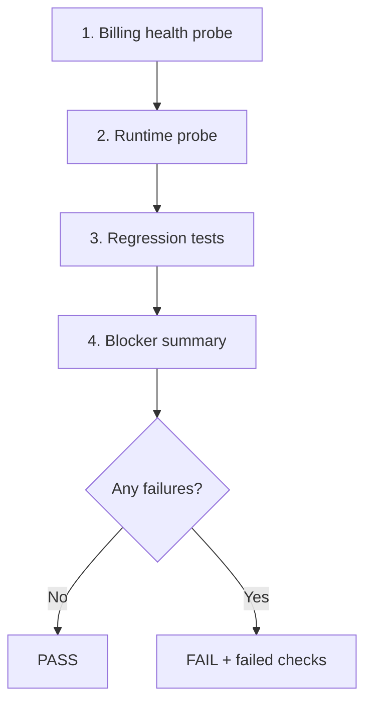

# Production Release Gate

VaultOS Subscription Detail ships only after `npm run production:gate` reports **PASS**. The gate is a non-interactive, cross-platform pipeline that reuses existing probes and tests — it does not duplicate billing or runtime logic.

## Command

From `artifacts/login-app`:

```bash
npm run production:gate
```

| Outcome | Exit code | Output |
|---------|-----------|--------|
| All steps pass | `0` | `PASS` + production-ready message |
| Any step fails | `1` | `FAIL` + list of failed checks |

## Pipeline (strict order)



### 1. Verify billing health

**Script:** `npm run billing-health-probe` → `scripts/billing-health-probe.mts`

Uses shared `runBillingHealthCheck()` from `src/lib/billing/billing-health.ts` against live Supabase:

- Migration **104** — `get_billing_payment_options_v1`
- Migration **105** — `list_billing_audit_logs_paged(p_company_id)`
- Default currency configured
- Supported payment methods configured
- Active plans have required pricing

Requires `VITE_SUPABASE_URL` and `VITE_SUPABASE_PUBLISHABLE_KEY` in `artifacts/login-app/.env.local` or project `.env`.

### 2. Run runtime probe

**Script:** `node scripts/subscription-detail-runtime-probe.mjs` (project root)

Invoked with `VAULTOS_PRODUCTION_GATE=1` for strict mode:

- **Fails** if Supabase credentials are missing (standalone probe skips when credentials are absent)
- **Fails** if payment options RPC is missing or empty (standalone probe treats missing migration 104 as graceful degradation)
- Authenticates as platform demo user and verifies subscription detail data paths for demo companies

### 3. Run Subscription Detail regression tests

**Script:** `npm run test:subscription-detail` → `scripts/subscription-detail-regression.test.mts`

Static/source regression suite for UI wiring, RBAC gates, i18n, and RPC client contracts.

### 4. Verify no production blockers remain

The orchestrator aggregates exit codes from steps 1–3. Any non-zero exit code is recorded as a failed check.

### 5. Final summary

**PASS:**

```
PASS

VaultOS Subscription Detail is Production Ready.
```

**FAIL:**

```
FAIL

Failed checks:
  - <step name>: <detail>
```

## Scripts reference

| npm script | File | Role |
|------------|------|------|
| `production:gate` | `scripts/production-gate.mts` | Orchestrator |
| `billing-health-probe` | `scripts/billing-health-probe.mts` | Billing platform health |
| `test:subscription-detail` | `scripts/subscription-detail-regression.test.mts` | Regression tests |

Shared env loading: `scripts/lib/supabase-env.mjs` (project root).

Runtime probe: `scripts/subscription-detail-runtime-probe.mjs` (project root).

## When to run

- Before tagging a Subscription Detail release
- After applying migrations 104 and 105 to the target Supabase project
- In CI when Supabase credentials are available as secrets

## Related documentation

- [Subscription Detail hardening report](./subscription-detail-hardening-report.md)
- [Subscription Detail sprint report](./subscription-detail-sprint-report.md)
