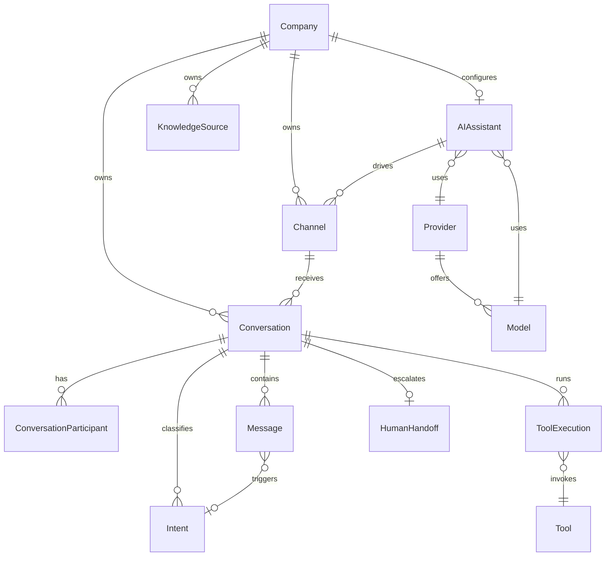
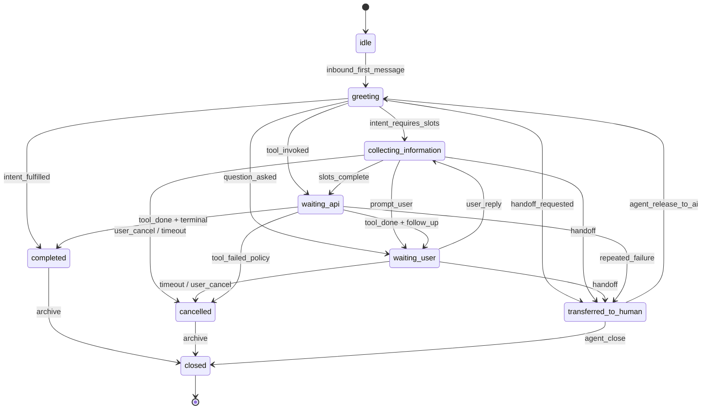

# VaultOS AI Platform — Architecture Foundation

**Status:** Architecture contract (documentation only)  
**Version:** 1.0  
**Last updated:** 2026-07-17  
**Scope:** Enterprise AI platform design for all future AI capabilities inside VaultOS  
**Out of scope for this document:** Migrations, UI, APIs, provider integrations, channel adapters, conversation runtime

---

## Purpose

This document defines the **canonical architecture** for the VaultOS AI platform. It is the contract for all Phase 2+ AI development: Conversation Engine, channel integrations (WhatsApp, Web Chat, Messenger, Telegram, Instagram, Voice), knowledge, automation, and analytics.

Design goals:

- **Generic** — one domain model and pipeline for every channel and modality
- **Multi-tenant** — strict company isolation at every layer
- **Secure** — LLM never touches the database; all actions go through VaultOS APIs
- **Extensible** — new channels, tools, and providers without redesign
- **Aligned with VaultOS** — Supabase, RLS, RBAC, audit logs, i18n, existing CRM/admin stack

### Relationship to current implementation

| Already shipped (Phase 0–1) | Defined here (Phase 2+) |
|-----------------------------|-------------------------|
| `ai_assistant_settings` per company | Conversations, messages, channels, tools |
| AI Assistant settings UI | Conversation Manager, Intent Engine, Tool Router |
| Permissions: `ai_assistant.*`, seeded `ai.*` | Full RBAC matrix for runtime modules |
| Audit on settings changes | Audit on conversations, tools, handoffs |
| Provider/model/temperature config fields | Provider adapters, usage metering |

---

## 1. Domain Model

All entities are **company-scoped** unless marked as global catalog. Identifiers use UUID. Timestamps use `timestamptz`. Soft delete uses `deleted_at` / `deleted_by` where history matters.

### 1.1 Core configuration

#### AI Assistant

The **tenant-facing AI identity and policy**. Maps 1:1 to `ai_assistant_settings` today.

| Attribute | Description |
|-----------|-------------|
| `id`, `company_id` | Primary key; unique active settings per company |
| Personality | Name, avatar, tone, welcome/fallback messages, default language |
| Behavior flags | Auto-booking, reschedule, cancellation, handoff, working-hours-only, knowledge enabled |
| Runtime config | `is_enabled`, provider, model, temperature, max_tokens, response_language |
| Governance | `version`, audit fields, soft delete |

**Invariants:** One active AI Assistant configuration per company. Disabled assistant (`is_enabled = false`) rejects new automated sessions but may allow human-only channels.

#### Provider

Global or company-overridable **LLM/vendor abstraction**.

| Attribute | Description |
|-----------|-------------|
| `code` | `openai`, `anthropic`, `google`, `azure` (extensible enum) |
| Capabilities | Chat, embeddings, speech-to-text, text-to-speech |
| Default models | Catalog entries per capability |
| Secret reference | Pointer to vault/env secret, never stored in DB plaintext |

#### Model

A **callable model identity** within a provider.

| Attribute | Description |
|-----------|-------------|
| `provider_code`, `model_id` | e.g. `openai` + `gpt-5.5` |
| Context window, modalities | Text, vision, audio |
| Cost tier | For usage/analytics (future) |

---

### 1.2 Channels and ingress

#### Channel

A **logical connection type** between an external surface and VaultOS.

| Channel type | Examples |
|--------------|----------|
| `web_chat` | Embedded widget, dashboard AI Chat |
| `whatsapp` | WhatsApp Business API |
| `messenger` | Meta Messenger |
| `telegram` | Telegram Bot API |
| `instagram` | Instagram DM |
| `voice` | SIP, Twilio Voice, WebRTC |

| Attribute | Description |
|-----------|-------------|
| `company_id`, `channel_type` | Tenant binding |
| `external_account_id` | Phone number ID, page ID, bot token ref |
| `status` | `active`, `paused`, `error` |
| `config` | JSONB: webhook URLs, templates, business hours overlay |
| `ai_assistant_id` | Which assistant config drives this channel |

**Invariants:** Inbound webhooks resolve to exactly one `Channel` + `company_id` before any conversation logic runs.

---

### 1.3 Conversations and messages

#### Conversation

A **single threaded interaction** between participants over one channel.

| Attribute | Description |
|-----------|-------------|
| `id`, `company_id`, `channel_id` | Tenant + ingress |
| `ai_assistant_id` | Config snapshot reference (or version id) |
| `state` | See §5 State Machine |
| `external_thread_id` | Channel-native thread/conversation id |
| `customer_id` | Optional link to VaultOS CRM `customers` |
| `assigned_user_id` | Human agent when in handoff |
| `metadata` | JSONB: locale, source campaign, device |
| `started_at`, `ended_at`, `last_message_at` | Lifecycle |

**Invariants:** Every conversation belongs to exactly one company. Cross-company access is forbidden.

#### Conversation Participant

An **actor in a conversation**.

| Role | Description |
|------|-------------|
| `customer` | End user (anonymous or CRM-linked) |
| `assistant` | AI persona |
| `agent` | Human staff |
| `system` | Automated system notices |

| Attribute | Description |
|-----------|-------------|
| `conversation_id`, `role`, `external_participant_id` | Identity within thread |
| `display_name`, `profile_ref` | Presentation |

#### Message

An **immutable event** in a conversation timeline.

| Attribute | Description |
|-----------|-------------|
| `id`, `conversation_id`, `company_id` | Scoped event |
| `participant_id`, `direction` | `inbound` / `outbound` |
| `content_type` | `text`, `audio`, `image`, `template`, `tool_result`, `system` |
| `body` | Text or structured payload |
| `external_message_id` | Idempotency for webhooks |
| `intent_id`, `tool_execution_id` | Optional lineage |
| `created_at` | Immutable timestamp |

**Invariants:** Messages are append-only. Edits create new system messages or correction records, never overwrite.

---

### 1.4 Intelligence layer

#### Intent

A **classified user goal** extracted from one or more messages.

| Attribute | Description |
|-----------|-------------|
| `conversation_id`, `message_id` | Source |
| `name` | e.g. `book_appointment`, `cancel_booking`, `faq_hours` |
| `confidence` | 0.0–1.0 |
| `entities` | JSONB: slots (date, service, customer name) |
| `status` | `detected`, `confirmed`, `rejected`, `expired` |

#### Tool

A **registered capability** the LLM may invoke (never raw SQL).

| Examples | VaultOS API surface |
|----------|---------------------|
| `create_booking` | Bookings module API |
| `lookup_customer` | Customers module API |
| `get_availability` | Calendar service (future) |
| `handoff_to_human` | Conversation Manager API |

| Attribute | Description |
|-----------|-------------|
| `name`, `description`, `input_schema` | JSON Schema for arguments |
| `required_permissions` | RBAC codes |
| `module` | `crm`, `scheduling`, `billing` |
| `idempotent` | Safe retry flag |

#### Tool Execution

A **single invocation** of a tool with audit trail.

| Attribute | Description |
|-----------|-------------|
| `id`, `conversation_id`, `tool_name` | Lineage |
| `input`, `output` | Redacted JSONB |
| `status` | `pending`, `running`, `succeeded`, `failed`, `denied` |
| `error_code`, `duration_ms` | Observability |
| `triggered_by` | `llm`, `agent`, `automation` |

**Invariant (critical):** Tool Execution handlers call **VaultOS Application APIs** only. No direct database access from LLM or provider runtimes.

---

### 1.5 Knowledge and automation

#### Knowledge Source

A **retrievable corpus** for RAG (future).

| Types | `faq`, `services`, `pricing`, `policies`, `custom` |
| Attribute | `company_id`, `name`, `status`, `embedding_index_ref` |
| Link | Optional binding to AI Assistant |

#### Automation

A **rule or workflow** triggered by conversation events (future).

| Trigger | `message_received`, `intent_detected`, `conversation_idle`, `schedule` |
| Action | Invoke tool, send template, notify agent, webhook |

---

### 1.6 Human handoff and analytics

#### Human Handoff

A **structured escalation** from AI to agent.

| Attribute | Description |
|-----------|-------------|
| `conversation_id`, `requested_at`, `accepted_at` |
| `reason` | `user_request`, `low_confidence`, `policy`, `error` |
| `from_participant`, `to_user_id` | Agent assignment |
| `status` | `pending`, `active`, `released`, `expired` |

#### Usage

**Metering** for billing and quotas (future).

| Grain | Tokens, requests, minutes (voice), messages per company/channel/period |

#### Analytics

**Aggregated metrics** derived from conversations, intents, tools, handoffs (read-only domain).

---

### 1.7 Entity relationship (conceptual)



---

## 2. Module Boundaries

Each module owns a bounded context. Modules communicate via **Application APIs** and **domain events**, not shared DB writes across boundaries.

| Module | Responsibility | Does NOT |
|--------|----------------|----------|
| **AI Assistant (Config)** | Company assistant settings, versioning, enable/disable | Run conversations |
| **Channel Registry** | Register channels, webhook endpoints, credential refs, health | Classify intents |
| **Channel Adapters** | Normalize inbound/outbound payloads per platform | Business logic, CRM rules |
| **Conversation Manager** | Thread lifecycle, state machine, participant roster, timeouts | Call LLM directly for tools |
| **Message Store** | Append-only message persistence, idempotency | Intent detection |
| **Intent Engine** | NLU: intent + entity extraction (LLM or rules) | Execute side effects |
| **Tool Registry** | Tool definitions, schemas, permission requirements | Implement CRM logic |
| **Tool Router** | Validate tool calls, RBAC, dispatch to VaultOS APIs | Access Supabase from LLM |
| **Response Generator** | Compose assistant replies (LLM + templates + policy) | Bypass assistant settings |
| **Knowledge Service** | Ingest, index, retrieve chunks (future) | Store conversations |
| **Handoff Service** | Queue, assign, release human agents | Replace CRM |
| **Automation Engine** | Event-driven workflows (future) | Replace Conversation Manager |
| **Usage & Analytics** | Metrics, dashboards, quotas | Mutate conversation state |
| **Provider Gateway** | Unified LLM/STT/TTS adapter layer | Tenant data isolation logic |
| **AI Admin UI** | Settings, conversation inbox, analytics views | Channel webhook verification |
| **VaultOS CRM APIs** | Customers, bookings, invoices (existing) | AI-specific state |

---

## 3. Layered Architecture

VaultOS AI follows **clean layering** consistent with the existing monorepo (`artifacts/login-app`, `supabase/`, future `lib/ai-*`).

```
┌─────────────────────────────────────────────────────────────┐
│  PRESENTATION                                                │
│  React dashboard · Web chat widget · Agent inbox · i18n/RTL │
└──────────────────────────────┬──────────────────────────────┘
                               │
┌──────────────────────────────▼──────────────────────────────┐
│  APPLICATION                                                 │
│  Use cases: StartConversation, ProcessInboundMessage,        │
│  ExecuteTool, RequestHandoff, GenerateReply                  │
│  Orchestration, transactions, RBAC checks at boundary        │
└──────────────────────────────┬──────────────────────────────┘
                               │
┌──────────────────────────────▼──────────────────────────────┐
│  DOMAIN                                                      │
│  Entities, state machine, invariants, domain events          │
│  Pure TypeScript; no Supabase, no fetch, no LLM SDKs         │
└──────────────────────────────┬──────────────────────────────┘
                               │
┌──────────────────────────────▼──────────────────────────────┐
│  INFRASTRUCTURE                                              │
│  Supabase Postgres + RLS · Edge Functions · Realtime         │
│  Provider Gateway · Channel webhooks · Secrets · Queue (TBD) │
│  VaultOS CRM service clients · Audit log writers             │
└─────────────────────────────────────────────────────────────┘
```

### Layer rules

| Layer | Allowed dependencies |
|-------|----------------------|
| Presentation | Application DTOs, hooks, i18n |
| Application | Domain + Infrastructure interfaces (ports) |
| Domain | None (stdlib/types only) |
| Infrastructure | Domain, external SDKs, Supabase |

**Existing pattern:** `login-app` hooks talk to Supabase today for CRM; AI runtime will introduce **Edge Functions as Application entry points** for webhooks and privileged orchestration, keeping secrets off the client.

---

## 4. Data Flow

### 4.1 Canonical inbound pipeline

Every channel converges on the same pipeline after adapter normalization.

```
Incoming Message (any channel)
        │
        ▼
┌───────────────┐
│   Channel     │  Verify signature · Resolve company_id · Idempotency key
│   Adapter     │  Map payload → InboundMessageDTO
└───────┬───────┘
        │
        ▼
┌───────────────┐
│ Conversation  │  Find or create thread · Apply timeout rules
│ Manager       │  Enforce state machine · Persist Message (inbound)
└───────┬───────┘
        │
        ▼
┌───────────────┐
│ Intent        │  Classify intent + entities · Respect assistant language/tone
│ Detection     │  May use LLM via Provider Gateway (read-only context)
└───────┬───────┘
        │
        ▼
┌───────────────┐
│ Tool Router   │  If intent requires action: select tool(s)
│               │  Validate RBAC + assistant business rules
│               │  Execute via VaultOS APIs · Record ToolExecution
└───────┬───────┘
        │
        ▼
┌───────────────┐
│ VaultOS APIs  │  Customers · Bookings · Invoices · Future calendar/email
│ (existing)    │  Company-scoped · RLS-backed · Audited
└───────┬───────┘
        │
        ▼
┌───────────────┐
│ Response      │  LLM or template · Apply welcome/fallback policies
│ Generator     │  Localize (en/ar/system) · Redact secrets
└───────┬───────┘
        │
        ▼
┌───────────────┐
│   Channel     │  Format outbound payload · Send via provider API
│   Adapter     │  Persist Message (outbound)
└───────────────┘
        │
        ▼
Outgoing Message
```

### 4.2 Human handoff branch

When state transitions to `transferred_to_human`:

- Response Generator stops autonomous LLM replies (unless agent releases).
- Agent messages flow through Conversation Manager with `participant.role = agent`.
- Tool Router accepts agent-initiated tools with `triggered_by = agent`.

### 4.3 Voice AI (future)

Same pipeline with additional adapters:

- **Inbound:** STT → `Message` (`content_type = audio`, transcript in `body`)
- **Outbound:** TTS ← `Response Generator` output

No separate conversation model; modality is a message content concern.

---

## 5. Conversation State Machine

States are **explicit** and stored on `Conversation.state`. Transitions are validated in the Domain layer; invalid transitions are rejected and audited.



| State | Meaning |
|-------|---------|
| `idle` | Thread exists; no active turn (may be pre-first-message) |
| `greeting` | Assistant welcome / initial turn |
| `collecting_information` | Slot-filling for an intent |
| `waiting_user` | Assistant asked; awaiting inbound message |
| `waiting_api` | Tool execution in flight |
| `completed` | Goal satisfied; optional summary sent |
| `cancelled` | User or policy aborted the flow |
| `transferred_to_human` | AI paused; agent owns thread |
| `closed` | Terminal; read-only history |

**Timeouts:** Driven by `ai_assistant_settings.conversation_timeout_minutes`, `max_conversation_age`, and `remember_conversation`. Conversation Manager applies transitions to `cancelled` or `closed` on expiry.

---

## 6. Tool Calling Philosophy

### 6.1 Core principle

> **The LLM must NEVER access the database directly.**

The LLM (via Provider Gateway) may:

- Read conversation context provided by the Application layer
- Propose **tool calls** with structured arguments
- Generate natural language responses

The LLM may NOT:

- Execute SQL
- Hold service-role Supabase keys
- Call CRM tables without going through Tool Router

### 6.2 Tool execution contract

```
LLM proposal → Tool Router validates → VaultOS API executes → Result to LLM/User
                      │
                      ├─ Schema validation (JSON Schema)
                      ├─ RBAC (user/conversation/agent context)
                      ├─ Assistant business rules (allow_auto_booking, etc.)
                      ├─ Rate limits
                      └─ Audit log + ToolExecution record
```

### 6.3 Tool categories

| Category | Examples | Executor |
|----------|----------|----------|
| Read | `lookup_customer`, `list_bookings` | CRM Application API |
| Write | `create_booking`, `cancel_booking` | CRM Application API + audit |
| Control | `handoff_to_human`, `end_conversation` | Conversation Manager |
| Knowledge | `search_knowledge` (future) | Knowledge Service |

### 6.4 Failure handling

| Failure | Behavior |
|---------|----------|
| Permission denied | ToolExecution `denied`; assistant uses fallback message |
| Validation error | Retry slot collection; never expose internal errors |
| API error | Bounded retries; then handoff or fallback |
| Policy block | Explain policy (e.g. working hours); no silent failure |

---

## 7. Multi-Tenant Rules

Non-negotiable invariants for every Phase 2+ table and service.

| Rule | Enforcement |
|------|-------------|
| Every **Conversation** belongs to one `company_id` | NOT NULL FK + RLS |
| Every **AI Assistant** belongs to one company | Unique active config per company (existing) |
| Every **Message** belongs to one conversation (and inherits `company_id`) | FK + denormalized `company_id` for RLS performance |
| Every **Channel** belongs to one company | Webhook routing validates company before insert |
| **Tool executions** inherit conversation company | No cross-tenant tool calls |
| **Knowledge sources** are company-private | No shared embeddings across tenants |
| **Usage/analytics** aggregated per company | Dashboard filters by `current_company_id()` |
| Super admin | May view cross-company for support; actions still audited |

### RLS pattern (consistent with VaultOS)

```sql
-- Illustrative policy shape (not a migration)
USING (
  auth.role() = 'authenticated'
  AND deleted_at IS NULL
  AND (
    public.is_super_admin()
    OR company_id = public.current_company_id()
  )
)
```

### CRM linkage

When a conversation links to `customer_id`, the Tool Router must verify the customer belongs to the **same company** as the conversation before any read/write.

---

## 8. Security

### 8.1 RBAC

| Permission (existing / planned) | Capability |
|---------------------------------|------------|
| `ai_assistant.view` / `.edit` | Configuration |
| `ai.conversations.view` | Read conversation inbox |
| `ai.conversations.reply` | Send agent messages |
| `ai.conversations.takeover` | Handoff ownership |
| `ai.conversations.release` | Return thread to AI |
| `ai.analytics.view` | Metrics dashboards |
| `ai.knowledge.manage` | Knowledge sources |
| `ai.whatsapp.manage` | Channel admin |

Runtime checks occur in **Application layer** (Edge Functions) and are **mirrored in RLS** where data is exposed to clients.

### 8.2 Audit

Audit all:

- Settings changes (existing)
- Conversation state transitions
- Tool executions (especially write tools)
- Handoff request/accept/release
- Channel config changes
- Failed auth/webhook verification

Metadata must include **field-level changes** for settings (existing pattern) and **action summaries** for runtime events.

### 8.3 RLS

- All AI platform tables: RLS enabled, default deny
- Service role only inside Edge Functions for orchestration; still pass `company_id` explicitly
- Client (login-app) uses anon/authenticated key + RLS; never service role

### 8.4 Rate limiting

| Surface | Limit |
|---------|-------|
| Inbound webhooks | Per channel id + IP |
| LLM calls | Per company + assistant + window |
| Tool writes | Per conversation + tool name |
| Agent API | Per user |

Implement at Edge Function gateway; return `429` with retry-after.

### 8.5 Input validation

- All inbound payloads: schema validation per channel adapter
- Tool arguments: JSON Schema from Tool Registry
- Message body: max length, MIME allowlist for media
- Strip/control HTML where not supported by channel

### 8.6 Prompt protection

- System prompts built server-side from AI Assistant settings; never trust client-supplied system prompts
- Tool output sanitized before re-injection into LLM context
- PII redaction rules before logging or analytics export

### 8.7 Secrets isolation

| Secret | Storage |
|--------|---------|
| LLM API keys | Supabase secrets / vault; Provider Gateway only |
| WhatsApp/Meta tokens | Encrypted config ref on Channel; Edge Functions only |
| Webhook verify tokens | Environment / channel config |

Never store secrets in `ai_assistant_settings` or client bundles.

---

## 9. Future Expansion

The domain model and pipeline are intentionally **channel-agnostic** and **modality-agnostic**.

| Capability | How it plugs in |
|------------|-----------------|
| **Voice AI** | Channel type `voice`; STT/TTS in Provider Gateway; same Conversation/Message |
| **CRM AI** | Tools wrapping existing customers/bookings/invoices APIs |
| **AI Agents** | Multiple tools + Automation Engine; optional sub-agent orchestration in Application layer |
| **Knowledge Base** | Knowledge Source + `search_knowledge` tool; RAG in Response Generator |
| **Automation** | Subscribes to domain events (`IntentDetected`, `ConversationIdle`) |
| **Calendar** | New tools + Calendar module API |
| **Email / SMS** | New Channel adapters; identical pipeline |

**Extension checklist for new channels:**

1. Add `channel_type` enum value
2. Implement Channel Adapter (inbound + outbound)
3. Register webhook Edge Function route
4. Map external ids → `Conversation.external_thread_id`
5. Add i18n keys under `ai.channels.*`
6. Seed RBAC if channel-specific admin is needed
7. No changes to Conversation Manager state machine or Tool Router contract

---

## 10. Coding Standards

### 10.1 Naming conventions

| Artifact | Convention | Example |
|----------|------------|---------|
| Database tables | `snake_case`, plural | `ai_conversations`, `ai_messages` |
| Edge Functions | `kebab-case` | `ai-process-inbound`, `ai-execute-tool` |
| TypeScript types | `PascalCase` | `Conversation`, `InboundMessageDTO` |
| React components | `PascalCase` | `ConversationInbox` |
| Hooks | `use` + `PascalCase` | `useConversations` |
| Permissions | dot notation | `ai.conversations.view` |
| i18n keys | camelCase segments | `aiAssistant.general.enableAi` |
| Domain events | `PascalCase` past tense | `ConversationHandoffRequested` |

### 10.2 Folder structure (proposed)

```
project/
├── docs/architecture/
│   └── ai-platform.md                 # This document
├── artifacts/login-app/src/
│   ├── pages/ai-assistant.tsx           # Config UI (existing)
│   ├── pages/ai-conversations/          # Future inbox UI
│   ├── hooks/use-ai-*.ts                # Client data hooks
│   └── lib/ai/                          # Client-safe DTOs, constants
├── lib/
│   └── ai-domain/                       # Pure domain (entities, FSM, events)
│       └── src/
├── supabase/
│   ├── migrations/                      # ai_* tables (future)
│   └── functions/
│       ├── ai-process-inbound/          # Webhook entry
│       ├── ai-generate-response/        # LLM orchestration
│       └── ai-execute-tool/             # Tool Router entry
└── scripts/
    └── validate-ai-schema.mjs           # Cross-check hooks vs migrations (future)
```

Monorepo packages follow existing `@workspace/*` pattern when AI domain grows beyond a single app.

### 10.3 Service boundaries

| Service | Location | Exposes |
|---------|----------|---------|
| Conversation Service | Edge Function + domain lib | State transitions, message append |
| Tool Service | Edge Function | `executeTool(name, args, context)` |
| Provider Service | Edge Function (internal) | `completeChat`, `embed`, `transcribe` |
| CRM Facade | Reuse existing Supabase RPC/hooks patterns | Customer/booking operations |

**No business logic in React components.** UI calls hooks; hooks call Supabase or REST; webhooks never hit the client.

### 10.4 Error handling

| Layer | Pattern |
|-------|---------|
| Domain | Result type or typed errors (`ConversationNotFound`, `InvalidTransition`) |
| Application | Catch domain errors; map to HTTP status + safe message |
| Infrastructure | Retry transient provider errors (exponential backoff, max 3) |
| Presentation | i18n error keys; toast for user; never show stack traces |

Error codes are stable strings: `AI_CONVERSATION_TIMEOUT`, `AI_TOOL_DENIED`, `AI_PROVIDER_UNAVAILABLE`.

### 10.5 Logging

| Requirement | Detail |
|-------------|--------|
| Correlation id | `conversation_id` + `trace_id` on every log line |
| Structured JSON | Edge Functions; no raw PII in info logs |
| Levels | `error` for failures, `warn` for policy blocks, `info` for state changes, `debug` disabled in prod |
| Audit vs logs | Audit = business record in `audit_logs`; logs = operational telemetry |

---

## Appendix A — Glossary

| Term | Definition |
|------|------------|
| Assistant | Company AI configuration (`ai_assistant_settings`) |
| Channel | External surface adapter (WhatsApp, web, etc.) |
| Thread | Synonym for Conversation |
| Tool | Registered side-effect the AI may request |
| Handoff | Transfer from AI to human agent |
| Provider Gateway | Internal abstraction over OpenAI, Anthropic, etc. |

---

## Appendix B — Phase roadmap reference

| Phase | Deliverable | Depends on |
|-------|-------------|------------|
| 0–1 ✅ | AI Assistant settings + enterprise fields | — |
| 2 | Conversation Engine (Message Store, FSM, web chat) | This architecture |
| 3 | Tool Router + CRM tools | Phase 2 |
| 4 | WhatsApp Channel Adapter | Phase 2–3 |
| 5 | Knowledge Base + RAG | Phase 3 |
| 6 | Voice + additional channels | Phase 2 adapter pattern |
| 7 | Automation + Analytics | Phase 3+ events |

---

## Appendix C — Document governance

- **Changes** to this architecture require explicit review before Phase 2 implementation PRs merge.
- Implementation PRs must reference the section they satisfy (e.g. "Implements §4 Data Flow, §5 FSM").
- Deviations require an ADR (Architecture Decision Record) appended under `docs/architecture/adr/`.
- **Technical debt** is tracked separately in [Technical Debt Register](./technical-debt.md). Debt items are informational and must not expand active increment scope unless explicitly approved.

---

*This document is the single source of truth for VaultOS AI platform design until superseded by a newer major version.*
