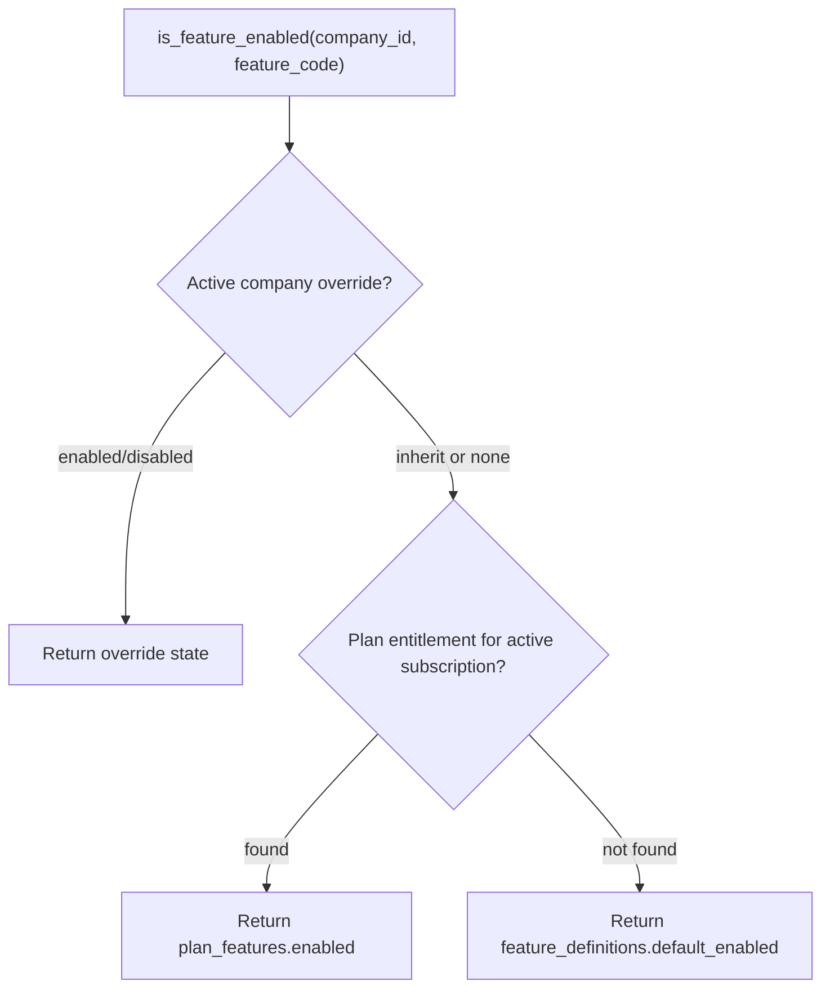
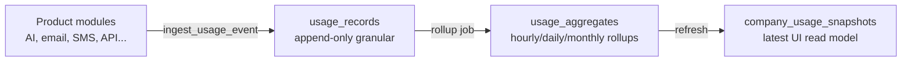
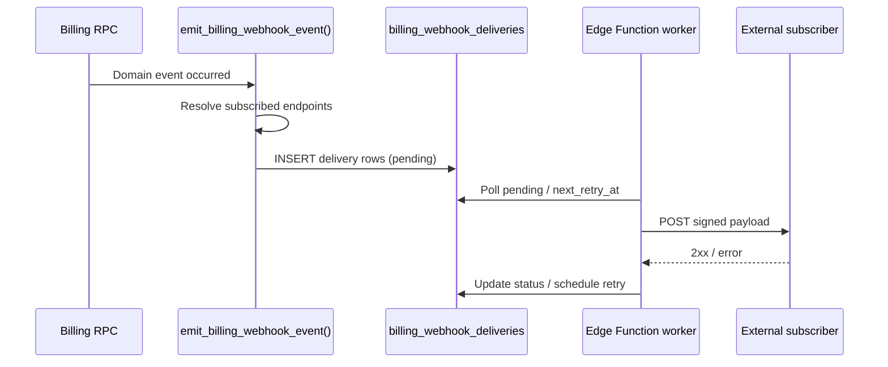
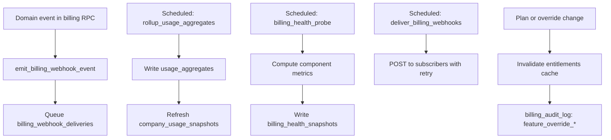

# VaultOS Billing & Subscriptions — Enterprise Architecture

**Status:** Architecture contract (documentation only)  
**Version:** 4.0  
**Last updated:** 2026-07-17  
**Scope:** Enterprise SaaS billing domain — subscriptions, payments, invoices, settings, audit, entitlements, metering, health, webhooks  
**Out of scope for this document:** Migrations, UI implementation, payment gateway integrations

---

## Purpose

This document is the **canonical architecture** for the VaultOS Billing & Subscriptions module. It supersedes all prior billing design notes (v1–v3) and is the contract for Phase 1+ implementation.

Design goals:

- **Enterprise SaaS quality** — no hardcoded billing behavior; full auditability
- **Backward compatible** — preserves Route Registry, Dashboard shell, URL-first routing, React Query, RBAC, CRM Invoice module
- **Separation of concerns** — subscription lifecycle events ≠ billing audit log ≠ generic `audit_logs` ≠ outbound webhooks
- **Entitlements decoupled from plans** — plans define defaults; per-company feature overrides are first-class
- **Usage-ready** — historical metering designed for future usage-based billing
- **Operable** — Billing Health dashboard for platform reliability
- **Integrable** — outbound webhook event architecture for external systems
- **Payment-ready** — provider abstraction without gateway implementation in early phases
- **Future unified Invoice Center** — type discriminator prep; no schema merge today

### Relationship to current implementation

| Already shipped (MVP) | Defined here (Phase 1+) |
|-----------------------|-------------------------|
| `subscriptions.tsx` super-admin spreadsheet over `companies` | Full Billing & Subscriptions module with nested navigation |
| `plans` table (Basic/Pro/Enterprise) | Extended plan catalog with features, limits, tier rank |
| Denormalized subscription fields on `companies` | Authoritative `company_subscriptions` + sync trigger |
| CRM `invoices` (customer billing) | Separate `billing_invoices` + `billing_receipts` (platform SaaS) |
| Permission `subscriptions.view` | Full `billing.*` permission matrix |
| Generic `audit_logs` on CRM entities | Dedicated `billing_audit_logs` for billing compliance |
| `ai_token_cost_records` (AI observability) | Unified usage metering ingests AI tokens + all billable resources |

---

## 1. Domain Model

All billing entities are **company-scoped** unless marked as platform-global. Identifiers use UUID. Timestamps use `timestamptz`.

### 1.1 High-level diagram

```mermaid
flowchart TB
  subgraph Config["Configuration Layer"]
    billing_setting_definitions["billing_setting_definitions"]
    billing_settings["billing_settings"]
    billing_email_templates["billing_email_templates"]
  end

  subgraph Entitlements["Entitlements Layer"]
    feature_definitions["feature_definitions"]
    plan_features["plan_features<br/>default entitlements"]
    company_feature_overrides["company_feature_overrides"]
  end

  subgraph Tenant["Tenant Identity"]
    companies["companies"]
    billing_contacts["company_billing_contacts"]
    company_billing_profiles["company_billing_profiles"]
  end

  subgraph Subscription["Subscription Domain"]
    company_subscriptions["company_subscriptions"]
    subscription_events["subscription_events"]
  end

  subgraph Financial["Financial Records"]
    billing_invoices["billing_invoices"]
    billing_receipts["billing_receipts"]
    billing_payments["billing_payments"]
  end

  subgraph Usage["Usage Metering"]
    usage_metric_definitions["usage_metric_definitions"]
    usage_records["usage_records<br/>granular history"]
    usage_aggregates["usage_aggregates<br/>rollups"]
    company_usage_snapshots["company_usage_snapshots<br/>UI read model"]
  end

  subgraph Compliance["Compliance"]
    billing_audit_logs["billing_audit_logs"]
  end

  subgraph Operations["Operations"]
    billing_job_executions["billing_job_executions"]
    billing_health_snapshots["billing_health_snapshots"]
  end

  subgraph Integrations["Integrations"]
    inbound_webhook_events["webhook_events<br/>inbound payment provider"]
    billing_webhook_endpoints["billing_webhook_endpoints<br/>outbound subscribers"]
    billing_webhook_deliveries["billing_webhook_deliveries"]
  end

  subgraph PaymentsFuture["Payment Prep"]
    payment_method_types["payment_method_types"]
    company_payment_methods["company_payment_methods"]
    payment_intents["payment_intents"]
    payment_providers["payment_providers"]
  end

  plans["plans"] --> plan_features
  feature_definitions --> plan_features
  feature_definitions --> company_feature_overrides
  plan_features --> company_subscriptions
  company_feature_overrides --> companies
  usage_records --> usage_aggregates
  usage_aggregates --> company_usage_snapshots
  subscription_events --> billing_webhook_deliveries
  billing_setting_definitions --> billing_settings
```



### 1.2 Contact model

| Concept | Storage | Used for |
|---------|---------|----------|
| **Company contact** | Optional fields on `companies` | General business operations |
| **Billing contact** | `company_billing_contacts` (1 active per company) | Invoices, receipts, dunning, renewal notices |

Billing contact is **not** assumed to be the company owner or primary profile user.

### 1.3 Company identity bundle

Every billing surface renders a **`CompanyIdentity`** block:

- Company Logo (`companies.logo_url`)
- Company Name
- Company Type
- Company ID (short display + copy)
- Billing Contact Name
- Billing Contact Email
- Billing Contact Phone

Used in: Billing Overview, Subscriptions table, Subscription Detail, invoices, receipts, reports, audit log, health dashboard drill-downs.

### 1.4 Intelligent subscription status

Status display = `{statusLabel}` + `{contextLine}` computed client-side from canonical server timestamps.

| Raw status | Context examples |
|------------|------------------|
| `trialing` | "5 Days Remaining" / "Ends Tomorrow" |
| `active` | "Renews in 12 Days" / "Renews Tomorrow" |
| `grace_period` | "3 Days Remaining" |
| `past_due` | "Payment overdue — action required" |
| `expired` | "Payment Required" |
| `canceled` | "Access until {date}" |

Helper: `lib/billing/subscription-status-display.ts`. **Grace period duration** read from `billing_settings`, never hardcoded.

### 1.5 Plan experience (Subscription Detail)

- Current Plan (name, tier, cycle, price)
- Plan Features (from `plan_features` + effective overrides)
- Plan Limits (from plan + usage aggregates)
- Usage Summary (current period vs limits)
- **Upgrade Plan** CTA if not on highest active plan; else **Current Plan** badge

### 1.6 Event stream separation

Four distinct event/audit streams:

| Stream | Table | Audience | Purpose |
|--------|-------|----------|---------|
| **Subscription Timeline** | `subscription_events` (filtered) | Tenant admins, billing admins | Visual lifecycle milestones |
| **Subscription Activity** | `subscription_events` (full feed) | Same | Operational subscription feed |
| **Billing Audit Log** | `billing_audit_logs` | Compliance officers, platform admins | Administrative actions with before/after |
| **Outbound Webhook Deliveries** | `billing_webhook_deliveries` | Integrators, platform admins | External system notification audit |

**Subscription events** are lifecycle facts. **Billing audit** is compliance traceability. **Outbound webhooks** are integration delivery with retry semantics. **Inbound `webhook_events`** remain payment-provider ingress only.

### 1.7 Payment documents

On successful payment, generate **both**:

| Document | Table | Purpose |
|----------|-------|---------|
| **Invoice** | `billing_invoices` | Accounting record |
| **Receipt** | `billing_receipts` | Payment confirmation |

Both downloadable. Number formats read from **Billing Settings**, not hardcoded.

### 1.8 Future invoice unification

Keep `billing_invoices` separate from CRM `invoices`. Prepare via `invoice_type`:

- CRM: `'customer'` (default, unchanged behavior)
- Platform: `'platform_subscription'`

Future Invoice Center unions both read models. **No schema merge in Phase 1–4.**

---

## 2. Feature Flag & Entitlements Architecture (v4)

> **Phase 7.5:** `company_subscriptions` is lifecycle SoT only. It does **not** replace Phase 6 commercial entitlement resolution. See `docs/architecture/commercial-packages-v1.md` (Subscription lifecycle).
>
> **Phase 7.6:** Administrative Trial → Paid via `convert_trial_to_paid_v1`. No payment provider / checkout. See commercial-packages doc (Trial → Paid conversion).

> **Phase 7.7:** Administrative package upgrade/downgrade via `change_company_package_v1` (preserves lifecycle dates/cycle; syncs `source=package` grants only). No payment / proration. See commercial-packages doc.

> **Phase 7.8:** Operational lifecycle enforcement via `run_subscription_lifecycle_enforcement_v1` (trial/period/grace). Optional worker/CLI/internal cron. **No fabricated renewal.** Paid renewal remains `renew_subscription_from_payment`.

### 2.1 Purpose

Provide a **feature flag system independent from subscription plans**. Plans define **default entitlements**; platform admins can enable or disable individual features for specific companies without changing plan assignment.

This supports: beta access, enterprise custom deals, temporary grants, kill switches, and gradual rollouts — without plan proliferation.

### 2.2 Resolution model

> **Superseded (Phase 6 / 7.3):** Runtime commercial access is **not** resolved from `plan_features`.
> Authoritative path: `company_feature_overrides` + `feature_definitions` classification + approval/suspension + flags + RBAC → `is_feature_enabled` / `require_company_feature_v1`.
> `plan_features` is packaging metadata only (see `docs/architecture/commercial-packages-v1.md`).

Legacy diagram (historical — do not implement):



**Current precedence (commercial):** active `company_feature_overrides` → deny for commercial catalog features → `default_enabled` only for non-commercial/core.

Overrides may be **time-bound** (`expires_at`) for trials and promotions.

### 2.3 Tables

#### `feature_definitions` (global catalog)

| Column | Notes |
|--------|-------|
| `id` | uuid PK |
| `code` | unique, e.g. `ai_assistant`, `whatsapp_channel`, `advanced_reports` |
| `category` | `core`, `ai`, `channels`, `integrations`, `billing`, `admin` |
| `label`, `description` | Admin UI copy |
| `default_enabled` | boolean — fallback when no plan mapping |
| `is_billable` | boolean — ties to usage metric (future) |
| `linked_usage_metric_code` | nullable FK → `usage_metric_definitions.code` |
| `requires_subscription` | boolean — false = available on free/trial |
| `sort_order`, `is_active` | |

New product feature = new catalog row. No schema migration.

#### `plan_features` (plan default entitlements)

| Column | Notes |
|--------|-------|
| `id` | uuid PK |
| `plan_id` | FK → `plans.id` |
| `feature_code` | FK → `feature_definitions.code` |
| `enabled` | boolean |
| `limit_value` | jsonb nullable — e.g. `{ "max_users": 10, "max_ai_tokens_monthly": 100000 }` |
| `metadata` | jsonb |

Unique: `(plan_id, feature_code)`.

Plans define **defaults only**. They do not block per-company overrides.

#### `company_feature_overrides`

| Column | Notes |
|--------|-------|
| `id` | uuid PK |
| `company_id` | FK → `companies.id` |
| `feature_code` | FK → `feature_definitions.code` |
| `override_state` | `enabled` \| `disabled` |
| `reason` | text — required for audit (e.g. "Enterprise deal", "Beta program") |
| `expires_at` | timestamptz nullable |
| `created_by`, `updated_by` | uuid |
| `is_active` | boolean — soft revoke without delete |
| `created_at`, `updated_at` | |

Unique active override: `(company_id, feature_code)` where `is_active = true`.

### 2.4 Server API

| Function | Purpose |
|----------|---------|
| `is_feature_enabled(p_company_id, p_feature_code)` | Authoritative entitlement check — used by all modules |
| `get_company_entitlements(p_company_id)` | Bulk resolved map for UI and auth context |
| `set_company_feature_override(...)` | Admin RPC; writes `billing_audit_log` |
| `revoke_company_feature_override(...)` | Soft revoke; audit |

**Cache strategy:** Auth context may cache entitlements with TTL (e.g. 60s). Invalidation on override change, plan change, or subscription status change via trigger notification.

**Integration with VaultOS modules:** AI Assistant, channels, reports, etc. call `is_feature_enabled()` — never check plan name strings directly.

### 2.5 RBAC

| Permission | Description |
|------------|-------------|
| `billing.features.view` | View feature catalog, plan mappings, company overrides |
| `billing.features.edit` | Create/revoke company feature overrides |
| `billing.features.manage_catalog` | Platform-only: add/edit `feature_definitions` |

Company admins may **view** their own effective entitlements (`billing.view_own`) but cannot edit overrides unless granted `billing.features.edit`.

### 2.6 React structure (future management UI)

Route: `/dashboard/subscriptions/features` (Phase 2+)

| Screen | Purpose |
|--------|---------|
| Feature Catalog | Platform admin: all `feature_definitions` |
| Plan Entitlements Editor | Within Plans Admin: matrix of plan × feature |
| Company Overrides | Per-company override table with reason, expiry |
| Effective Entitlements | Subscription Detail panel: resolved features with source badge (Plan / Override / Default) |

Components:

```
src/components/billing/features/
├── feature-catalog-table.tsx
├── plan-features-matrix.tsx
├── company-feature-overrides-card.tsx
├── effective-entitlements-list.tsx
├── feature-override-form-modal.tsx
└── feature-source-badge.tsx          # "Plan" | "Override" | "Default"
```

Hooks: `use-feature-definitions.ts`, `use-plan-features.ts`, `use-company-feature-overrides.ts`, `use-company-entitlements.ts`.

Lib: `lib/billing/entitlements-resolver.ts` (client display mirror of server precedence).

---

## 3. Usage Metering Architecture (v4)

### 3.1 Purpose

Extend beyond point-in-time snapshots to **historical usage metering** capable of recording granular consumption across all billable resources. Designed for:

- Subscription Detail usage panels (current period)
- Billing reports and trend charts
- Overage detection vs plan limits
- **Future usage-based billing** (metered line items, tiered pricing)

### 3.2 Metric catalog

#### `usage_metric_definitions`

| Column | Notes |
|--------|-------|
| `id` | uuid PK |
| `code` | unique |
| `label`, `description` | |
| `unit` | `count`, `token`, `byte`, `message`, `call` |
| `aggregation_type` | `counter` (monotonic) \| `gauge` (point-in-time) |
| `billable` | boolean |
| `default_period` | `hourly`, `daily`, `monthly` |
| `retention_days` | integer — granular record TTL |
| `is_active` | |

**Initial metric codes:**

| Code | Unit | Type | Source |
|------|------|------|--------|
| `ai_tokens` | token | counter | AI observability (`ai_token_cost_records`) |
| `storage_bytes` | byte | gauge | Storage service |
| `api_calls` | count | counter | API gateway / Edge Functions |
| `users` | count | gauge | `profiles` count per company |
| `emails_sent` | count | counter | Notification/email service |
| `sms_sent` | count | counter | SMS provider |
| `whatsapp_messages` | count | counter | Channel adapter |
| *(extensible)* | | | New row in catalog |

### 3.3 Data layers

Three-tier storage for performance and billing accuracy:



#### `usage_records` (granular history)

| Column | Notes |
|--------|-------|
| `id` | uuid PK |
| `company_id` | FK |
| `metric_code` | FK → `usage_metric_definitions.code` |
| `quantity` | numeric — tokens, bytes, count |
| `recorded_at` | timestamptz |
| `billing_period` | text — e.g. `2026-07` for monthly grouping |
| `source` | `ai_platform`, `api_gateway`, `notification_service`, `manual`, `backfill` |
| `reference_type`, `reference_id` | nullable — link to trace, message, user |
| `metadata` | jsonb — model, channel, endpoint |
| `idempotency_key` | text nullable — dedupe |

Index: `(company_id, metric_code, recorded_at desc)`, `(company_id, billing_period, metric_code)`.

**Partitioning (future):** Monthly range partitions on `recorded_at` when volume exceeds threshold.

#### `usage_aggregates` (historical rollups)

| Column | Notes |
|--------|-------|
| `id` | uuid PK |
| `company_id` | FK |
| `metric_code` | FK |
| `granularity` | `hour`, `day`, `month` |
| `period_start`, `period_end` | timestamptz |
| `total_quantity` | numeric |
| `record_count` | integer — source records aggregated |
| `computed_at` | timestamptz |

Unique: `(company_id, metric_code, granularity, period_start)`.

Powers trend charts, overage calculations, and future usage invoices.

#### `company_usage_snapshots` (UI read model — retained from v3)

| Column | Notes |
|--------|-------|
| `company_id`, `snapshot_date` | |
| `metrics` | jsonb — `{ "ai_tokens": 45000, "storage_bytes": 1073741824, ... }` |
| `source` | `daily_rollup` \| `on_demand` |

Refreshed from `usage_aggregates` for Subscription Detail "Usage Summary" panel. **Not** the authoritative billing record.

### 3.4 Ingestion API

| Function | Purpose |
|----------|---------|
| `ingest_usage_event(p_company_id, p_metric_code, p_quantity, p_metadata, p_idempotency_key)` | Single event; SECURITY DEFINER; called by product modules |
| `ingest_usage_events_batch(p_events jsonb)` | Bulk ingest for high-volume (AI tokens) |
| `rollup_usage_aggregates(p_granularity, p_from, p_to)` | Scheduled job |
| `get_usage_for_period(p_company_id, p_metric_code, p_period)` | Query for UI and overage checks |

**AI token bridge:** Existing `ai_token_cost_records` ingested via trigger or scheduled ETL into `usage_records` with `source = 'ai_platform'`. No duplicate counting — idempotency key = `ai_token_cost_record:{id}`.

### 3.5 Future usage-based billing (prep only)

| Future table | Purpose |
|--------------|---------|
| `usage_pricing_rules` | Per-metric unit price, tiered blocks |
| `usage_billing_line_items` | Metered charges on `billing_invoices` |

Phase 1–4: metering and reporting only. No metered invoicing until Phase 7+.

### 3.6 React structure

Subscription Detail: `usage-summary-card.tsx`, `usage-limit-meters.tsx`, `usage-trend-chart.tsx`.

Reports: `usage-report-page.tsx` section under `/subscriptions/reports`.

Hooks: `use-company-usage-snapshot.ts`, `use-usage-aggregates.ts`, `use-usage-records.ts` (admin drill-down).

---

## 4. Billing Health Module (v4)

### 4.1 Purpose

Operational dashboard exposing **billing service health** for platform administrators. Answers: Is billing working? What failed? What is stuck?

This is distinct from business KPIs (MRR, churn) on Billing Overview.

### 4.2 Monitored domains

| Domain | Signals |
|--------|---------|
| **Payment health** | Failed payments (24h/7d), past_due count, retry queue depth |
| **Renewal jobs** | Upcoming renewals, last job run, failures |
| **Scheduled tasks** | Cron executions: grace checks, expiring notices, usage rollups |
| **Inbound webhooks** | Payment provider `webhook_events` backlog, error rate, latency |
| **Outbound webhooks** | `billing_webhook_deliveries` pending/failed |
| **Invoice generation** | Stuck `billing_invoices` in draft, generation errors |
| **Email queue** | Billing notification send failures, queue depth |
| **Overall service** | Composite health score, last successful end-to-end payment test |

### 4.3 Tables

#### `billing_scheduled_jobs` (catalog)

| Column | Notes |
|--------|-------|
| `code` | unique, e.g. `renewal_check`, `grace_period_enforce`, `usage_rollup`, `expiring_notice` |
| `label`, `description` | |
| `schedule_cron` | text |
| `is_active` | |
| `timeout_seconds` | |

#### `billing_job_executions`

| Column | Notes |
|--------|-------|
| `id` | uuid PK |
| `job_code` | FK → `billing_scheduled_jobs.code` |
| `status` | `running`, `success`, `failed`, `partial` |
| `started_at`, `finished_at` | |
| `records_processed`, `records_failed` | integer |
| `error_summary` | text nullable |
| `metadata` | jsonb — per-job details |

Append-only execution log. Retention configurable via billing settings.

#### `billing_health_snapshots`

| Column | Notes |
|--------|-------|
| `id` | uuid PK |
| `snapshot_at` | timestamptz |
| `overall_status` | `healthy`, `degraded`, `critical` |
| `components` | jsonb — per-domain status + metrics |
| `computed_by` | job execution ref |

Periodic probe (e.g. every 5 min) writes snapshot. Dashboard reads latest + history.

#### Derived metrics (no extra tables)

Computed views/RPCs over existing tables:

- `v_billing_failed_payments_24h`
- `v_billing_pending_renewals`
- `v_billing_webhook_backlog`
- `v_billing_email_failures`

Integrates with existing `notifications` / email delivery status where available.

### 4.4 UI

Route: `/dashboard/subscriptions/health`

```
┌─────────────────────────────────────────────────────────────┐
│  Billing Health                          [Overall: Healthy]  │
├─────────────────────────────────────────────────────────────┤
│  HealthKpiRow: Payments | Renewals | Webhooks | Invoices | Email │
├──────────────────────────────┬──────────────────────────────┤
│  FailedPaymentsPanel         │  RenewalJobsPanel             │
├──────────────────────────────┼──────────────────────────────┤
│  ScheduledTasksPanel         │  WebhookProcessingPanel       │
├──────────────────────────────┴──────────────────────────────┤
│  JobExecutionTimeline                                        │
└─────────────────────────────────────────────────────────────┘
```

Actions (permission `billing.health.manage`): retry failed webhook delivery, re-queue email, trigger manual job run.

### 4.5 RBAC

| Permission | Description |
|------------|-------------|
| `billing.health.view` | View Billing Health dashboard |
| `billing.health.manage` | Retry jobs, re-process webhooks, manual triggers |

Platform admins only. Not exposed to tenant company admins.

---

## 5. Outbound Billing Webhooks (v4)

### 5.1 Purpose

Allow **external systems to subscribe** to billing domain events. Distinct from:

- **`webhook_events`** — inbound payment provider callbacks (Stripe, Paymob)
- **`subscription_events`** — internal lifecycle UX
- **`billing_audit_logs`** — compliance admin actions

Outbound webhooks are **integration-facing**, signed, retriable, and auditable.

### 5.2 Event catalog

#### `billing_webhook_event_types`

| `event_type` | Emitted when |
|--------------|--------------|
| `subscription.created` | New subscription record |
| `subscription.updated` | Status, plan, or period change |
| `payment.succeeded` | Payment confirmed |
| `payment.failed` | Payment attempt failed |
| `invoice.created` | Invoice issued |
| `invoice.paid` | Invoice marked paid |
| `receipt.generated` | Receipt issued |

Extensible via catalog row — no schema change.

### 5.3 Tables

#### `billing_webhook_endpoints`

| Column | Notes |
|--------|-------|
| `id` | uuid PK |
| `company_id` | uuid nullable — NULL = platform-level integrator |
| `url` | HTTPS endpoint |
| `secret_ref` | pointer to encrypted signing secret (never plaintext in DB) |
| `description` | |
| `is_active` | |
| `created_by` | |

#### `billing_webhook_subscriptions`

| Column | Notes |
|--------|-------|
| `endpoint_id` | FK |
| `event_type` | FK → `billing_webhook_event_types` |
| `is_active` | |

Unique: `(endpoint_id, event_type)`.

#### `billing_webhook_deliveries`

| Column | Notes |
|--------|-------|
| `id` | uuid PK |
| `endpoint_id` | FK |
| `event_type` | text |
| `event_id` | uuid — source entity id |
| `payload` | jsonb — canonical event envelope |
| `status` | `pending`, `delivering`, `delivered`, `failed`, `dead_letter` |
| `attempt_count` | integer |
| `next_retry_at` | timestamptz |
| `last_response_code` | integer |
| `last_error` | text |
| `delivered_at` | timestamptz nullable |
| `created_at` | |

### 5.4 Event envelope (canonical)

```json
{
  "id": "evt_uuid",
  "type": "payment.succeeded",
  "created_at": "2026-07-17T17:00:00Z",
  "company_id": "uuid",
  "data": {
    "payment_id": "uuid",
    "amount": 9900,
    "currency": "USD",
    "subscription_id": "uuid"
  }
}
```

Signed with HMAC-SHA256 header: `X-VaultOS-Signature`, timestamp: `X-VaultOS-Timestamp`. Replay protection via timestamp window (configurable in billing settings).

### 5.5 Delivery flow



Retry policy read from billing settings (`webhook_retry_max_attempts`, `webhook_retry_backoff_seconds`). Failed deliveries visible in Billing Health dashboard.

### 5.6 RBAC

| Permission | Description |
|------------|-------------|
| `billing.webhooks.view` | View endpoints, subscriptions, delivery log |
| `billing.webhooks.manage` | CRUD endpoints, rotate secrets, retry deliveries |

Tenant company admins may manage **their own** endpoints (`company_id` scoped) if granted `billing.webhooks.manage`. Platform integrators use `company_id = NULL`.

### 5.7 React structure (Phase 3+)

Route: `/dashboard/subscriptions/webhooks`

Components: `webhook-endpoints-table.tsx`, `webhook-endpoint-form.tsx`, `webhook-delivery-log.tsx`, `webhook-event-type-picker.tsx`.

Hooks: `use-billing-webhook-endpoints.ts`, `use-billing-webhook-deliveries.ts`.

---

## 6. Billing Settings Module (v3 — unchanged core)

### 6.1 Purpose

Centralized configuration for **all billing behavior**. No grace periods, tax rates, number formats, retry policies, or email copy may be hardcoded. All runtime billing code resolves values through **`get_billing_setting(code, scope)`**.

### 6.2 Design pattern: Definition + Value

See v3 sections. v4 additions to settings catalog:

| Category | New setting codes |
|----------|-------------------|
| **Webhooks** | `webhook_retry_max_attempts`, `webhook_retry_backoff_seconds`, `webhook_signature_tolerance_seconds` |
| **Usage** | `usage_rollup_schedule_cron`, `usage_record_retention_days` |
| **Health** | `health_probe_interval_seconds`, `health_alert_threshold_failed_payments` |
| **Entitlements** | `entitlements_cache_ttl_seconds` |

---

## 7. Billing Audit Log (v3 — extended)

v4 additions to event types:

| `event_type` | Trigger |
|--------------|---------|
| `feature_override_created` | Company feature override added |
| `feature_override_revoked` | Override revoked |
| `webhook_endpoint_created` | Outbound webhook endpoint created |
| `webhook_endpoint_deleted` | Endpoint removed |
| `usage_manual_adjustment` | Admin manual usage correction |

All other v3 audit behavior unchanged.

---

## 8. Database Design (Complete)

### 8.1 Migration sequence (planned)

| Migration | Contents |
|-----------|----------|
| `030_billing_plans_extend.sql` | Extend `plans` (features, limits, tier_rank) |
| `031_billing_contacts_profiles.sql` | Contacts, profiles, extend `companies` |
| `032_company_subscriptions.sql` | Authoritative subscription table |
| `033_subscription_events.sql` | Lifecycle events |
| `034_billing_invoices.sql` | `billing_invoices`, CRM `invoice_type` prep |
| `035_billing_receipts.sql` | Payment receipts |
| `036_billing_payments.sql` | Payments + method FK |
| `037_payment_method_prep.sql` | Inbound payment webhooks, intents, providers |
| `038_billing_settings.sql` | Settings definitions, values, email templates |
| `039_billing_audit_logs.sql` | Audit log + write function |
| `040_billing_rpcs.sql` | Renew, settings, document numbering, sync |
| `041_billing_permissions.sql` | Seed `billing.*` permissions |
| **`042_feature_entitlements.sql`** | `feature_definitions`, `plan_features`, `company_feature_overrides`, resolver RPC |
| **`043_usage_metering.sql`** | Metric definitions, records, aggregates, snapshots, ingest RPC |
| **`044_billing_phase1_hardening.sql`** | Phase 1 RBAC/RLS/RPC hardening, pagination, settings validation |
| **`045_billing_health.sql`** | Scheduled jobs catalog, job executions, health snapshots, views |
| **`046_billing_outbound_webhooks.sql`** | Endpoints, subscriptions, deliveries, emit function |
| **`047_billing_integration_rpcs.sql`** | Entitlement cache invalidation, usage rollup jobs, webhook worker helpers |

### 8.2 Core tables (summary)

All v3 tables retained. See sections 2–5 for v4 additions.

#### Denormalized sync (unchanged)

Trigger/RPC keeps `companies.plan_id`, `subscription_status`, `billing_cycle`, `subscription_expires_at`, `status` in sync for auth and notifications.

---

## 9. React Structure

### 9.1 Module navigation (v4)

```
Billing & Subscriptions
├── Overview              /subscriptions
├── Companies             /subscriptions/companies
├── Plans                 /subscriptions/plans
├── Subscriptions         /subscriptions/list
├── Payments              /subscriptions/payments
├── Billing Invoices      /subscriptions/invoices
├── Reports               /subscriptions/reports
├── Features              /subscriptions/features      ← Phase 2
├── Billing Settings      /subscriptions/settings
├── Billing Audit Log     /subscriptions/audit
├── Billing Health        /subscriptions/health        ← new
└── Webhooks              /subscriptions/webhooks      ← Phase 3
```

Detail routes unchanged. `/subscriptions/my` for tenant self-service.

### 9.2 Pages (v4 additions)

| Page | File | Permission |
|------|------|------------|
| Feature Management | `feature-management-page.tsx` | `billing.features.view` |
| Billing Health | `billing-health-page.tsx` | `billing.health.view` |
| Webhook Management | `billing-webhooks-page.tsx` | `billing.webhooks.view` |

### 9.3 Component tree (v4 additions)

```
src/components/billing/
├── features/          # See §2.6
├── usage/
│   ├── usage-summary-card.tsx
│   ├── usage-limit-meters.tsx
│   └── usage-trend-chart.tsx
├── health/
│   ├── billing-health-overview.tsx
│   ├── health-kpi-row.tsx
│   ├── failed-payments-panel.tsx
│   ├── renewal-jobs-panel.tsx
│   ├── scheduled-tasks-panel.tsx
│   ├── webhook-processing-panel.tsx
│   ├── invoice-generation-panel.tsx
│   ├── email-queue-panel.tsx
│   └── job-execution-timeline.tsx
└── webhooks/
    ├── webhook-endpoints-table.tsx
    ├── webhook-endpoint-form.tsx
    ├── webhook-delivery-log.tsx
    └── webhook-event-type-picker.tsx

src/hooks/billing/
├── use-feature-definitions.ts
├── use-plan-features.ts
├── use-company-feature-overrides.ts
├── use-company-entitlements.ts
├── use-usage-records.ts
├── use-usage-aggregates.ts
├── use-billing-health.ts
├── use-billing-job-executions.ts
├── use-billing-webhook-endpoints.ts
└── use-billing-webhook-deliveries.ts

src/lib/billing/
├── entitlements-resolver.ts
├── usage-formatters.ts
├── health-status-labels.ts
└── webhook-event-envelope.ts
```

All v3 components retained.

---

## 10. RBAC (Complete v4)

### 10.1 Permission matrix

| Permission | Description |
|------------|-------------|
| `billing.view` | Overview, subscriptions, detail, payments, invoices |
| `billing.view_own` | Tenant self-service |
| `billing.view_reports` | Billing reports + usage reports |
| `billing.edit` | Plan assignment, billing contact, suspend/restore |
| `billing.manage_plans` | Plans admin CRUD |
| `billing.record_payment` | Manual payment + manual invoice |
| `billing.settings.view` | View Billing Settings |
| `billing.settings.edit` | Modify Billing Settings |
| `billing.audit.view` | View Billing Audit Log |
| `billing.audit.export` | Export audit log |
| **`billing.features.view`** | View feature catalog and overrides |
| **`billing.features.edit`** | Manage company feature overrides |
| **`billing.features.manage_catalog`** | Platform: edit feature definitions |
| **`billing.health.view`** | View Billing Health dashboard |
| **`billing.health.manage`** | Retry jobs, manual triggers |
| **`billing.webhooks.view`** | View webhook endpoints and deliveries |
| **`billing.webhooks.manage`** | CRUD endpoints, retry deliveries |

### 10.2 Seed roles (updated)

| Role | Permissions |
|------|-------------|
| **Platform Billing Admin** | All `billing.*` |
| **Platform SRE / Ops** | `billing.health.view`, `billing.health.manage`, `billing.webhooks.view` |
| **Compliance Officer** | `billing.audit.view`, `billing.audit.export` |
| **Company Admin** | `billing.view_own`, `billing.settings.view`, company-scoped `billing.settings.edit` |
| **Integration Developer** | `billing.webhooks.view`, `billing.webhooks.manage` (scoped) |

Legacy `subscriptions.*` maps to `billing.*`. Super-admin retains all.

---

## 11. Automation Flow (v4)

v3 automation unchanged. v4 additions:



All schedules read cron/interval from **Billing Settings**.

---

## 12. Payment, Lifecycle, Invoice Strategy

Unchanged from v3. v4 notes:

- Payment success emits outbound `payment.succeeded`, `invoice.created`, `invoice.paid`, `receipt.generated`
- Usage metering does not affect subscription lifecycle in Phase 1–4
- Feature overrides do not change subscription status — only entitlements

---

## 13. Future Scalability

| Area | Design |
|------|--------|
| **New features** | Row in `feature_definitions` |
| **New usage metrics** | Row in `usage_metric_definitions` |
| **Usage volume** | Partition `usage_records` by month; aggregate rollups |
| **Usage-based billing** | `usage_pricing_rules` + metered line items (Phase 7+) |
| **Entitlements at edge** | Cache with TTL; invalidate on change |
| **Webhook throughput** | Queue + worker; dead letter queue |
| **Health at scale** | Materialized views; snapshot retention policy |
| All v3 scalability items | Retained |

---

## 14. Backward Compatibility

| Module | Impact |
|--------|--------|
| Route Registry | Same `subscriptions` id; nested billing layout |
| Dashboard Layout / Outlet | Unchanged |
| URL-first routing | Preserved |
| React Query | Additive hooks |
| CRM Invoice module | Untouched |
| Companies module | Additive |
| Auth / suspension | `companies.status` remains access gate |
| **`plans.features` jsonb (v3)** | Coexists; `plan_features` table is authoritative; jsonb migrated/synced for compat |
| **`ai_token_cost_records`** | Bridged to usage metering; table retained |
| **`webhook_events`** | Remains inbound-only; outbound uses new tables |
| Generic `audit_logs` | Unchanged |
| Existing `subscriptions.tsx` | Replaced in Phase 1 |

---

## 15. Implementation Phases (updated)

| Phase | Deliverables |
|-------|--------------|
| **1 — Foundation** | Subscriptions, events, settings, audit, overview, detail, settings, audit UI, entitlements tables + resolver RPC, usage tables + ingest, snapshots |
| **2 — Plans & automation** | Plans admin, plan_features matrix, feature overrides UI, scheduled checks, usage rollups, reports |
| **3 — Ops & integrations** | Billing Health dashboard, outbound webhooks scaffold, webhook management UI, payment scaffold |
| **4 — Gateways** | Stripe, Paymob, etc. |
| **5 — Invoice Center** | Unified read UI |
| **6 — PDF documents** | Branded invoice + receipt downloads |
| **7 — Usage billing** | Metered pricing, overage invoices |

---

## 16. Enterprise Architecture Review (v4)

Formal review of scalability, security, RBAC, migrations, consistency, and extensibility.

### 16.1 Scalability risks

| Risk | Severity | Mitigation |
|------|----------|------------|
| **`usage_records` write volume** (AI tokens) | High | Batch ingest RPC; idempotency keys; monthly partitioning; retention policy via settings; aggregate rollups for queries |
| **`billing_webhook_deliveries` growth** | Medium | Retry with exponential backoff; dead letter after max attempts; archival job |
| **`subscription_events` / audit log growth** | Medium | Indexed time-range queries; export + archive to cold storage; retention settings per stream |
| **Entitlements check on every request** | Medium | Cache with TTL (`entitlements_cache_ttl_seconds`); bulk preload in auth context; invalidate on change |
| **Health dashboard query cost** | Low | Pre-computed `billing_health_snapshots`; materialized views for KPIs |
| **Multi-tenant usage rollup job** | Medium | Batch by company shard; `partial` status on job execution; resumable cursor in metadata |

### 16.2 Security issues & mitigations

| Concern | Mitigation |
|---------|------------|
| **Webhook signing secrets in DB** | Store `secret_ref` only; secrets in Supabase Vault / env; rotate via `billing.webhooks.manage` |
| **Outbound webhook SSRF** | Validate endpoint URLs (HTTPS only, block private IP ranges); allowlist optional per platform |
| **Feature override privilege escalation** | `set_company_feature_override` RPC only; requires `billing.features.edit`; audit every change |
| **Usage ingest spoofing** | `ingest_usage_event` SECURITY DEFINER; caller must be service role or authenticated module with company scope validation |
| **Billing settings tampering** | RLS + RPC validation against `validation_schema`; platform settings super-admin only |
| **Audit log immutability** | No UPDATE/DELETE policies; insert via definer functions only |
| **PII in webhook payloads** | Payload schema excludes billing contact email by default; configurable field mask in settings |
| **Webhook replay attacks** | Timestamp tolerance window; idempotent delivery id |

### 16.3 RBAC weaknesses addressed

| Gap (pre-v4) | Resolution |
|--------------|------------|
| No separation of ops vs finance | `billing.health.*` for SRE; finance retains `billing.view` / `billing.audit.*` |
| Feature overrides too powerful without audit | Dedicated permissions + mandatory `reason` + audit log |
| Webhook management unprotected | `billing.webhooks.view/manage` with company scope |
| Company admin could see platform health | Health dashboard platform-admin only |
| Usage record drill-down exposes cross-tenant data | RLS on `usage_records` — company scope or platform admin |

**Remaining consideration:** Map new permissions to existing roles in migration `040` + `045` seed updates. Document explicit deny: tenant users never receive `billing.health.*` or `billing.features.manage_catalog`.

### 16.4 Migration concerns

| Concern | Strategy |
|---------|----------|
| **Migration ordering** | Strict sequence 030–045; entitlements (041) after plans extend (030); usage (042) independent; webhooks (044) after events (033) |
| **Backfill plan features from `plans.features` jsonb** | One-time migration script populates `plan_features`; keep jsonb synced via trigger during transition |
| **Backfill usage from `ai_token_cost_records`** | Idempotent backfill job with `idempotency_key`; run after 042 |
| **Existing super-admin subscriptions page** | Feature flag or route swap after Phase 1 pages ready |
| **Permission migration for existing roles** | Add new permissions; map `subscriptions.view` → `billing.view`; no removal of legacy until Phase 2 |
| **Zero-downtime** | All migrations additive; new tables empty; denormalized `companies` fields synced before switching read path |
| **Rollback plan** | Each migration reversible; RPC functions versioned; UI reads old path until subscription domain verified |

### 16.5 Data consistency

| Consistency point | Mechanism |
|-------------------|-----------|
| **`companies` denormalized subscription fields** | Single sync function called from all subscription RPCs; transactional |
| **Plan features vs overrides vs effective entitlement** | Single resolver RPC; no duplicated logic in UI |
| **Usage snapshots vs aggregates** | Snapshots derived from aggregates only; labeled `snapshot_date` |
| **Invoice + receipt + payment trinity** | Single `renew_subscription_from_payment` transaction |
| **Outbound webhook vs subscription event** | Emit after transaction commit; at-least-once delivery; subscribers must idempotent |
| **Entitlements cache staleness** | Max TTL bound; invalidate trigger on override/plan/subscription change |
| **Duplicate usage counts** | Idempotency key required for high-volume sources |

**Known eventual consistency:** Outbound webhook delivery (seconds delay acceptable). Health snapshots (minutes). Usage aggregates (hourly/daily lag). Document SLAs in Billing Settings.

### 16.6 Future extensibility

| Extension | Ready? |
|-----------|--------|
| New billable resource | Add `usage_metric_definitions` row + ingest from module |
| New product feature flag | Add `feature_definitions` row + plan matrix |
| New webhook event type | Add catalog row + emit call in RPC |
| New billing setting | Add definition row |
| New payment gateway | `PaymentProviderAdapter` (v3) |
| Usage-based invoice line items | `usage_aggregates` + future pricing rules |
| Multi-region deployment | Company-scoped partitioning; settings per region (future scope) |
| Unified Invoice Center | `invoice_type` discriminator (v3) |

**Architectural principle validated:** Catalog + value pattern used consistently across settings, features, usage metrics, webhook events, and audit event types. New capabilities should follow this pattern.

### 16.7 Review verdict

Architecture v4 is **approved for Phase 1 implementation** subject to:

1. Enforcing idempotency on all usage ingest paths before production AI token volume
2. Implementing webhook URL validation before enabling outbound delivery
3. Seeding all v4 permissions in migration `040`/`045` before UI exposes new routes
4. Documenting eventual consistency SLAs for health and usage aggregates

No blocking structural defects identified. Primary operational risk is **`usage_records` volume** — mitigated by partitioning and retention policy in Phase 1 migration design.

---

## 17. Approval Gate

**No code until explicit Phase 1 start confirmation.**

v3 confirmations remain valid. v4 additions:

1. Feature flags independent from plans with override precedence — approved?
2. Three-tier usage metering (records → aggregates → snapshots) — approved?
3. Billing Health as platform-admin-only ops dashboard — approved?
4. Outbound webhooks separate from inbound `webhook_events` — approved?
5. Extended navigation (Features, Health, Webhooks) — approved?

---

## Appendix A: Event Stream Quick Reference

| Question | Subscription Activity | Billing Audit | Outbound Webhook | Inbound Webhook |
|----------|----------------------|---------------|------------------|-----------------|
| Audience | Operators | Compliance | Integrators | Payment providers |
| Payment success? | Yes (friendly) | Yes (admin detail) | Yes (API envelope) | Triggers payment RPC |
| Feature override? | No | Yes | No | No |
| Retries? | N/A | N/A | Yes | Provider-dependent |
| Mutable? | Append-only | Append-only | Status updates on delivery | Processed flag |

## Appendix B: No Hardcoded Values Policy

Unchanged from v3. v4 additions — must resolve via settings:

- Webhook retry attempts and backoff
- Usage rollup schedule and retention
- Health probe interval and alert thresholds
- Entitlements cache TTL

## Appendix C: Entitlements vs Plans vs Feature Flags

| Concept | Role |
|---------|------|
| **Plan** | Commercial tier; defines price, limits, default feature set |
| **Plan feature** | Default entitlement for all companies on that plan |
| **Feature override** | Per-company exception; independent of plan change |
| **Feature flag (effective)** | Resolved result consumed by product modules |

Plans alone do **not** gate features at runtime. Always use `is_feature_enabled()`.
