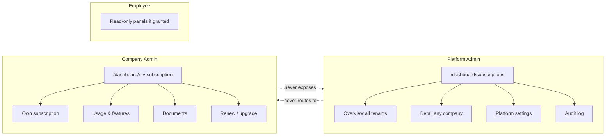
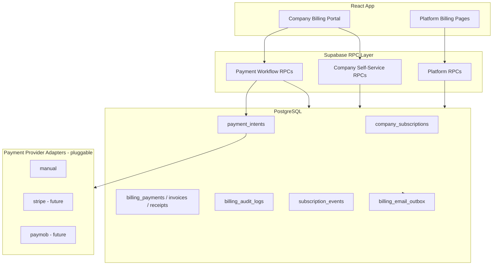
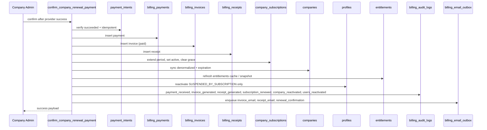
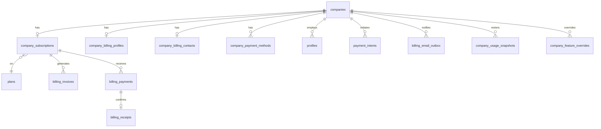
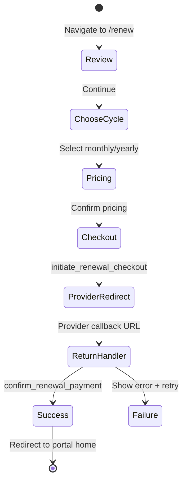

# VaultOS Company Billing Portal — Enterprise Architecture

**Status:** ~~Architecture proposal~~ **SUPERSEDED** — see [`enterprise-billing-platform-v2.md`](./enterprise-billing-platform-v2.md)  
**Version:** 1.0  
**Date:** 2026-07-17  
**Author:** Principal Software Architect  
**Parent contract:** [`billing-subscriptions.md`](./billing-subscriptions.md) v4.0  
**Scope:** Evolve Platform Billing into a dual-persona Enterprise SaaS Billing Platform with a Company Admin self-service portal  
**Out of scope for this document:** Implementation code, SMTP integration, direct Stripe/Paymob SDK wiring

---

## Executive Summary

VaultOS billing is **company-based, never user-based**. The existing Platform Billing module (`/dashboard/subscriptions/*`) serves Platform Admins who manage subscriptions across tenants. This architecture adds a **Company Billing Portal** (`/dashboard/my-subscription`) for Company Admins who manage **only their own company's subscription**.

The evolution preserves:

- Route Registry patterns (additive dashboard section, not a replacement)
- RPC-first mutations with RLS read gates
- React Query data layer
- Enterprise UI conventions
- Dedicated `billing_audit_logs` compliance stream
- Payment provider abstraction (pluggable, no direct gateway coupling)

Implementation is deliberately phased. **No code should be written until this document is approved.**

---

## 1. Architecture Principles

### 1.1 Domain invariants

| Invariant | Rule |
|-----------|------|
| Billing scope | Always `company_id`. Never `user_id`. |
| Subscription ownership | One authoritative `company_subscriptions` row per company. |
| Employee access | Inherited from company subscription + entitlements. |
| Platform Admin UX | Cross-tenant operations at `/dashboard/subscriptions/*`. |
| Company Admin UX | Single-tenant self-service at `/dashboard/my-subscription`. |
| Mutations | Client → `SECURITY DEFINER` RPC → audit → optional domain events. |
| User suspension | Distinct from company suspension; reactivation on renewal is **reason-aware**. |

### 1.2 Persona separation



**Hard rule:** Company Admins must never see multi-tenant lists, platform settings, or cross-company audit. Platform Admins may optionally deep-link to a company detail page but do not use the self-service portal for operations they already have in Platform Billing.

### 1.3 What stays unchanged

| Asset | Action |
|-------|--------|
| `BillingOverviewPage` | Keep; extend only if shared components extracted |
| `SubscriptionDetailPage` | Keep for platform ops |
| `BillingSettingsPage` | Keep platform scope; company scope settings accessed from portal |
| `BillingAuditLogPage` | Keep platform/compliance access |
| `billing-route-registry.ts` | **No** my-subscription entry |
| CRM `invoices` module | Untouched |
| Generic `audit_logs` | Untouched |

---

## 2. Current State Assessment

### 2.1 Already implemented (Phase 1 foundation)

| Capability | Backend | Frontend |
|------------|---------|----------|
| Authoritative subscriptions | ✅ `company_subscriptions` | ✅ Overview + detail |
| Manual payment → invoice + receipt + renew | ✅ `renew_subscription_from_payment` | ✅ Platform detail only |
| Billing settings (platform) | ✅ RPC + validation | ✅ Settings page |
| Billing audit | ✅ Immutable log + export | ✅ Audit page |
| Entitlements resolver | ✅ `get_company_entitlements` | ✅ Detail panel |
| Usage schema | ✅ Tables exist | ⚠️ UI empty without snapshot jobs |
| Payment prep | ✅ `payment_providers`, `payment_intents` | ❌ No UI/RPC |
| Permission `billing.view_own` | ✅ SQL helpers | ❌ Not wired in frontend |
| Company billing profile | ✅ `company_billing_profiles` | ❌ No dedicated UI |
| Payment methods | ✅ `company_payment_methods` | ❌ No UI |

### 2.2 Critical gaps for Company Portal

1. **No self-service route** — `/dashboard/my-subscription` does not exist.
2. **Permission mismatch** — `can_view_billing_company()` includes `is_company_admin()`, but `list_company_subscriptions_paged` requires platform permissions; company admins cannot use admin list RPCs (correct) but lack dedicated read RPCs.
3. **User account status model** — `profiles.is_active` boolean only; no `SUSPENDED_BY_SUBSCRIPTION` vs `SUSPENDED_BY_ADMIN` distinction.
4. **No checkout flow** — `payment_intents` exist without create/confirm RPCs.
5. **No email event architecture** — templates exist; no outbox/dispatch contract.
6. **No self-service plan change** — `assign_subscription_plan` requires `billing.edit` (platform).
7. **Document download** — `document_url` column exists; no generation pipeline.

---

## 3. Target Architecture

### 3.1 System context



### 3.2 Layered responsibilities

| Layer | Responsibility |
|-------|----------------|
| **Presentation** | Persona-specific routes, shared panel library, renewal wizard |
| **Application hooks** | React Query wrappers; company context from `useAuth().company.id` |
| **API (RPC)** | Authorization, validation, transactions, audit, event emission |
| **Domain (SQL)** | State machines, snapshots, entitlements refresh, user reactivation |
| **Integration** | Payment provider adapter interface; email outbox (no SMTP) |
| **Compliance** | `billing_audit_logs` + `subscription_events` + email outbox audit |

### 3.3 Payment provider abstraction

**Design pattern:** Strategy + registry. No Stripe/Paymob imports in core RPCs.

```
payment_providers (registry)
       │
       ▼
PaymentProviderAdapter (interface contract)
  ├── createCheckoutIntent(company_id, amount, currency, metadata)
  ├── getCheckoutRedirectUrl(intent_id)
  ├── handleWebhook(payload) → normalized PaymentResult
  └── getPaymentStatus(provider_intent_id)

Implementations (Edge Functions or future workers):
  ├── ManualProviderAdapter    (Phase 2 — immediate for testing)
  ├── StripeProviderAdapter    (Phase 4+)
  └── PaymobProviderAdapter    (Phase 4+)
```

**Core tables (existing):**

- `payment_providers` — registry, `config jsonb`, `is_active`
- `payment_intents` — checkout state machine
- `webhook_events` — inbound idempotent webhook store
- `billing_payments` — financial record after success

**New workflow RPCs** orchestrate intents; adapters are invoked via `provider_code` lookup, never hardcoded.

### 3.4 Post-payment transactional workflow

Single database transaction (SECURITY DEFINER RPC):



**Idempotency key:** `(provider_code, provider_payment_id)` on `billing_payments` + `payment_intents.id`.

### 3.5 User reactivation business rule

**New column:** `profiles.account_status` (enum, see §4).

| Status | Meaning | Renewal reactivates? |
|--------|---------|----------------------|
| `ACTIVE` | Normal access | N/A |
| `SUSPENDED_BY_SUBSCRIPTION` | Auto-suspended when company subscription expired | **Yes → ACTIVE** |
| `SUSPENDED_BY_ADMIN` | Manual admin suspension | **No** |
| `LOCKED` | Security lock (failed logins, etc.) | **No** |
| `DISABLED` | Account permanently disabled | **No** |

**RPC logic:**

```sql
UPDATE profiles
SET account_status = 'ACTIVE', is_active = true, updated_at = now()
WHERE company_id = p_company_id
  AND account_status = 'SUSPENDED_BY_SUBSCRIPTION';
```

Store `suspension_reason`, `suspended_at`, `suspended_by` for audit trail. Manual suspensions must set `SUSPENDED_BY_ADMIN` explicitly via admin RPC (existing user management, not billing portal).

### 3.6 Email architecture (events only)

**New table:** `billing_email_outbox` (see §4). No SMTP.

| Event type | Trigger | Template ref |
|------------|---------|--------------|
| `invoice_email` | Invoice created/paid | `billing_email_templates` |
| `receipt_email` | Receipt generated | settings: `receipt_email_template` |
| `renewal_confirmation` | Subscription renewed | new template seed |
| `payment_confirmation` | Payment succeeded | new template seed |

**Flow:** RPC inserts outbox row with `status = pending`, payload jsonb. Future worker (Phase 5+) consumes outbox. Architecture-only in Phase 2–3.

---

## 4. Database Changes

All changes are **additive migrations** (047+). No destructive changes to Phase 1 tables.

### 4.1 User account status (047)

```sql
-- Enum
CREATE TYPE public.profile_account_status AS ENUM (
  'ACTIVE',
  'SUSPENDED_BY_SUBSCRIPTION',
  'SUSPENDED_BY_ADMIN',
  'LOCKED',
  'DISABLED'
);

ALTER TABLE public.profiles
  ADD COLUMN account_status public.profile_account_status NOT NULL DEFAULT 'ACTIVE',
  ADD COLUMN suspension_reason text,
  ADD COLUMN suspended_at timestamptz,
  ADD COLUMN suspended_by uuid REFERENCES auth.users(id);

-- Backfill
UPDATE public.profiles SET account_status = 'DISABLED' WHERE is_active = false AND account_status = 'ACTIVE';
-- (Refine backfill rules in migration with explicit mapping policy)
```

**New RPCs:**

- `suspend_users_by_subscription(company_id)` — called by expiration job
- `reactivate_subscription_suspended_users(company_id)` — called by renewal RPC (internal)

### 4.2 Company self-service permissions (047)

New permission codes:

| Code | Description |
|------|-------------|
| `billing.view_own` | View own company subscription portal (already exists — seed to Company Admin role) |
| `billing.manage_own` | Renew, upgrade, downgrade, change cycle |
| `billing.payment_method.manage_own` | Add/update primary payment method |
| `billing.documents.download_own` | Download invoices/receipts |
| `billing.contact.edit_own` | Update billing contact |

**Role seed:**

| Role | New permissions |
|------|-----------------|
| Company Admin | `billing.view_own`, `billing.manage_own`, `billing.payment_method.manage_own`, `billing.documents.download_own`, `billing.contact.edit_own`, `billing.settings.view` |
| Employee (optional) | `billing.view_own` (read-only portal) |

Platform permissions (`billing.view`, `billing.edit`, etc.) unchanged.

### 4.3 Billing email outbox (048)

```sql
CREATE TABLE public.billing_email_outbox (
  id uuid PRIMARY KEY DEFAULT gen_random_uuid(),
  company_id uuid REFERENCES public.companies(id),
  event_type text NOT NULL,  -- invoice_email, receipt_email, renewal_confirmation, payment_confirmation
  template_code text,
  recipient_email text NOT NULL,
  payload jsonb NOT NULL DEFAULT '{}',
  status text NOT NULL DEFAULT 'pending',  -- pending, sent, failed, cancelled
  idempotency_key text UNIQUE,
  related_payment_id uuid,
  related_invoice_id uuid,
  related_receipt_id uuid,
  created_at timestamptz NOT NULL DEFAULT now(),
  processed_at timestamptz
);
```

RLS: company admin read own rows; insert via RPC only.

### 4.4 Payment intent extensions (048)

Extend `payment_intents` (additive columns):

```sql
ALTER TABLE public.payment_intents
  ADD COLUMN purpose text NOT NULL DEFAULT 'renewal',  -- renewal, upgrade, plan_change
  ADD COLUMN billing_cycle text,                       -- monthly, yearly
  ADD COLUMN target_plan_id uuid REFERENCES public.plans(id),
  ADD COLUMN pricing_snapshot jsonb NOT NULL DEFAULT '{}',  -- subtotal, discount, tax, total
  ADD COLUMN checkout_url text,
  ADD COLUMN expires_at timestamptz;
```

### 4.5 Audit event types (048)

Seed new `billing_audit_event_types`:

- `subscription_renewed`
- `subscription_upgraded`
- `subscription_downgraded`
- `billing_cycle_changed`
- `payment_method_updated`
- `company_reactivated`
- `users_reactivated`
- `renewal_checkout_started`
- `renewal_checkout_completed`
- `renewal_checkout_failed`

(Many event types already exist; verify and add missing.)

### 4.6 Subscription events (048)

Add operational event types for portal timeline:

- `renewal_initiated`
- `checkout_redirected`
- `plan_upgrade_requested`
- `plan_downgrade_scheduled`

### 4.7 Views / read models (049)

**Materialized or standard view:** `company_billing_portal_summary_v1`

Denormalized read model for portal landing page:

- Subscription fields
- Next invoice amount (computed from plan + cycle + tax settings)
- Primary payment method summary
- Billing profile + contact
- Usage snapshot metrics
- Entitlements summary

**Rationale:** Single RPC round-trip for portal shell; avoids N+1 client queries.

### 4.8 Scheduled jobs tables (049 — optional Phase 3)

Per parent architecture v4, defer unless needed:

- `billing_job_executions`
- Expiration processor: `process_expired_subscriptions()` → suspend company + `SUSPENDED_BY_SUBSCRIPTION` users

### 4.9 Entity relationship (portal scope)



---

## 5. API / RPC Design

### 5.1 Authorization helpers (047)

| Function | Logic |
|----------|-------|
| `can_view_own_billing()` | `billing.view_own` OR (`is_company_admin()` AND same company) OR super admin |
| `can_manage_own_billing()` | `billing.manage_own` AND `company_id = current_company_id()` |
| `can_edit_own_billing_contact()` | `billing.contact.edit_own` AND company admin |
| `can_manage_own_payment_method()` | `billing.payment_method.manage_own` AND company admin |

**Fix existing inconsistency:** Align `can_view_own_billing()` with `can_view_billing_company()` for company-scoped reads.

### 5.2 Company portal read RPCs

| RPC | Params | Returns | Auth |
|-----|--------|---------|------|
| `get_my_billing_portal_summary` | — | Portal summary jsonb | `can_view_own_billing()` |
| `get_my_subscription` | — | Subscription + plan + dates | `can_view_own_billing()` |
| `get_my_billing_documents_paged` | type, limit, offset, search, status | Invoices/payments/receipts | `can_view_own_billing()` |
| `get_my_usage_dashboard` | — | Metrics + limits + progress | `can_view_own_billing()` |
| `get_my_entitlements` | — | Features + quotas | `can_view_own_billing()` |
| `get_my_billing_profile` | — | VAT, tax ID, address | `can_view_own_billing()` |
| `get_my_payment_methods` | — | Methods + primary | `can_manage_own_payment_method()` OR view_own |
| `preview_renewal_pricing` | billing_cycle, plan_id? | subtotal, discount, tax, total | `can_manage_own_billing()` |
| `list_available_plans_for_company` | — | Upgrade/downgrade options | `can_manage_own_billing()` |

**Note:** `get_my_*` RPCs infer `company_id` from `current_company_id()` — never accept arbitrary company_id from client.

### 5.3 Company portal mutation RPCs

| RPC | Purpose | Auth |
|-----|---------|------|
| `upsert_my_billing_contact` | Update billing contact | `can_edit_own_billing_contact()` |
| `upsert_my_billing_profile` | Update VAT, tax ID, address | `can_edit_own_billing_contact()` |
| `set_my_primary_payment_method` | Set default method | `can_manage_own_payment_method()` |
| `initiate_renewal_checkout` | Create payment_intent + adapter redirect URL | `can_manage_own_billing()` |
| `confirm_renewal_payment` | Post-payment workflow (§3.4) | `can_manage_own_billing()` + intent ownership |
| `request_plan_change` | Upgrade/downgrade (immediate or scheduled) | `can_manage_own_billing()` |
| `change_my_billing_cycle` | Monthly ↔ yearly at renewal boundary | `can_manage_own_billing()` |
| `cancel_scheduled_plan_change` | Cancel pending downgrade | `can_manage_own_billing()` |

**Platform RPCs unchanged:** `assign_subscription_plan`, `suspend_billing_subscription`, `renew_subscription_from_payment` remain platform-operator only.

### 5.4 Payment workflow RPC detail

#### `initiate_renewal_checkout(p_billing_cycle, p_plan_id default null)`

1. Auth + lock subscription row
2. Resolve plan (current or target for upgrade)
3. Compute pricing via `preview_renewal_pricing` logic (settings: VAT, currency)
4. Insert `payment_intents` with `purpose = 'renewal'`, `pricing_snapshot`
5. Invoke provider adapter → `checkout_url`
6. Audit: `renewal_checkout_started`
7. Emit subscription event: `renewal_initiated`
8. Return `{ intent_id, checkout_url, expires_at, pricing }`

#### `confirm_renewal_payment(p_intent_id, p_provider_payment_id default null)`

1. Verify intent belongs to `current_company_id()`
2. Verify intent status transition valid
3. **Single transaction:**
   - Create `billing_payments`
   - Create `billing_invoices` (paid)
   - Create `billing_receipts`
   - Renew `company_subscriptions`
   - `sync_company_subscription_denormalized`
   - Refresh entitlements / usage limits
   - `reactivate_subscription_suspended_users`
   - Write audit events (§3.4)
   - Enqueue email outbox rows
4. Mark intent `succeeded`
5. Return `{ payment_id, invoice_id, receipt_id, subscription }`

**Webhook path (future):** Inbound webhook processor calls same `confirm_renewal_payment` core with service role.

### 5.5 RLS summary (company portal)

| Table | Company Admin SELECT | INSERT/UPDATE |
|-------|---------------------|---------------|
| `company_subscriptions` | Own company via `can_view_billing_company` | RPC only |
| `billing_invoices/payments/receipts` | Own company | RPC only |
| `company_payment_methods` | Own company | RPC for mutations; RLS read |
| `payment_intents` | Own company | RPC only |
| `billing_email_outbox` | Own company (read status) | RPC only |
| `profiles` | Existing RLS | Reactivation RPC only (internal) |

---

## 6. React Architecture

### 6.1 Route design

**New dashboard section** (NOT in `billing-route-registry.ts`):

```typescript
// dashboard-route-registry.ts (future)
{
  id: "my-subscription",
  path: "/dashboard/my-subscription",
  nestedPath: "/my-subscription",
  titleKey: "navigation.mySubscription",
  icon: CreditCard,
  permission: "billing.view_own",
  Page: lazyNamed(() => import("@/pages/dashboard/my-subscription-page"), "MySubscriptionPage"),
}
```

**Optional nested routes (URL-first):**

| Path | Purpose |
|------|---------|
| `/dashboard/my-subscription` | Portal home |
| `/dashboard/my-subscription/renew` | Renewal wizard |
| `/dashboard/my-subscription/documents` | Document center |
| `/dashboard/my-subscription/documents/invoices` | Invoice tab (default) |
| `/dashboard/my-subscription/payment-methods` | Payment method management |

Renewal wizard may also be implemented as a full-page route (preferred for accessibility and deep-linking).

### 6.2 File structure (proposed)

```
src/
├── config/
│   └── my-subscription-route-registry.ts   # Optional nested routes
├── pages/dashboard/
│   └── my-subscription/
│       ├── my-subscription-page.tsx        # Portal shell
│       ├── my-subscription-renew-page.tsx  # 4-step wizard
│       └── my-subscription-documents-page.tsx
├── hooks/billing/portal/
│   ├── use-my-billing-portal-summary.ts
│   ├── use-my-subscription.ts
│   ├── use-my-usage-dashboard.ts
│   ├── use-my-entitlements.ts
│   ├── use-my-billing-documents.ts
│   ├── use-my-payment-methods.ts
│   ├── use-renewal-pricing-preview.ts
│   ├── use-initiate-renewal-checkout.ts
│   └── use-my-billing-mutations.ts
├── lib/billing/portal/
│   ├── portal-permissions.ts
│   └── renewal-pricing.ts
└── components/billing/portal/
    ├── portal-section-card.tsx
    ├── current-subscription-panel.tsx
    ├── usage-dashboard-panel.tsx
    ├── plan-features-panel-portal.tsx      # Wraps existing panel
    ├── billing-info-panel.tsx
    ├── payment-method-panel.tsx
    ├── document-center.tsx
    ├── renewal-wizard/
    │   ├── renewal-step-review.tsx
    │   ├── renewal-step-cycle.tsx
    │   ├── renewal-step-pricing.tsx
    │   └── renewal-step-checkout.tsx
    └── dialogs/
        ├── edit-my-billing-contact-dialog.tsx
        └── update-payment-method-dialog.tsx
```

### 6.3 Permission module

**New file:** `lib/billing/portal/portal-permissions.ts`

| Function | Permission |
|----------|------------|
| `canViewMySubscription` | `billing.view_own` OR super admin |
| `canManageMySubscription` | `billing.manage_own` |
| `canEditMyBillingContact` | `billing.contact.edit_own` |
| `canManageMyPaymentMethod` | `billing.payment_method.manage_own` |
| `canDownloadMyDocuments` | `billing.documents.download_own` |

**Platform `billing-permissions.ts` unchanged.**

### 6.4 React Query conventions

| Query key root | Example |
|----------------|---------|
| `["billing", "portal", "summary"]` | Portal shell |
| `["billing", "portal", "subscription"]` | Current subscription |
| `["billing", "portal", "usage"]` | Usage dashboard |
| `["billing", "portal", "documents", type, ...params]` | Paginated docs |
| `["billing", "portal", "payment-methods"]` | Payment methods |
| `["billing", "portal", "renewal-preview", cycle, planId]` | Pricing preview |

Mutations invalidate portal summary + subscription + documents on success.

### 6.5 Component reuse strategy

| Existing component | Portal usage |
|--------------------|--------------|
| `PlanFeaturesPanel` | Reuse with `companyId={auth.company.id}` |
| `UsageSummaryPanel` | Extend with progress bars |
| `InvoiceHistoryPanel` | Extract shared table; portal adds download |
| `PaymentHistoryPanel` | Same |
| `ReceiptHistoryPanel` | Same |
| `BillingContactPanel` | Portal variant with own edit dialog |
| `SubscriptionStatusBadge` | Reuse |
| `BillingEmptyState`, `BillingPagination`, `BillingToolbar` | Reuse in document center |

**Do not reuse:** `BillingLayout`, `BillingSubNav`, platform edit dialogs (`BillingAssignPlanDialog`, suspend/restore).

### 6.6 Renewal wizard (client flow)



**Return URL pattern:** `/dashboard/my-subscription/renew/complete?intent_id={id}`

Manual provider (Phase 2): skip redirect; show "Confirm payment" for sandbox.

---

## 7. UI Wireframe

### 7.1 Portal home — `/dashboard/my-subscription`

```
┌─────────────────────────────────────────────────────────────────────────┐
│  My Subscription                                    [Renew] [Upgrade Plan]│
│  Manage your company's plan, usage, and billing documents.              │
├─────────────────────────────────────────────────────────────────────────┤
│ ┌─ Current Subscription ─────────────────────────────────────────────┐ │
│ │  Plan: Pro (Tier 2)          Status: [Active]                       │ │
│ │  Billing cycle: Monthly      Auto-renewal: On                       │ │
│ │  Renewal date: Aug 17, 2026  Expiration: Aug 17, 2026               │ │
│ │  Next invoice amount: $149.00 USD                                   │ │
│ └─────────────────────────────────────────────────────────────────────┘ │
│ ┌─ Usage ──────────────────────┐ ┌─ Plan Features ────────────────────┐ │
│ │ AI Tokens  ████████░░  82%   │ │ ✓ AI Assistant    Unlimited       │ │
│ │ Storage    ████░░░░░░  41%   │ │ ✓ WhatsApp        5,000 / mo      │ │
│ │ Users      ██░░░░░░░░  12/50 │ │ ✓ Reports         Enabled         │ │
│ │ API Calls  █░░░░░░░░░  8%    │ │                                   │ │
│ └──────────────────────────────┘ └───────────────────────────────────┘ │
│ ┌─ Billing Information ────────────────────────────────────────────────┐ │
│ │  Acme Corp · VAT: GB123456789 · Tax ID: —                            │ │
│ │  123 Enterprise Way, London · Contact: billing@acme.com  [Edit]     │ │
│ └─────────────────────────────────────────────────────────────────────┘ │
│ ┌─ Payment Method ─────────────────────────────────────────────────────┐ │
│ │  Visa •••• 4242  Exp 12/27  Primary  [Update payment method]        │ │
│ └─────────────────────────────────────────────────────────────────────┘ │
│ ┌─ Documents ──────────────────────────────────────────────────────────┐ │
│ │  [Invoices] [Payments] [Receipts]                                    │ │
│ │  Search…                                    Filter ▾                 │ │
│ │  ┌──────────┬─────────┬──────────┬─────────┬────────┐               │ │
│ │  │ Number   │ Amount  │ Status   │ Date    │ Actions│               │ │
│ │  │ INV-0042 │ $149.00 │ Paid     │ Jul 01  │ ⬇ View │               │ │
│ │  └──────────┴─────────┴──────────┴─────────┴────────┘               │ │
│ └─────────────────────────────────────────────────────────────────────┘ │
└─────────────────────────────────────────────────────────────────────────┘
```

### 7.2 Renewal wizard — Step 1–4

```
Step 1 — Review                Step 2 — Billing Cycle
┌──────────────────────┐       ┌──────────────────────┐
│ Current: Pro Monthly │  →    │ ( ) Monthly  $149/mo │
│ Status: Expired      │       │ (•) Yearly   $1,490  │
│ [Continue]           │       │ [Back] [Continue]    │
└──────────────────────┘       └──────────────────────┘

Step 3 — Pricing               Step 4 — Payment
┌──────────────────────┐       ┌──────────────────────┐
│ Subtotal    $1,490   │  →    │ Redirecting to secure│
│ Discount    -$149    │       │ checkout…            │
│ Tax (15%)   $201.15  │       │ [Pay Now]            │
│ Total       $1,542   │       │ Provider abstraction │
│ [Back][Pay]          │       │ (no Stripe UI here)  │
└──────────────────────┘       └──────────────────────┘
```

### 7.3 Responsive behavior

| Breakpoint | Layout |
|------------|--------|
| Desktop (≥1280px) | Two-column usage/features; full document table |
| Tablet (768–1279px) | Stacked sections; horizontal scroll on tables |
| Mobile (<768px) | Single column; sticky "Renew" CTA; card-based documents |

### 7.4 Accessibility

- Wizard steps as `<nav aria-label="Renewal steps">` with `aria-current="step"`
- Progress bars: `role="progressbar"` with `aria-valuenow/min/max`
- All actions keyboard reachable; focus trap in dialogs
- Status badges include screen-reader text
- i18n keys under `billing.portal.*` (EN + AR)

---

## 8. RBAC Matrix

| Action | Platform Admin | Company Admin | Employee |
|--------|---------------|---------------|----------|
| View all subscriptions | ✅ `billing.view` | ❌ | ❌ |
| View own subscription portal | ✅ (optional) | ✅ `billing.view_own` | ✅ if granted |
| Renew / upgrade / downgrade | ✅ `billing.edit` | ✅ `billing.manage_own` | ❌ |
| Record manual payment | ✅ `billing.record_payment` | ❌ | ❌ |
| Suspend company | ✅ `billing.edit` | ❌ | ❌ |
| Edit billing contact (own) | ✅ | ✅ `billing.contact.edit_own` | ❌ |
| Update payment method (own) | ✅ | ✅ `billing.payment_method.manage_own` | ❌ |
| Download documents (own) | ✅ | ✅ `billing.documents.download_own` | ✅ if granted |
| Platform settings | ✅ `billing.settings.view` | ❌ | ❌ |
| Company billing settings | ✅ | ✅ `billing.settings.view/edit` (company scope) | ❌ |
| Billing audit log | ✅ `billing.audit.view` | ❌ (default) | ❌ |

**Sidebar visibility:**

- Platform Admin sees "Billing & Subscriptions" (`/dashboard/subscriptions`)
- Company Admin sees "My Subscription" (`/dashboard/my-subscription`)
- Users with both permissions see both entries (rare; super admin)

---

## 9. Audit & Observability

Every portal mutation writes to `billing_audit_logs` with:

- `event_type` (typed)
- `company_id`
- `user_id` = `auth.uid()`
- `previous_value` / `new_value`
- `source` = `manual` (portal) or `api` (webhook)

Additionally, `subscription_events` for operational timeline visible in portal (optional Phase 3 panel).

**Metrics (future):** Portal conversion funnel — checkout started vs completed — via `billing_health_snapshots` or application analytics.

---

## 10. Phased Implementation Plan

### Phase B — Foundation (4–6 weeks)

**Goal:** Portal shell + read-only self-service

| Deliverable | Backend | Frontend |
|-------------|---------|----------|
| Permissions seed | 047: roles + `billing.view_own` wiring | `portal-permissions.ts` |
| Portal summary RPC | `get_my_billing_portal_summary` | `MySubscriptionPage` shell |
| Route registration | — | `/dashboard/my-subscription` |
| Reuse panels | — | Subscription, usage, features, contact |
| i18n | — | `billing.portal.*` EN/AR |

**Exit criteria:** Company Admin sees own subscription; no platform routes exposed; RLS verified.

### Phase C — Documents & Billing Info (3–4 weeks)

| Deliverable | Backend | Frontend |
|-------------|---------|----------|
| Documents RPC | `get_my_billing_documents_paged` | Document center tabs |
| Billing profile RPC | `get/upsert_my_billing_profile` | Billing info section |
| Contact self-service | `upsert_my_billing_contact` | Edit dialog |
| Download | Signed URL or `document_url` | Download action |

**Exit criteria:** Search/filter/download for invoices, payments, receipts.

### Phase D — Payment Methods & Pricing Preview (3–4 weeks)

| Deliverable | Backend | Frontend |
|-------------|---------|----------|
| Payment method RPCs | `get/set_my_payment_methods` | Payment method panel |
| Pricing preview | `preview_renewal_pricing` | Pricing display in portal |
| Provider registry | Activate `manual` adapter | Sandbox update flow |

**Exit criteria:** Company Admin can view/update primary payment method (manual provider).

### Phase E — Renewal Workflow (5–6 weeks)

| Deliverable | Backend | Frontend |
|-------------|---------|----------|
| User status enum | 047 `profiles.account_status` | — |
| Checkout RPCs | `initiate/confirm_renewal_checkout` | 4-step wizard |
| Post-payment workflow | Transactional confirm RPC | Return handler page |
| User reactivation | `reactivate_subscription_suspended_users` | — |
| Email outbox | 048 table + enqueue | — |

**Exit criteria:** End-to-end renewal with manual provider; only `SUSPENDED_BY_SUBSCRIPTION` users reactivated; full audit trail.

### Phase F — Plan Changes (4–5 weeks)

| Deliverable | Backend | Frontend |
|-------------|---------|----------|
| Plan change RPCs | `request_plan_change`, cycle change | Upgrade/downgrade UI |
| Scheduled downgrades | `pending_plan_id` column (if needed) | Confirmation UX |
| Entitlements refresh | Hook into existing resolver | Features panel update |

**Exit criteria:** Upgrade immediate; downgrade at period end; audited.

### Phase G — Automation & Providers (6+ weeks)

| Deliverable | Backend | Frontend |
|-------------|---------|----------|
| Expiration job | Suspend company + users by subscription | — |
| Stripe/Paymob adapters | Edge Functions + webhooks | Redirect checkout |
| Email worker | Outbox consumer | — |
| PDF generation | Invoice/receipt documents | Download |

**Exit criteria:** Production payment provider; automated expiration; email events queued.

### Phase H — Platform Billing Extensions (ongoing)

Minimal extensions to existing platform pages:

- Link from platform detail → "View as company admin" (optional impersonation — defer)
- Shared component extraction from portal panels
- No redesign of Overview/Settings/Audit

---

## 11. Risks & Mitigations

| Risk | Mitigation |
|------|------------|
| Permission drift between platform and portal | Separate permission modules; shared SQL helpers only |
| Company admin accesses other tenant data | RPCs use `current_company_id()` only; never trust client `company_id` |
| Double payment on renewal | Idempotency on intents + payments |
| Manual admin suspensions reversed on renewal | Strict `account_status` enum + RPC guard |
| Gateway coupling | Adapter interface; core RPCs provider-agnostic |
| Migration failure on function signature change | DROP + CREATE pattern (lesson from 046) |
| Large portal payload | Summary RPC with denormalized read model |

---

## 12. Approval Checklist

Before implementation begins, stakeholders must confirm:

- [ ] Dual-route persona separation (`/subscriptions` vs `/my-subscription`)
- [ ] New permission codes and Company Admin role seed
- [ ] `profiles.account_status` enum and reactivation rules
- [ ] Payment provider abstraction boundary (no direct SDK in RPCs)
- [ ] Email outbox architecture (no SMTP in Phase B–E)
- [ ] Phased delivery order (B → C → D → E → F → G)
- [ ] UI wireframe and component reuse strategy
- [ ] No changes to Route Registry `subscriptions` id or blocked paths

---

## 13. References

| Document / path | Purpose |
|-----------------|---------|
| `docs/architecture/billing-subscriptions.md` | Parent v4 contract |
| `supabase/migrations/032–046` | Phase 1 schema + RPCs |
| `artifacts/login-app/src/config/billing-route-registry.ts` | Platform route registry |
| `artifacts/login-app/src/config/dashboard-route-registry.ts` | Dashboard sections |
| `artifacts/login-app/src/lib/billing/billing-permissions.ts` | Platform permissions |

---

*End of architecture proposal. Awaiting approval before Phase B implementation.*
