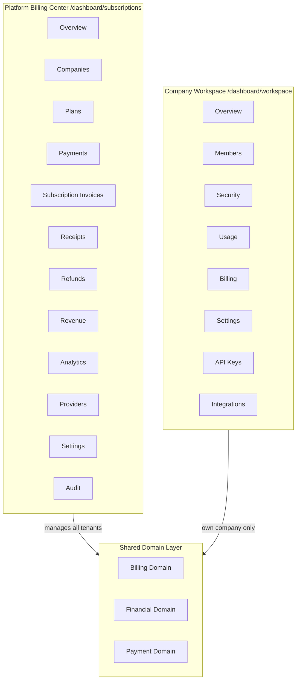
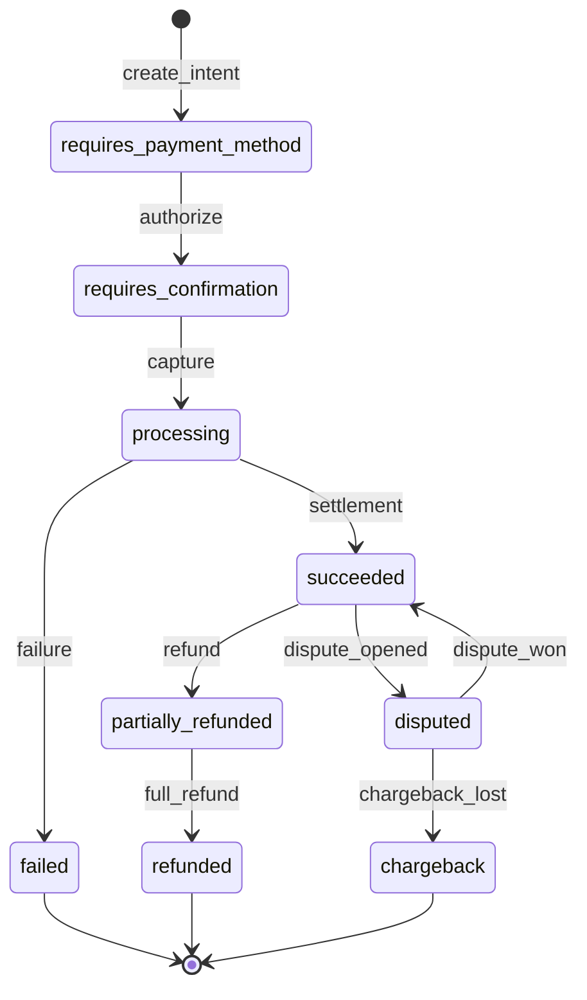

# VaultOS Enterprise Billing Platform — Final Architecture (v2)

**Status:** **APPROVED** — canonical source for all Billing development (v2.1 refinements §16–20)  
**Version:** 2.1  
**Date:** 2026-07-18  
**Author:** Principal Enterprise SaaS Architect  
**Supersedes:**
- [`company-billing-portal-v1.md`](./company-billing-portal-v1.md)
- [`enterprise-billing-impact-analysis-v1.md`](./enterprise-billing-impact-analysis-v1.md) (impact analysis updated in v2 companion doc)

**Parent contract:** [`billing-subscriptions.md`](./billing-subscriptions.md) v4.0 (extended, not replaced)

**Companion:** [`enterprise-billing-impact-analysis-v2.md`](./enterprise-billing-impact-analysis-v2.md)

---

## Executive Summary

VaultOS evolves into a **world-class Enterprise SaaS Billing Platform** with two strictly separated experiences:

1. **Platform Billing Center** — `/dashboard/subscriptions/*` — Platform Owner manages all tenants.
2. **Company Workspace** — `/dashboard/workspace/*` — Company Admin manages their own organization; **Billing is one section inside Workspace**, not a standalone portal.

Three logical domains govern the backend (no code duplication):

| Domain | Responsibility |
|--------|----------------|
| **Billing** | Subscriptions, plans, usage, entitlements, billing settings, coupons |
| **Financial** | Payments, invoices, receipts, refunds, revenue, taxes, accounting |
| **Payment** | Intent → authorization → capture → settlement → refund → dispute → chargeback lifecycle |

Cross-cutting: **Notification Bus** (not direct email coupling), **Analytics Foundation**, **Payment Sandbox Mode**, **Testing Environment**.

**Phase 1 billing is preserved.** Route Registry, React Query, RPC-first, RLS, RBAC, existing migrations, and reusable components remain unchanged.

---

## 1. Architecture Principles

### 1.1 Core invariants

| Invariant | Rule |
|-----------|------|
| Billing scope | Always `company_id`. Never `user_id`. |
| Subscription | One active subscription per company (`company_subscriptions`). |
| Employee access | Inherited from company subscription + entitlements. |
| Platform UX | Cross-tenant at `/dashboard/subscriptions/*`. Never checkout or card entry. |
| Company UX | Single-tenant at `/dashboard/workspace/*`. Self-service renewal inside Workspace → Billing. |
| Mutations | Client → RPC → domain event → Notification Bus → channels. |
| Domain separation | Billing, Financial, Payment are logical boundaries sharing Postgres + RPCs — not duplicate code paths. |

### 1.2 Dual experience model



---

## 2. Company Workspace — Administration Center

### 2.1 Workspace is not “Billing Portal”

Billing is **one section** within the Company Workspace — the central administration experience for every company.

### 2.2 Approved route hierarchy

**Base:** `/dashboard/workspace`

| Child route | Nested path | Phase | Purpose |
|-------------|-------------|-------|---------|
| Overview | `/dashboard/workspace` | B | Workspace health, quick links |
| Members | `/dashboard/workspace/members` | B+ | Team (reuse/extend profiles) |
| Security | `/dashboard/workspace/security` | C+ | Access policies |
| Usage | `/dashboard/workspace/usage` | B | Workspace usage meters |
| **Billing** | **`/dashboard/workspace/billing`** | **B–F** | **Subscription self-service** |
| Settings | `/dashboard/workspace/settings` | C | Company-scoped settings |
| API Keys | `/dashboard/workspace/api-keys` | G+ | Integrations prep |
| Integrations | `/dashboard/workspace/integrations` | G+ | Third-party connections |

### 2.3 Workspace Billing nested routes

| Route | Purpose |
|-------|---------|
| `/dashboard/workspace/billing` | Workspace billing overview |
| `/dashboard/workspace/billing/documents` | Document center (Subscription Invoices, Payments, Receipts) |
| `/dashboard/workspace/billing/renew` | 7-step renewal wizard |
| `/dashboard/workspace/billing/renew/complete` | Payment return handler |
| `/dashboard/workspace/billing/payment-methods` | Payment methods |

### 2.4 Route Registry integration

```typescript
// dashboard-route-registry.ts (future — additive only)
{
  id: "workspace",
  path: "/dashboard/workspace",
  nestedPath: "/workspace",
  titleKey: "navigation.workspace",
  permission: "workspace.view", // or billing.view_own for Phase B bootstrap
  Page: WorkspaceLayout,
  nest: true,
}
```

**Separate registry:** `workspace-route-registry.ts` (mirrors `billing-route-registry.ts` pattern).

Platform billing registry (`billing-route-registry.ts`) **unchanged in ID and base path** (`subscriptions`).

### 2.5 Audience & visibility

| Role | Workspace | Platform Billing |
|------|-----------|------------------|
| Platform Owner / Admin | Optional | ✅ Primary |
| Company Admin | ✅ Primary | ❌ (unless also platform role) |
| Finance Manager | ✅ Billing + documents | ❌ |
| Employee | Read-only sections if permitted | ❌ |

---

## 3. Domain Model — Billing vs Financial vs Payment

### 3.1 Logical separation (not code duplication)

Domains share infrastructure (Postgres, RPCs, React components) but have **clear ownership boundaries**. Internal modules/RPC namespaces reflect domain:

```
billing.*     → subscriptions, plans, usage, entitlements, coupons, billing settings
financial.*   → payments, invoices, receipts, refunds, revenue, taxes, accounting views
payment.*     → intents, authorization, capture, settlement, disputes, provider registry
```

### 3.2 Billing Domain

| Entity / concern | Tables / RPCs |
|------------------|---------------|
| Subscriptions | `company_subscriptions`, `subscription_events` |
| Plans | `plans`, `plan_features` |
| Usage | `usage_*`, `company_usage_snapshots` |
| Entitlements | `feature_definitions`, `company_feature_overrides`, `get_company_entitlements` |
| Billing settings | `billing_setting_definitions`, `billing_settings` |
| Coupons | `billing_coupons`, `billing_coupon_redemptions` (new) |

**Billing Domain never writes payment rows directly.** It emits events consumed by Financial Domain orchestrators.

### 3.3 Financial Domain

| Entity / concern | Tables / RPCs |
|------------------|---------------|
| Payments | `billing_payments` |
| Invoices | `billing_invoices` |
| Receipts | `billing_receipts` |
| Refunds | `billing_refunds` (new) |
| Revenue | `financial_revenue_snapshots` (new) |
| Taxes | Computed at checkout; stored on invoice line items |
| Accounting | Read views / export (future GL integration) |

**Financial Domain orchestrates** document creation after Payment Domain reports success.

### 3.4 Payment Domain — full lifecycle (design for extensibility)



| Stage | Phase | Storage |
|-------|-------|---------|
| Payment Intent | D–E | `payment_intents` |
| Authorization | G | `payment_intent_events` (new) |
| Capture | G | `payment_intents.status`, `billing_payments` |
| Settlement | G | `billing_payments.metadata` |
| Refund | G | `billing_refunds` |
| Dispute | H+ | `payment_disputes` (new) |
| Chargeback | H+ | `payment_disputes.status` |

**Phase B–E implement:** Intent → (sandbox authorize/capture) → success path only.  
**Schema and state machine designed** for full lifecycle from day one.

### 3.5 Shared orchestration (no duplication)

Single internal function:

```
financial.apply_payment_success(p_intent_id)
```

Called by:
- Sandbox provider (Phase E)
- Manual platform payment (`renew_subscription_from_payment` refactors to call shared core)
- Future provider webhooks (Phase G)

Billing Domain triggers via event; Financial Domain executes documents + renewal side effects.

---

## 4. Notification Bus Architecture

### 4.1 Problem with direct coupling

❌ `Billing RPC → billing_email_outbox` (tight coupling)

### 4.2 Approved architecture

```
Billing / Financial Domain Event
        ↓
  notification_bus.publish(event)
        ↓
  ┌─────┴─────┬─────────┬──────────┐
  ▼           ▼         ▼          ▼
Email      In-App    Webhook    SMS (future)
Outbox     notifications  outbox
```

### 4.3 Notification Bus table

```sql
-- billing_notification_events (canonical bus)
id, event_type, company_id, user_id, payload jsonb,
channels text[],  -- ['email','in_app','webhook']
status, created_at, processed_at
```

**Channel workers (phased):**

| Channel | Table | Worker |
|---------|-------|--------|
| Email | `billing_email_outbox` | Phase G email worker |
| In-app | `notifications` (existing) | Phase E inline subscriber |
| Webhook | `billing_webhook_deliveries` | Phase G |
| SMS | `billing_sms_outbox` (future) | Phase H+ |

### 4.4 Event catalog

| Domain event | Channels |
|--------------|----------|
| `subscription.renewed` | email, in-app, webhook |
| `plan.changed` | email, in-app |
| `payment.succeeded` | email, in-app, webhook |
| `payment.failed` | email, in-app, webhook |
| `invoice.generated` | email, in-app |
| `receipt.generated` | email, in-app |
| `renewal.reminder` | email |
| `trial.ending` | email, in-app |
| `card.expiring` | email |
| `company.reactivated` | in-app |
| `users.reactivated` | in-app (admin) |

Billing/Financial RPCs call **`notification_bus.publish()`** only — never email tables directly.

---

## 5. Analytics Foundation

### 5.1 Purpose

Prepare SaaS business analytics without requiring full dashboards in Phase B.

### 5.2 Metric catalog (future-ready)

| Metric | Definition | Snapshot field |
|--------|------------|----------------|
| **MRR** | Sum normalized monthly recurring revenue | `mrr` |
| **ARR** | MRR × 12 (or sum of annual normalized) | `arr` |
| **ARPU** | MRR / active paying companies | `arpu` |
| **LTV** | ARPU / churn rate (or cohort model) | `ltv_estimate` |
| **Churn** | Logo/revenue churn rate | `logo_churn_rate`, `revenue_churn_rate` |
| **Renewal Rate** | Renewed / eligible | `renewal_rate` |
| **Failed Payment Rate** | Failed / attempted | `failed_payment_rate` |
| **Collection Rate** | Collected / billed | `collection_rate` |

### 5.3 Storage

```sql
financial_analytics_snapshots (
  snapshot_date date,
  granularity text,  -- daily, monthly
  metrics jsonb,     -- all KPIs above
  dimensions jsonb,  -- optional segment (plan, region)
  computed_at timestamptz
)
```

### 5.4 Platform routes

| Route | Phase |
|-------|-------|
| `/dashboard/subscriptions/revenue` | B (basic MRR/ARR) |
| `/dashboard/subscriptions/analytics` | B+ (full KPI dashboard) |

Computation via **`financial.compute_analytics_snapshot()`** scheduled job — not live aggregation at scale.

---

## 6. Payment Sandbox Mode

### 6.1 Purpose

Complete end-to-end testing without Stripe, Paymob, or real cards.

### 6.2 Configuration

**Billing Setting:** `payment_sandbox_mode` (platform scope, boolean)

When **enabled** (or company override in sandbox companies):

| Behavior | |
|----------|--|
| Provider | `sandbox` (registered in `payment_providers`) |
| Cards | Fake test PANs only |
| Authorization | Instant simulated approve/decline |
| Capture | Immediate |
| Webhooks | Internal simulated events |

### 6.3 Sandbox supports full flow

- Renewal wizard (all 7 steps)
- Subscription Invoices + Receipts + Payments creation
- Subscription activation + period extension
- Company reactivation
- User reactivation (`SUSPENDED_BY_SUBSCRIPTION` only)
- Audit events
- Notification Bus (all channels in test mode)

### 6.4 Sandbox provider adapter

```
payment_providers.code = 'sandbox'
payment_provider_adapters → SandboxAdapter (Edge Function)
```

**No external network calls.** Decline scenarios via test card numbers (e.g. `4000...0002` = decline).

---

## 7. Platform Billing Center — Route Expansion

### 7.1 Extend existing center (no redesign)

Base unchanged: `/dashboard/subscriptions`

| Route | Registry ID | Phase | Domain |
|-------|-------------|-------|--------|
| `/` | overview | ✅ Exists | Billing |
| `/:companyId` | detail | ✅ Exists | Billing |
| `/settings` | settings | ✅ Exists | Billing |
| `/audit` | audit | ✅ Exists | Compliance |
| `/companies` | companies | B | Billing |
| `/plans` | plans | G | Billing |
| `/payments` | payments | B | Financial |
| `/invoices` | invoices | B | Financial |
| `/receipts` | receipts | B | Financial |
| `/refunds` | refunds | G | Financial |
| `/revenue` | revenue | B | Financial |
| `/analytics` | analytics | B+ | Financial |
| `/providers` | providers | D | Payment |
| `/renewals` | renewals | B | Billing |
| `/expirations` | expirations | B | Billing |
| `/failures` | failures | B | Financial |

**Action:** Remove entries from `BLOCKED_BILLING_PATHS` as each route ships.

### 7.2 Platform Owner capabilities (unchanged philosophy)

Monitors and manages — **never** customer checkout or card entry.

---

## 8. UI Naming — Invoice Disambiguation

| UI label (EN) | Route | Table | i18n key |
|---------------|-------|-------|----------|
| **Customer Invoices** | `/dashboard/invoices` | `invoices` | `navigation.invoices` / `invoices.title` |
| **Subscription Invoices** | `/dashboard/subscriptions/invoices` | `billing_invoices` | `billing.nav.subscriptionInvoices` |
| **Subscription Invoices** (workspace) | `/dashboard/workspace/billing/documents?type=invoices` | `billing_invoices` | `billing.workspace.documents.subscriptionInvoices` |

Arabic equivalents in `ar/common.json`. Never use generic "Invoices" alone in billing contexts.

---

## 9. Testing Architecture

### 9.1 Official Testing Environment

**Seed migration:** `099_billing_demo_environment.sql` (or `supabase/seed/billing-demo.sql`)

Idempotent seed runnable after migrations for local/staging.

### 9.2 Seed personas

| Persona | Role | Access |
|---------|------|--------|
| Platform Owner | Super admin | Platform Billing Center |
| Company Admin (×3 companies) | Company Admin | Workspace |
| Finance Manager | Custom role | Workspace → Billing |
| Employee | Standard user | Read-only where granted |

### 9.3 Demo companies (3)

| Company | Subscription state | Plan tier |
|---------|-------------------|-----------|
| Demo Alpha | Active trialing | Trial |
| Demo Beta | Active | Professional |
| Demo Gamma | Active | Enterprise |
| Demo Delta (optional 4th) | Expired | Professional |
| Demo Epsilon (optional 5th) | Suspended (subscription) | Professional |

*Minimum 3 per spec; seed includes expired + suspended scenarios.*

### 9.4 Seed data coverage

| Data | Count / coverage |
|------|------------------|
| Subscriptions | Trial, Professional, Enterprise, Expired, Suspended |
| Payments | succeeded, failed, pending samples |
| Subscription Invoices | draft, issued, paid, overdue |
| Receipts | linked to paid payments |
| Audit logs | representative event types |
| Usage snapshots | populated metrics |
| Entitlements | per plan tier |
| Billing contacts + profiles | per company |
| Payment methods | sandbox test cards |
| Coupons | active test coupon |

### 9.5 Sandbox mode default in seed

`payment_sandbox_mode = true` in demo environment.

### 9.6 E2E test scenarios enabled without manual setup

1. Platform Owner views MRR on analytics
2. Company Admin renews via wizard (sandbox)
3. Expired company → renewal → company + user reactivation
4. Finance Manager downloads Subscription Invoice
5. Platform Admin records manual payment
6. Failed payment appears in failures dashboard
7. Audit log shows full trail
8. Notifications appear in-app + email outbox

---

## 10. Workspace Billing — Section Detail

### 10.1 Workspace Overview (billing slice)

- Current Plan, Status, Cycle, Renewal, Expiration, Next Invoice Amount, Auto Renewal
- Workspace Health indicator (subscription + usage status)

### 10.2 Usage (`/workspace/usage` + billing embed)

AI Tokens, Storage, Users, Seats, Projects, Knowledge Bases, Agents, Automations, API Calls, Bandwidth, Execution Count — progress bars, remaining quota.

### 10.3 Plan Features

Enabled / disabled features, limits, remaining quota.

### 10.4 Company Profile (billing context)

Logo, legal name, commercial registration, VAT, billing address, country, city, timezone, currency, billing contact.

### 10.5 Payment Methods

Multiple methods: Visa, Mastercard, Corporate Card — primary, default, expired, remove, set default, add new (architecture only until Phase D).

### 10.6 Document Center

Tabs: Subscription Invoices | Payments | Receipts — search, filter, sort, pagination, download, view details.

### 10.7 Self-service actions

Renew, upgrade, downgrade, change cycle, update contact/address, update payment method, download documents.

### 10.8 Renewal wizard (7 steps)

1. Review subscription  
2. Select plan  
3. Choose billing cycle  
4. Coupon / promo  
5. Review pricing (subtotal, discount, tax, total)  
6. Redirect to Payment Service (sandbox or production)  
7. Confirmation  

### 10.9 Post-payment workflow

```
Payment Success
  → financial.apply_payment_success()
  → Create Payment, Invoice, Receipt
  → Renew Subscription
  → Update Company Expiration
  → Refresh Entitlements + Usage Limits
  → Reactivate SUSPENDED_BY_SUBSCRIPTION users only
  → Invalidate cache
  → notification_bus.publish()
  → Audit everything
```

---

## 11. Security & RBAC (unchanged philosophy)

- Every RPC infers `company_id` from auth — never trust client input for tenant scope.
- RLS on all tables.
- RBAC on registry + page + RPC.
- Workspace permissions (new): `workspace.view`, `workspace.billing.manage`, etc. — map to existing `billing.view_own`, `billing.manage_own` where possible to avoid proliferation.

---

## 12. Preserved Architecture (non-negotiable)

| Asset | Status |
|-------|--------|
| Route Registry pattern | ✅ Extended additively |
| `subscriptions` dashboard section ID | ✅ Unchanged |
| React Query | ✅ Unchanged |
| RPC-first mutations | ✅ Unchanged |
| RLS | ✅ Extended, not weakened |
| RBAC | ✅ Extended permissions only |
| Phase 1 pages (overview, detail, settings, audit) | ✅ Preserved |
| Migrations 030–046 | ✅ Immutable |
| Reusable billing components | ✅ Reused |
| Manual payment flow | ✅ Preserved (refactor to shared core) |

**Never rewrite working functionality.**

---

## 13. Phased Roadmap (Revised)

### Phase B — Workspace foundation + Platform lists + Analytics seed

**Workspace:**
- `workspace-route-registry.ts` + layout
- Routes: Overview, Usage, **Billing** (read-only shell)
- `get_workspace_billing_summary`, usage dashboard RPCs

**Platform:**
- Unblock `/payments`, `/invoices`, `/receipts`, `/renewals`, `/expirations`, `/failures`
- `/revenue` basic MRR/ARR
- `/analytics` shell + `financial_analytics_snapshots` table
- Enhance overview KPIs (no redesign)

**Cross-cutting:**
- Domain namespace conventions in RPC naming
- `billing_notification_events` bus table
- `profiles.account_status` enum
- Demo seed migration (personas + 3 companies + sample data)
- `payment_sandbox_mode` setting + `sandbox` provider registration

### Phase C — Document Center + Profiles

- Workspace billing documents
- Company/billing profile RPCs + UI
- Workspace Members shell (reuse profiles)
- UI naming: Customer vs Subscription Invoices

### Phase D — Payment Domain scaffold + Payment Methods

- Payment intent lifecycle schema (full state machine, implement intent→sandbox capture)
- Payment Service Edge Function + Sandbox adapter
- `/subscriptions/providers` (admin)
- Workspace payment methods UI
- `preview_checkout_pricing`

### Phase E — Renewal Wizard + Financial orchestration

- 7-step wizard
- Coupons tables + validation
- `financial.apply_payment_success()` shared orchestrator
- Notification Bus subscribers (in-app + email outbox enqueue)
- User reactivation logic
- Sandbox E2E complete

### Phase F — Plan changes + Entitlements refresh

- Upgrade/downgrade/cycle change
- Entitlement + usage limit refresh
- Workspace Settings shell

### Phase G — Production providers + Automation

- Stripe/Paymob/Paddle/Fawry/Moyasar adapters (registry)
- Authorization/capture/settlement for real providers
- Refunds (`/subscriptions/refunds`)
- Expiration jobs, email worker, PDF generation
- Webhook channel subscriber
- Workspace Security, API Keys, Integrations ( shells )

### Phase H+ — Advanced Payment + Analytics

- Disputes, chargebacks
- LTV cohort models
- SMS channel
- Accounting export

---

## 14. Resolved Conflicts (from v1)

| Conflict | Resolution |
|----------|------------|
| A — Portal route | ✅ `/dashboard/workspace/billing` inside Workspace center |
| B — Blocked paths | ✅ Unblock as platform routes ship |
| C — Invoice naming | ✅ Customer Invoices vs Subscription Invoices |
| D — Payment runtime | ✅ Edge Functions as Payment Service |
| E — Migration numbers | ✅ Continue from 047 |

---

## 15. Approval Checklist

- [x] Workspace as Company Administration Center (§2)
- [x] Billing / Financial / Payment domain separation (§3)
- [x] Payment lifecycle extensibility (§3.4)
- [x] Notification Bus architecture (§4)
- [x] Analytics foundation (§5)
- [x] Payment Sandbox Mode (§6)
- [x] Platform route expansion (§7)
- [x] UI naming (§8)
- [x] Testing environment seed (§9)
- [x] Preserved architecture guarantees (§11–12)
- [x] Phased roadmap (§13)
- [x] v2.1 refinements (§16–20)

**Approved — Phase B implementation complete (pending live E2E verification).**

---

## 16. Workspace Ownership Business Rules

The Workspace is **owned by the Company entity**, never by an individual user.

| Rule | Description |
|------|-------------|
| **WO-1** | Exactly one Workspace per Company (1:1 with `companies.id`). |
| **WO-2** | The Workspace is the administrative boundary for all company-scoped settings, members, usage, and billing self-service. |
| **WO-3** | Company Admins manage their Workspace; Platform Owners manage all Workspaces via Platform Billing Center. |
| **WO-4** | No user may own, transfer, or delete a Workspace independently of the Company. |
| **WO-5** | Workspace lifecycle follows Company lifecycle — company deletion cascades Workspace data. |
| **WO-6** | Billing within Workspace inherits the Company's subscription; employees inherit entitlements from that subscription. |
| **WO-7** | A user without `company_id` has no Workspace access. |
| **WO-8** | Platform impersonation (if ever added) is audit-logged and super-admin only — not part of Phase B. |
| **WO-9** | Workspace RPCs infer `company_id` from `current_company_id()` — never from client input. |
| **WO-10** | Finance Manager role may access Workspace → Billing and documents but not Members/Security admin actions. |

---

## 17. Feature Flags Layer (Plans → Flags → Features)

Feature Flags sit **between Plans and Features** as a platform-wide rollout gate.

### 17.1 Resolution precedence (updated)

```
1. company_feature_overrides (highest)
2. feature_flags.is_globally_enabled (platform gate)
3. plan_features.enabled
4. feature_definitions.default_enabled (lowest)
```

If `feature_flags.is_globally_enabled = false` for a feature, it is **disabled for all companies** unless a super-admin override explicitly enables it for a company.

### 17.2 Table

```sql
feature_flags (
  feature_code text PK → feature_definitions(code),
  is_globally_enabled boolean default true,
  label text,
  description text,
  rollout_metadata jsonb default '{}',
  updated_at timestamptz
)
```

### 17.3 Rules

| Rule | Description |
|------|-------------|
| **FF-1** | Feature Flags are platform-global; not company-scoped. |
| **FF-2** | Disabling a flag immediately gates new entitlement checks; cache TTL applies to edge caches only. |
| **FF-3** | Plan features may include a feature, but the flag must also be enabled for it to resolve true. |
| **FF-4** | `get_company_entitlements` returns source `feature_flag` when disabled by flag. |
| **FF-5** | Platform Admin manages flags via Platform Billing Center (Phase G UI); Phase B seeds all flags enabled. |

---

## 18. Billing Event Catalog (Official)

All billing-related domain events **must** be registered in `billing_event_catalog` before publication to the Notification Bus.

### 18.1 Catalog schema

```sql
billing_event_catalog (
  code text PRIMARY KEY,
  domain text CHECK (domain IN ('billing','financial','payment','workspace','notification')),
  label text NOT NULL,
  description text,
  schema_version integer NOT NULL DEFAULT 1,
  default_channels text[] NOT NULL DEFAULT '{}',
  is_active boolean NOT NULL DEFAULT true,
  created_at timestamptz NOT NULL DEFAULT now()
)
```

### 18.2 Official events (v1)

| Code | Domain | Default channels |
|------|--------|------------------|
| `billing.subscription.created` | billing | in_app, webhook |
| `billing.subscription.renewed` | billing | email, in_app, webhook |
| `billing.subscription.expired` | billing | email, in_app |
| `billing.subscription.suspended` | billing | email, in_app |
| `billing.subscription.restored` | billing | in_app |
| `billing.plan.changed` | billing | email, in_app, webhook |
| `billing.cycle.changed` | billing | email, in_app |
| `billing.trial.ending` | billing | email, in_app |
| `financial.payment.succeeded` | financial | email, in_app, webhook |
| `financial.payment.failed` | financial | email, in_app, webhook |
| `financial.invoice.generated` | financial | email, in_app |
| `financial.invoice.paid` | financial | email, in_app |
| `financial.receipt.generated` | financial | email, in_app |
| `financial.refund.processed` | financial | email, in_app, webhook |
| `payment.intent.created` | payment | in_app |
| `payment.intent.succeeded` | payment | in_app, webhook |
| `payment.intent.failed` | payment | in_app, webhook |
| `payment.provider.degraded` | payment | in_app |
| `workspace.company.reactivated` | workspace | in_app |
| `workspace.users.reactivated` | workspace | in_app |

### 18.3 Rules

| Rule | Description |
|------|-------------|
| **EC-1** | `notification_bus.publish(event_code, ...)` rejects unregistered codes. |
| **EC-2** | Audit log event types (`billing_audit_event_types`) remain separate from domain event catalog. |
| **EC-3** | New events require catalog entry + schema_version bump if payload shape changes. |
| **EC-4** | Subscription timeline events (`subscription_events`) are operational; catalog events drive notifications. |

---

## 19. Provider Health Monitoring

Platform Billing Center includes **Provider Health** visibility.

### 19.1 Route

`/dashboard/subscriptions/provider-health` (Phase B shell; data from snapshots)

### 19.2 Storage

```sql
payment_provider_health_snapshots (
  id uuid PK,
  provider_code text → payment_providers(code),
  status text CHECK (status IN ('healthy','degraded','down','unknown')),
  latency_ms integer,
  success_rate numeric(5,2),
  error_rate numeric(5,2),
  last_success_at timestamptz,
  last_failure_at timestamptz,
  metadata jsonb DEFAULT '{}',
  checked_at timestamptz NOT NULL DEFAULT now()
)
```

### 19.3 Rules

| Rule | Description |
|------|-------------|
| **PH-1** | Health probes run via scheduled job (Phase G); Phase B seeds initial snapshot rows. |
| **PH-2** | Sandbox provider always reports `healthy` in non-production. |
| **PH-3** | `payment.provider.degraded` catalog event fires when status transitions to `degraded` or `down`. |
| **PH-4** | Platform Admin view only — not visible in Company Workspace. |

---

## 20. RPC / API Versioning Policy

### 20.1 Principles

| Rule | Policy |
|------|--------|
| **V-1** | **Additive by default** — new optional parameters and new RPCs preferred over breaking changes. |
| **V-2** | **Suffix versioning** — breaking changes ship as new RPC functions: `get_workspace_billing_summary_v2`. |
| **V-3** | **Domain prefixes** — `billing_*`, `financial_*`, `payment_*`, `workspace_*`, `notification_*`. |
| **V-4** | **Deprecation window** — old RPC remains granted for ≥2 phases after v(N+1) ships; client hooks migrate explicitly. |
| **V-5** | **RETURNS TABLE changes** — always `DROP FUNCTION IF EXISTS` + `CREATE` (never `CREATE OR REPLACE` on changed OUT params). |
| **V-6** | **JSON response contracts** — include `schema_version` integer in composite JSONB responses. |
| **V-7** | **Catalog versioning** — `billing_event_catalog.schema_version` tracks event payload versions. |
| **V-8** | **Client hooks** — encode RPC version in React Query key: `["billing", "portal", "summary", "v1"]`. |
| **V-9** | **Edge Functions** — Payment Service uses URL path versioning: `/v1/checkout`. |
| **V-10** | **Documentation** — every new RPC entry in migration comment header with domain + version. |

### 20.2 Current versioned RPCs (Phase B)

| RPC | Domain | Version |
|-----|--------|---------|
| `get_workspace_billing_summary_v1` | workspace | 1 |
| `get_billing_revenue_metrics_v1` | financial | 1 |
| `get_payment_provider_health_v1` | payment | 1 |
| `list_billing_payments_paged_v1` | financial | 1 |
| `list_billing_invoices_paged_v1` | financial | 1 |
| `list_billing_receipts_paged_v1` | financial | 1 |
| `notification_bus_publish_v1` | notification | 1 |

Unversioned Phase 1 RPCs remain at implicit v1; new work uses explicit suffixes.

---

*End of Final Architecture v2.1.*

