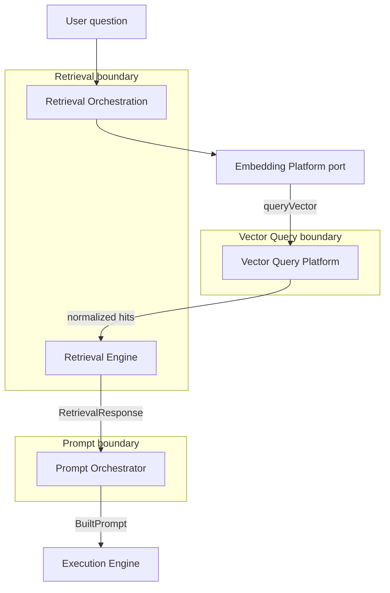

# Ranking and Context Assembly — Platform Boundaries

**Status:** Architecture reference (pre–Increment 4)  
**Last updated:** 2026-07-18

---

## Summary

**Nearest-neighbor search and score normalization live in the Vector Query Platform.**  
**Semantic context construction lives in the Retrieval Engine.**  
**Prompt formatting and LLM instruction assembly live in the Prompt Orchestrator.**

The Retrieval Engine orchestrates the end-to-end flow (question → embedding → vector query → context assembly) but **never** performs provider-level vector search or pgvector access directly.

---

## Responsibility matrix

| Concern | Vector Query Platform | Retrieval Engine | Prompt Orchestrator |
|---------|----------------------|------------------|---------------------|
| Query embedding generation | — | Orchestrates via Embedding Platform port | — |
| Provider similarity search | **Owns** | Reads completed results only | — |
| Score normalization (0–1) | **Owns** | Consumes normalized scores | — |
| Top-K / minimum similarity threshold | **Owns** (search policy) | — | — |
| Metadata filter at index/search time | **Owns** (provider + policy) | — | — |
| Knowledge chunk hydration | — | **Owns** | — |
| Candidate deduplication / overlap removal | — | **Owns** | — |
| Source/department priority ranking | — | **Owns** | — |
| Diversity / window expansion | — | **Owns** | — |
| Token budgeting (`max_context_tokens`) | — | **Owns** | — |
| Context assembly + checksum | — | **Owns** | — |
| Instruction string formatting | — | — | **Owns** |
| Template section layout | — | — | **Owns** |
| LLM message construction | — | — | **Owns** |

---

## Vector Query Platform — nearest-neighbor search

**Scope ends at ranked, normalized search hits.**

1. Accepts `queryVector` or resolves from `embeddingId`.
2. Delegates to provider adapters (pgvector, etc.) — **never bypassed**.
3. Normalizes provider scores to `[0, 1]`.
4. Applies search policy: `topK`, `minimum_similarity_score`, metadata filters.
5. Persists `vector_query_executions` + `vector_query_results`.
6. Returns `VectorQueryResponse` with `normalizedResults[]`.

**Does not:** hydrate knowledge content, enforce retrieval token budgets, or format prompts.

---

## Retrieval Engine — semantic context construction

**Scope starts after a completed vector query execution.**

1. **Orchestration** (`RetrievalOrchestrationEngine`): question → query embedding (Embedding Platform port) → vector query (Vector Query Platform port) → `RetrievalEngine.retrieve`.
2. **Candidate retrieval** (`ContextSelectionEngine.buildCandidates`): reads vector query results, hydrates `knowledge_chunks` + documents + sources.
3. **Ranking** (`ContextSelectionEngine.selectChunks`): dedupe, overlap filter, language filter, source/department priority, diversity — **distinct from vector-query ranking** (operates on hydrated text chunks).
4. **Thresholding**: overlap removal threshold, language filter, `max_chunks` cap (retrieval policy).
5. **Token budgeting** (`ContextBudgetEngine`): enforces `max_context_tokens` and `max_chunks`.
6. **Context assembly** (`ContextAssemblyEngine`): ordered chunks, checksum, sanitized metadata.
7. Returns `RetrievalResponse` / `SemanticRetrievalResponse` — structured DTO ready for downstream consumers.

**Does not:** call pgvector, OpenAI embeddings, or LLM providers directly.

---

## Prompt Orchestrator — instruction formatting

**Scope: transform retrieval output into prompt sections.**

1. Receives `RetrievalSnapshot` / chunk content via runtime coordinator.
2. Formats chunks into `systemInstructions[]` (e.g. `[Document Title] content`).
3. Composes template sections (system, instructions, messages).
4. Returns `BuiltPrompt` for the Execution Engine.

**Does not:** perform search, rank candidates, or enforce retrieval budgets.

---

## Boundary diagram

---

## Design rules

1. **No pgvector access from Retrieval Engine** — always via Vector Query Platform.
2. **No duplicate vector ranking** — Retrieval re-ranks hydrated *text chunks* for context quality; Vector Query ranks *vector hits* for similarity.
3. **DTO handoff** — `RetrievalResponse.context.chunks[]` is the contract to Prompt Orchestrator; no raw provider payloads.
4. **Dependency inversion** — Retrieval Engine uses ports for embedding and vector query; adapters wire platform services at the app layer.

---

## Related documentation

- [Ranking and Context Assembly Boundaries](./ranking-and-context-assembly-boundaries.md)
- [Increment 3 Vector Store Report](./increment-3-vector-store-report.md)
- [Embedding Platform Batch Strategy](./embedding-platform-batch-strategy.md)
- [Technical Debt Register](./technical-debt.md)
