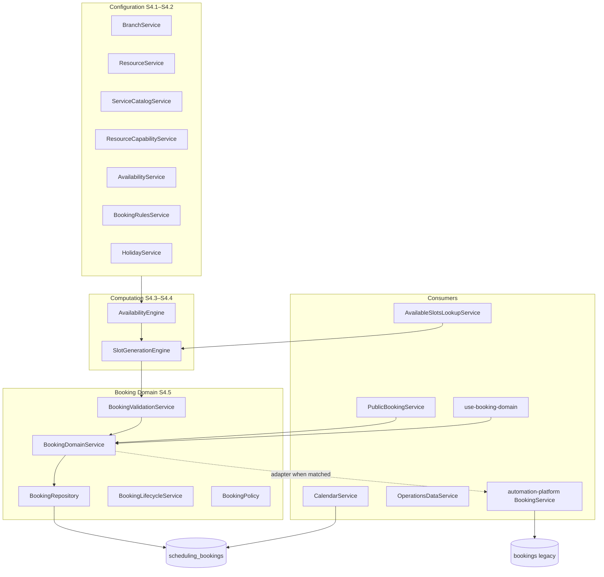
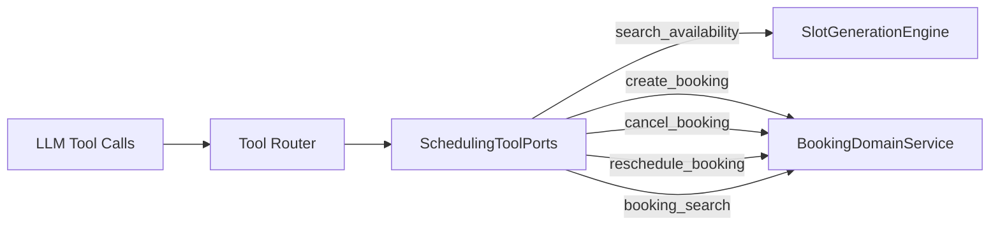

# Sprint AI.3 — Production Scheduling Tool Audit

**Date:** 2026-07-29  
**Status:** Architecture audit only — no implementation  
**Scope:** Replace mock scheduling tools with production-grade tools; full platform assessment

---

## Executive Summary

The scheduling platform is a mature, layered domain (S4.x) built around `scheduling_bookings`, with configuration services, an availability engine, a slot-generation engine, and a booking domain service. Production capabilities exist for **availability search**, **create**, **cancel**, and **reschedule** on the scheduling domain — but they are **not exposed to the AI Tool Router**.

The AI layer still relies on two **mock tools** (`appointment_lookup`, `booking`) that return fake data. The only production scheduling tool exposed to the LLM today is **`booking_search`** (read-only).

A **dual booking model** persists: legacy `public.bookings` (CRM/automation) vs canonical `public.scheduling_bookings` (scheduling domain). WhatsApp/webhook runtime writes to legacy `bookings` only; dashboard workflows can route to the scheduling domain via an adapter.

**Primary gap:** No production AI write path for scheduling. Mock `booking` must be replaced by tools backed by `BookingDomainService` and `SlotGenerationEngine`, with RBAC, confirmation gates, and channel-agnostic wiring (login-app + api-server).

---

## 1. Current Scheduling Architecture

### 1.1 Layer Model



**Primary code location:** `artifacts/login-app/src/lib/scheduling/`  
**Factory entry:** `createSchedulingServices()` in `scheduling/index.ts`  
**Booking factory:** `BookingFactory.create()` in `booking-domain/booking-factory.ts`

---

### 1.2 Scheduling Services (Configuration)

| Service | Responsibility | Key table(s) |
|---------|----------------|--------------|
| `BranchService` | Branch CRUD, timezone | `branches` |
| `ResourceService` | Staff/room/equipment resources; seeds default weekly hours | `scheduling_resources` |
| `ServiceCatalogService` | Bookable service catalog | `scheduling_services` |
| `ResourceCapabilityService` | Resource ↔ service capability mapping | `resource_services` |
| `AvailabilityService` | Weekly hours, breaks, exceptions CRUD | `scheduling_resource_weekly_hours`, `scheduling_resource_breaks`, `scheduling_availability_exceptions` |
| `BookingRulesService` | Company booking window, buffers, slot interval | `scheduling_booking_rules` |
| `HolidayService` | Company/branch holidays | `scheduling_holidays` |

---

### 1.3 Booking Services

Two parallel booking stacks coexist:

| Stack | Service | Table | Used by |
|-------|---------|-------|---------|
| **Scheduling domain** | `BookingDomainService` | `scheduling_bookings` | Dashboard calendar, portal, domain hooks, scheduling-aware automation adapter |
| **Legacy CRM** | `BookingService` (automation-platform) | `bookings` | Webhook automation, legacy hooks (`useUpdateBooking`), CRM agent read merge |

**Scheduling domain methods (production):**

| Method | Status | Notes |
|--------|--------|-------|
| `createBooking()` | ✅ Exists | Validates slot, writes `scheduling_bookings`, emits domain events |
| `cancelBooking()` | ✅ Exists | Enforces cancellation policy + lifecycle |
| `rescheduleBooking()` | ✅ Exists | Marks old row `rescheduled`, inserts new confirmed row with `rescheduled_from_id` |
| `updateBooking()` | ❌ Missing | No in-place domain update; use lifecycle methods or legacy path |
| `validateBooking()` | ✅ Exists | Pre-flight slot/policy validation |
| `checkInBooking()` | ✅ Exists | Day-of check-in |
| `markNoShowBooking()` | ✅ Exists | No-show automation |
| `completeBooking()` | ✅ Exists | Completion lifecycle |

**Legacy automation methods:**

| Method | Status | Table |
|--------|--------|-------|
| `createBooking()` | ✅ Exists | `bookings` (or scheduling via adapter) |
| `updateBooking()` | ✅ Exists | `bookings` only — field-level patch |
| `cancelBooking()` | ✅ Exists | `bookings` |
| `findBooking()` | ✅ Exists | `bookings` |
| `rescheduleBooking()` | ❌ Missing | Not in automation-platform |

---

### 1.4 Availability Engine (S4.3)

**Purpose:** Resolve **working periods** (when a resource is theoretically available), not bookable slots.

| API | Location | Output |
|-----|----------|--------|
| `resolveAvailability()` | `availability-engine/availability-engine.ts` | `ResolvedAvailability` — local time periods |
| `isResourceAvailable()` | Same | Boolean for a time range |
| `getEffectiveWorkingHours()` | Same | Weekly hours after exceptions/holidays |

**Inputs loaded by `AvailabilityContextLoader`:**

- Resource weekly hours + breaks
- Availability exceptions (vacation, training, unavailable)
- Company/branch holidays
- Booking rules (min notice, max window)
- Resource ↔ service capabilities

**Not included:** Existing booking conflicts (handled by slot engine).

---

### 1.5 Slot Generation Engine (S4.4)

**Purpose:** Produce **bookable slots** by combining availability with existing bookings, buffers, and slot interval rules.

| API | Location | Output |
|-----|----------|--------|
| `getAvailableSlots(companyId, resourceId, serviceId, date)` | `slot-generation-engine/slot-generation-engine.ts` | `ResolvedSlots` |
| `getAvailableSlotsBatch(...)` | Same | Multi-resource batch |

**Conflict resolution:** `booking-conflict-resolver.ts` — buffers, overbooking policy, overlap with `ExistingBooking` rows.

**This is the canonical "search availability" implementation** — there is no separate function named `searchAvailability()`.

---

### 1.6 Resource Allocation

**Model:** Resources are first-class entities in `scheduling_resources` with types:

`doctor | employee | therapist | room | chair | equipment | other`

**Capability mapping:** `resource_services` junction defines which resources can perform which services. Validated at booking time (`capability_missing` error).

**Assignment behavior:**

- Bookings require an explicit `resourceId` at create — **no auto-assignment optimizer**
- `listResourcesForService(serviceId, { branchId })` supports UI/workflow resource selection
- Conflict detection is **per-resource** overlap — no multi-resource bundle (doctor + room) in one booking row
- `organization_resource_assignments` (migration 160) handles org hierarchy transfers, not slot assignment

---

### 1.7 Staff Assignment

Staff are modeled as `scheduling_resources` where `resource_type IN ('doctor', 'employee', 'therapist')`.

There is **no separate `booking_staff` table**. Assignment = setting `scheduling_bookings.resource_id` to a staff resource UUID.

Legacy `bookings.doctor_id` is a **text field** (migration 137), not an FK — used only on the legacy path.

---

### 1.8 Room Assignment

Rooms are `scheduling_resources` where `resource_type = 'room'`.

There is **no separate `booking_rooms` table**. Same single-resource assignment model as staff.

Multi-room or staff+room paired bookings are **not supported** in the current schema.

---

### 1.9 Calendar Integration (S5.1)

| Component | Path | Role |
|-----------|------|------|
| `CalendarRepository` | `lib/calendar/repository/calendar-repository.ts` | Reads `scheduling_bookings` with joins (customer, service, resource, branch) |
| `CalendarService` | `lib/calendar/services/calendar-service.ts` | Range queries, grouping by day/resource |
| `BookingDomainAdapter` | `lib/calendar/adapters/booking-domain-adapter.ts` | Maps calendar intents → domain create/reschedule |
| `LegacyBookingAdapter` | `lib/calendar/adapters/legacy-booking-adapter.ts` | Maps events → legacy modal shape |
| `use-calendar-booking-mutations` | `hooks/calendar/` | Re-exports domain booking hooks |

**External calendar sync:** `connector-registry.ts` lists Google Calendar / Outlook as **`isAvailable: false`**. `calendar-event.ts` has optional `externalSync` metadata but no active sync implementation.

---

## 2. Existing Database Tables

### 2.1 Requested Names vs Actual Schema

| Name searched | Status | Actual implementation |
|---------------|--------|----------------------|
| `bookings` | **EXISTS** (legacy) | CRM/workflow table; text service name, no resource FK |
| `booking_services` | **MISSING** | → `scheduling_services` + `resource_services` |
| `booking_resources` | **MISSING** | → `scheduling_resources` |
| `booking_staff` | **MISSING** | → `scheduling_resources` (staff types) |
| `booking_rooms` | **MISSING** | → `scheduling_resources` (room type) |
| `schedules` | **MISSING** | No appointment schedule table; `automation_schedules` is workflow delays |
| `availability` | **MISSING** | Split across weekly hours, breaks, exceptions |
| `business_hours` | **MISSING** | → `scheduling_resource_weekly_hours` |
| `holidays` | **MISSING** (as table name) | → `scheduling_holidays` |
| `blackout periods` | **MISSING** | → `scheduling_holidays` + `scheduling_availability_exceptions` |
| `recurrence` | **MISSING** | No DB table; UI type only (`recurrenceRuleId` not persisted) |

---

### 2.2 Core Scheduling Tables

#### `scheduling_bookings` (canonical — migration 145+)

| Column group | Fields |
|--------------|--------|
| Identity | `id`, `company_id`, `branch_id` |
| Relations | `customer_id`, `resource_id`, `service_id` |
| Timing | `start_at`, `end_at`, `timezone` |
| Lifecycle | `status` (pending, confirmed, checked_in, completed, cancelled, no_show, rescheduled) |
| Provenance | `source` (crm, whatsapp, ai_assistant, call_center, public_booking, api) |
| Reschedule chain | `rescheduled_from_id` (self-FK) |
| Financial | `invoice_id` |
| Audit | `version`, `notes`, `deleted_at` |

#### `scheduling_resources`

Unified staff/room/equipment entity. `resource_type` discriminates role.

#### `scheduling_services`

Service catalog with `duration_minutes`, pricing (`price_cents`, `currency`).

#### `resource_services`

M:N junction — which resources can perform which services.

#### `scheduling_resource_weekly_hours` + `scheduling_resource_breaks`

Per-resource recurring business hours and intra-day breaks.

#### `scheduling_availability_exceptions`

Time-bound blocks: vacation, training, conference, unavailable, custom.

#### `scheduling_booking_rules`

One row per company: min notice, max window, buffers, slot interval, cancellation/reschedule notice.

#### `scheduling_holidays`

Company or branch-scoped holiday dates.

#### `scheduling_no_show_rules`

Grace period configuration for no-show automation.

---

### 2.3 Legacy `bookings` Table

Created in migration 001; extended in 137 (workflow fields), 167 (`company_id`).

| Column | Notes |
|--------|-------|
| `user_id` | → `auth.users` (not company-scoped originally) |
| `customer_id` | → `customers` |
| `service` | Free-text service name |
| `booking_date` | timestamptz |
| `status` | Pending / Confirmed / Cancelled |
| `doctor_id`, `location_id` | Text, not FK |

**Trigger:** `trg_notify_booking_changes` → `notify_booking_changes()` (legacy notifications only).

---

### 2.4 Scheduling RPCs

**No scheduling-specific RPCs exist.** All CRUD is direct table access from application services.

Adjacent functions: `organization_resolve_policy()` (working_hours, cancellation, no_show policies as JSON), `notify_booking_changes()` (legacy bookings trigger only).

---

## 3. Existing Service Layer

### 3.1 Function Matrix

| Function | Scheduling Domain | Legacy Automation | AI Tool Router | Integration API |
|----------|-------------------|-------------------|----------------|-----------------|
| **Search availability** | ✅ `getAvailableSlots()` / `resolveAvailability()` | ✅ via lookup `available_slots` | ❌ No tool | ❌ No endpoint |
| **createBooking()** | ✅ | ✅ (legacy or adapter) | ❌ Mock only | ❌ Read-only |
| **updateBooking()** | ❌ | ✅ legacy only | ❌ | ❌ |
| **cancelBooking()** | ✅ | ✅ legacy | ❌ | ❌ |
| **rescheduleBooking()** | ✅ | ❌ | ❌ | ❌ |
| **searchBookings()** | ✅ (via CRM ports) | — | ✅ `booking_search` (read) | ✅ GET `/bookings` |

### 3.2 Availability Search — Implementation Paths

| Entry point | Consumer | Backend |
|-------------|----------|---------|
| `SlotGenerationEngine.getAvailableSlots()` | Domain validation, portal | Full slot engine |
| `PublicBookingService.getAvailableSlots()` | Customer portal | Wraps slot engine |
| `fetchAvailableSlotsLookupOptions()` | Workflow list nodes | Lookup service → slot engine |
| `useAvailableBookingSlots()` | Dashboard React hook | React Query → slot engine |
| `BusinessCalendarService.getDatePickerConstraints()` | Date picker nodes | Holidays + closed weekdays |

### 3.3 Event / Side-Effect Pipeline

On scheduling domain mutations, `BookingFactory` wires:

1. `SupabaseCommunicationBookingEventPublisher` — communication platform
2. `BookingBillingBridge` — invoice creation hooks
3. `IntegrationBookingEventPublisher` — enterprise integration events

Templates: `booking_created`, `booking_cancelled`, `booking_rescheduled`, `booking_reminder`.

**Gap:** Legacy `bookings` trigger (`notify_booking_changes`) does **not** fire for `scheduling_bookings`. Scheduling notifications depend on domain event publishers (login-app only).

---

## 4. Workflow Integration

### 4.1 Automation Action Nodes

| Action | Handler | Builder UI | Production? |
|--------|---------|------------|-------------|
| `create_booking` | `create-booking-action.ts` | ✅ Yes | ✅ |
| `find_booking` | `find-booking-action.ts` | ❌ Engine only | ✅ (legacy table) |
| `update_booking` | `update-booking-action.ts` | ❌ Engine only | ✅ (legacy table) |
| `cancel_booking` | same file | ❌ Engine only | ✅ (legacy table) |

Routing: `lib/automation-platform/src/engine/built-in-nodes.ts`

### 4.2 Runtime Wiring Asymmetry

| Runtime | Booking port | Scheduling-aware? |
|---------|--------------|-------------------|
| **login-app** (dashboard) | `createSchedulingAwareBookingServicePort` | ✅ Routes to `BookingDomainService` when service/resource UUIDs match |
| **api-server** (webhook/WhatsApp) | `createSupabaseBookingServicePort` | ❌ Legacy `bookings` only |

**Impact:** WhatsApp booking workflows write to legacy `bookings`, not `scheduling_bookings`, unless the adapter is ported to api-server.

### 4.3 Scheduling Lookups (Conversation Workflows)

| Lookup entity | Service | Required context |
|---------------|---------|------------------|
| `services` | `lookup-options-service.ts` | Company |
| `resources` | Same | `service_id`, optional `branch_id` |
| `available_slots` | `available-slots-lookup-service.ts` | `service_id`, `resource_id`, `date` |

List node default bindings pre-fill from `selected_service`, `selected_resource`, `selected_date`.

### 4.4 Business Calendar

Date picker nodes use `BusinessCalendarPort` → holidays, booking rules, closed weekdays. Production-ready; not exposed as an AI tool.

---

## 5. AI Integration

### 5.1 Intent Engine

Seeded intents (migration 016, constants):

- `booking_request` — "book an appointment", "schedule a visit"
- `appointment_lookup` — "check my appointment", "when is my appointment"

These classify user intent but do **not** guarantee production tool execution.

### 5.2 Agent Planners

| Planner | Scheduling tools invoked | Path |
|---------|-------------------------|------|
| **Legacy agent planner** | Mock `booking`, mock `appointment_lookup` | `lib/agent-runtime/src/planner/agent-planner.ts` |
| **CRM agent planner** | Production `booking_search` (read) | `lib/agent-runtime/src/planner/crm-agent-planner.ts` |

### 5.3 AI Runtime (Dashboard + Webhook)

Both runtimes now have Tool Router wired (Sprint AI.1). Scheduling exposure:

- **Exposed:** `booking_search` (read-only)
- **Not exposed:** availability search, create, cancel, reschedule

### 5.4 Gap Summary

There is **no production AI write path for bookings**. The LLM cannot create, cancel, or reschedule appointments through Tool Router. Workflow automation (`create_booking` node) is the only production write path for conversational flows — and webhook runtime uses legacy table.

---

## 6. Tool Router Integration

### 6.1 Scheduling-Related Tool Registry

| Tool key | Classification | Handler | LLM exposed | Data source |
|----------|---------------|---------|-------------|-------------|
| `appointment_lookup` | **Mock** | `builtin-tools.ts` | **No** | Fake `appt-mock-1` |
| `booking` | **Mock** | `builtin-tools.ts` | **No** | Fake `booking-mock-1` |
| `booking_search` | **Read only** | `crm-agent-tools.ts` | **Yes** | `scheduling_bookings` + legacy `bookings` |

Catalog: `lib/ai-tool-router/src/llm-tool-catalog.ts`  
Audit: `docs/architecture/tool-router-llm-exposure-audit.json`

### 6.2 Handler Registration

```
createBuiltinTools()           → always registers mocks (including appointment_lookup, booking)
createCrmAgentTools(ports)     → booking_search (+ other CRM tools)
createCreateCustomerTool(...)  → create_customer
```

Exposure filter: `resolveLlmToolExposure()` exposes only `production_ready` + `read_only` tools whose handlers are registered. Mocks and confirmation-gated tools are excluded.

### 6.3 CRM Agent Ports — Booking Read Path

`supabase-crm-agent-tool-ports.ts`:

- `searchBookings()` — merges `scheduling_bookings` + legacy `bookings`, filters by `customerId` and `daysBack`
- Simplified queries (no slot engine involvement)

### 6.4 RBAC

`ToolRouterService.route()` enforces `tools.execute` plus per-tool `required_permissions` from `tool_definitions` (DB seeds in migrations 015, 176, 177).

Proposed scheduling write tools will need new `tool_definitions` rows with appropriate permissions (e.g. `bookings.create`, `bookings.cancel`, `bookings.reschedule`, `availability.search`).

---

## 7. Existing Mocks — Identification and Replacement Path

### 7.1 Mock Inventory

| Mock | File | Mock output | Used by | Replacement target |
|------|------|-------------|---------|-------------------|
| `appointment_lookup` | `builtin-tools.ts` | `{ appointments: [{ id: "appt-mock-1", ... }] }` | Legacy agent planner; registered always | **`booking_search`** (existing) or new **`search_availability`** for slots |
| `booking` | `builtin-tools.ts` | `{ bookingId: "booking-mock-1", status: "reserved" }` | Legacy agent planner | **`create_booking`** tool → `BookingDomainService.createBooking()` |

### 7.2 Replacement Architecture (Target State)



**Design principles:**

1. New **`SchedulingToolPorts`** interface in `@workspace/ai-tool-router` (mirrors `CrmAgentToolPorts` pattern)
2. Implementation in shared adapter using `BookingDomainService` + `SlotGenerationEngine` — wired on **both** login-app and api-server
3. Deprecate mock handlers; remove from `createBuiltinTools()` once replacements are registered
4. Update legacy `agent-planner.ts` to stop referencing mocks
5. Confirmation gates for destructive ops (cancel with policy violation, bulk reschedule) — follow `merge_customers` pattern if needed

### 7.3 Tool Key Mapping

| Current mock / gap | Proposed production tool | Backend | Classification |
|--------------------|-------------------------|---------|----------------|
| `appointment_lookup` | `search_availability` | `SlotGenerationEngine.getAvailableSlots()` (+ optional batch) | read_only |
| (none) | `booking_search` | Already exists | read_only |
| `booking` | `create_booking` | `BookingDomainService.createBooking()` | production_ready |
| (none) | `cancel_booking` | `BookingDomainService.cancelBooking()` | production_ready or requires_confirmation |
| (none) | `reschedule_booking` | `BookingDomainService.rescheduleBooking()` | production_ready |
| (none) | `update_booking` | Needs domain method or lifecycle-specific updates | TBD — domain gap |

---

## 8. Missing Production Capabilities

### 8.1 AI / Tool Router Gaps

| Capability | Status | Blocker |
|------------|--------|---------|
| LLM availability search | ❌ Missing | No tool; no port adapter |
| LLM create booking | ❌ Mock only | No `SchedulingToolPorts`; webhook uses legacy table |
| LLM cancel booking | ❌ Missing | No tool |
| LLM reschedule booking | ❌ Missing | No tool |
| LLM update booking (notes/status) | ❌ Missing | Domain has no generic update |
| Multi-day availability search | ❌ Missing | Engine is single-date |
| "Any eligible resource" search | ❌ Missing | Requires explicit `resourceId` |
| Auto resource assignment | ❌ Missing | No optimizer; explicit assignment required |

### 8.2 Domain / Service Gaps

| Capability | Status | Notes |
|------------|--------|-------|
| `updateBooking()` on scheduling domain | ❌ Missing | Legacy patch only; use lifecycle methods |
| `rescheduleBooking()` in automation-platform | ❌ Missing | Domain only |
| Recurring appointments | ❌ Missing | No DB schema |
| Multi-resource bookings (staff + room) | ❌ Missing | Single `resource_id` per row |
| Integration API write endpoints | ❌ Missing | GET only |
| External calendar sync | ❌ Missing | Connector stub only |
| Scheduling notifications on webhook path | ⚠️ Partial | Domain event publishers wired in login-app; legacy trigger on `bookings` only |
| api-server scheduling-aware automation | ❌ Missing | Legacy port only |

### 8.3 Workflow Builder Gaps

| Node | Status |
|------|--------|
| `create_booking` UI | ✅ Exists |
| `find_booking` UI | ❌ Engine only |
| `update_booking` UI | ❌ Engine only |
| `cancel_booking` UI | ❌ Engine only |
| Reschedule action node | ❌ Does not exist |

### 8.4 Data Model Gaps

| Concept | Status |
|---------|--------|
| `booking_services` junction on booking row | ❌ Single `service_id` FK suffices today |
| Waitlist / overbooking queue | ⚠️ `allow_overbooking` flag exists; no waitlist table |
| Appointment recurrence | ❌ Not persisted |

---

## 9. Migration Roadmap

### Phase 1 — Search Availability

**Objective:** Replace `appointment_lookup` mock with production read tool.

| Task | Detail |
|------|--------|
| Define `SchedulingToolPorts.searchAvailability()` | Wrap `SlotGenerationEngine.getAvailableSlots()` |
| Add `search_availability` tool definition | LLM function schema: serviceId, resourceId, date; optional branchId |
| Register in `llm-tool-catalog.ts` | Classification: `read_only` |
| Wire ports on login-app + api-server | Shared adapter in `@workspace/ai-tool-router` |
| RBAC seed | `availability.search` permission in `tool_definitions` |
| Deprecate `appointment_lookup` | Remove from agent planner; keep handler until Phase 2 validates |

**Acceptance:** LLM can list real slots for a service/resource/date on dashboard and WhatsApp runtime.

---

### Phase 2 — Create Booking

**Objective:** Replace `booking` mock with production write tool.

| Task | Detail |
|------|--------|
| Define `SchedulingToolPorts.createBooking()` | Wrap `BookingDomainService.createBooking()` |
| Add `create_booking` tool (Tool Router) | Distinct from workflow action key collision — use `schedule_appointment` or namespace |
| Set `source: ai_assistant` on domain insert | Audit trail |
| Port scheduling-aware adapter to api-server | Eliminate legacy-only webhook writes |
| RBAC seed | `bookings.create` permission |
| Validation | Reuse `validateBooking()` before create; return structured errors to LLM |
| Remove `booking` mock | Unregister from `createBuiltinTools()` |

**Acceptance:** LLM creates real `scheduling_bookings` row; slot conflict returns actionable error.

---

### Phase 3 — Update Booking

**Objective:** Support limited in-place updates (notes, metadata).

| Task | Detail |
|------|--------|
| Add `BookingDomainService.updateBooking()` | Allowlisted fields: `notes`, maybe `status` via lifecycle |
| Add `update_booking` tool | Classification: `production_ready` |
| Migrate legacy `useUpdateBooking()` | Point to domain service |
| Unify automation `update_booking` action | Route to domain when booking ID is scheduling UUID |

**Acceptance:** Notes update on scheduling booking without legacy table write.

---

### Phase 4 — Cancel Booking

**Objective:** Production cancel via Tool Router.

| Task | Detail |
|------|--------|
| Define `SchedulingToolPorts.cancelBooking()` | Wrap domain service; enforce cancellation policy |
| Add `cancel_booking` tool | Consider `requires_confirmation` if within min notice window |
| Wire automation `cancel_booking` to domain | Same adapter as Phase 2 |
| RBAC seed | `bookings.cancel` |

**Acceptance:** LLM cancels booking; policy violations return structured reason.

---

### Phase 5 — Reschedule Booking

**Objective:** Production reschedule via Tool Router and automation.

| Task | Detail |
|------|--------|
| Define `SchedulingToolPorts.rescheduleBooking()` | Wrap domain service |
| Add `reschedule_booking` tool | Requires new slot validation |
| Add workflow builder node | Currently engine-only for other booking actions |
| Add automation `reschedule_booking` action | New action in built-in-nodes |
| RBAC seed | `bookings.reschedule` |

**Acceptance:** Reschedule creates new row, marks old as `rescheduled`, validates new slot.

---

### Phase 6 — Notification Hooks

**Objective:** Ensure all scheduling mutations trigger notifications on every runtime.

| Task | Detail |
|------|--------|
| Audit event publisher wiring on api-server | Port `BookingFactory` event chain or equivalent |
| Extend communication bridge | Cover `scheduling_bookings` lifecycle (not just legacy trigger) |
| Reminder scheduler integration | `communication_reminder_schedules` + `booking_reminder` template |
| Idempotency | Already on communication dispatcher |
| AI source tagging | Include `source: ai_assistant` in notification metadata |

**Acceptance:** Create/cancel/reschedule from WhatsApp sends customer notification.

---

### Phase 7 — Calendar Synchronization

**Objective:** External calendar read/write (Google, Outlook).

| Task | Detail |
|------|--------|
| Implement calendar connector | Currently `isAvailable: false` in registry |
| Persist `externalSync` on calendar events | Type exists; no backend |
| Two-way sync strategy | Outbound on domain events; inbound via webhook/polling |
| Conflict resolution | Domain booking is source of truth |
| AI tool exposure | Optional read-only `calendar_search` — out of scope for core scheduling tools |

**Acceptance:** Confirmed booking appears in connected Google Calendar; external cancel propagates to domain.

---

## Appendix A — Key File Index

| Area | Path |
|------|------|
| Scheduling factory | `artifacts/login-app/src/lib/scheduling/index.ts` |
| Booking domain | `artifacts/login-app/src/lib/scheduling/booking-domain/` |
| Availability engine | `artifacts/login-app/src/lib/scheduling/availability-engine/` |
| Slot engine | `artifacts/login-app/src/lib/scheduling/slot-generation-engine/` |
| Calendar | `artifacts/login-app/src/lib/calendar/` |
| Workflow lookups | `artifacts/login-app/src/lib/lookups/` |
| Automation booking actions | `lib/automation-platform/src/engine/crm/` |
| Scheduling-aware adapter | `artifacts/login-app/src/lib/booking/automation-booking-adapter.ts` |
| Webhook automation (legacy) | `artifacts/api-server/src/platform/create-webhook-automation-services.ts` |
| Tool Router catalog | `lib/ai-tool-router/src/llm-tool-catalog.ts` |
| Mock handlers | `lib/ai-tool-router/src/tools/builtin-tools.ts` |
| CRM/scheduling read ports | `lib/ai-tool-router/src/adapters/supabase-crm-agent-tool-ports.ts` |
| Agent planners | `lib/agent-runtime/src/planner/` |
| DB migrations | `supabase/migrations/142_*` through `155_*`, `145_scheduling_bookings.sql` |
| Prior tool audit | `docs/architecture/tool-router-llm-exposure-audit.json` |

---

## Appendix B — Risk Register

| Risk | Severity | Mitigation |
|------|----------|------------|
| Dual table writes (legacy vs scheduling) | **High** | Phase 2 ports adapter to api-server; deprecate legacy writes |
| LLM books without resource selection | **Medium** | Require explicit resourceId or implement auto-assign in Phase 1 extension |
| Cancel/reschedule policy bypass | **Medium** | Domain policy enforcement + optional confirmation gate |
| Mock removal breaks legacy agent planner | **Medium** | Update planner in same PR as new tools |
| Notification gap on webhook path | **High** | Phase 6 before production AI writes on WhatsApp |
| No recurrence support | **Low** | Document limitation; Phase 7+ backlog |

---

*End of Sprint AI.3 architecture audit. No code changes included.*
