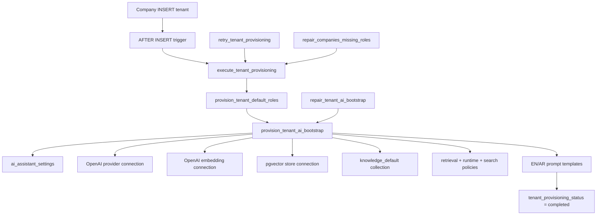

# Sprint A1-02 — Tenant AI Bootstrap Completion Report

**Date:** 2026-07-19  
**Project:** `lfbtnskmvibikalsxwsm`  
**Status:** **PASS**

---

## Summary

Automatic, idempotent AI bootstrap is now integrated into the enterprise tenant provisioning pipeline. Every new or repaired tenant receives default AI assistant settings, provider/embedding/vector connections, a `knowledge_default` collection, retrieval/runtime/search policies, and English + Arabic prompt templates — without overwriting existing tenant customization.

---

## Provisioning Flow



**Integration point:** `execute_tenant_provisioning` (migration 127) calls `provision_tenant_ai_bootstrap` after RBAC roles succeed, and also on the already-provisioned short-circuit path so repair/retry stays idempotent.

---

## Files Changed

| File | Change |
|------|--------|
| `supabase/migrations/127_tenant_ai_bootstrap.sql` | New RPCs + pipeline integration + backfill |
| `lib/tenant-ai-bootstrap/package.json` | New workspace package |
| `lib/tenant-ai-bootstrap/tsconfig.json` | Package TS config |
| `lib/tenant-ai-bootstrap/src/constants.ts` | Bootstrap defaults |
| `lib/tenant-ai-bootstrap/src/types.ts` | Result/verification types |
| `lib/tenant-ai-bootstrap/src/parse-tenant-ai-bootstrap-result.ts` | RPC result parser |
| `lib/tenant-ai-bootstrap/src/services/tenant-ai-bootstrap-service.ts` | Service-layer bootstrap (reuses AI/embedding/vector services) |
| `lib/tenant-ai-bootstrap/src/services/tenant-ai-bootstrap-service.test.ts` | Unit tests |
| `lib/tenant-ai-bootstrap/src/index.ts` | Public exports |
| `scripts/tenant-ai-bootstrap-validation.mts` | Acceptance scenarios 1–3 |

---

## Bootstrap Artifacts (per tenant)

| Artifact | Default | Idempotency |
|----------|---------|-------------|
| AI assistant settings | Enabled, OpenAI, knowledge on | Skip if row exists |
| OpenAI provider connection | Disabled unless API key in `vault.openai_api_key` / `app.openai_api_key` | Skip if OpenAI connection exists |
| OpenAI embedding connection | Same as provider | Skip if OpenAI embedding connection exists |
| pgvector connection | Enabled + active | Skip if pgvector connection exists |
| Collection `knowledge_default` | 1536 dims, active | Skip if collection exists |
| Retrieval policy | `tenant_default_retrieval` | Skip if default exists |
| Execution policy | `tenant_default_runtime` | Skip if default exists |
| Vector search policy | `tenant_default_search` | Skip if default exists |
| Prompt templates | `tenant_conversation_en`, `tenant_conversation_ar` | Skip per key if exists |

---

## Test Results

### Unit tests

```
lib/tenant-ai-bootstrap/src/services/tenant-ai-bootstrap-service.test.ts
▶ parseTenantAiBootstrapResult — 2/2 PASS
▶ tenant bootstrap constants — 1/1 PASS
Total: 3/3 PASS
```

### Integration / acceptance (`scripts/tenant-ai-bootstrap-validation.mts`)

| Scenario | Result |
|----------|--------|
| 1 — New tenant has full AI configuration | **PASS** |
| 2 — Re-run bootstrap, no duplicates | **PASS** |
| 3 — Customized tenant settings preserved | **PASS** |

**Summary: 5/5 PASS**

---

## Acceptance Scenario Evidence

**Scenario 1:** Tenant `1f95f8b8-…` after provisioning:

- Assistant settings: yes
- AI / embedding / vector connections: 1 each
- `knowledge_default` collection: 1
- Default retrieval, execution, search policies: yes
- Prompt templates (EN + AR): 2

**Scenario 2:** Second `provision_tenant_ai_bootstrap` run — 0 new rows created; counts unchanged.

**Scenario 3:** Custom assistant name/model/knowledge flag unchanged after re-bootstrap.

---

## Runtime Integration

- **Pipeline (production path):** SQL `provision_tenant_ai_bootstrap` inside `execute_tenant_provisioning` — uses real pgvector RPCs for collection creation.
- **Service path:** `TenantAiBootstrapService.provisionWithServices()` reuses `@workspace/ai-provider-layer`, `@workspace/embedding-platform`, and `@workspace/vector-store` (Supabase RPC backend, not in-memory).
- **Repair:** `repair_tenant_ai_bootstrap()` batch RPC (service_role / trusted caller); migration 127 backfilled existing tenants.

---

## Risks

| Risk | Severity | Notes |
|------|----------|-------|
| OpenAI connections bootstrap disabled without platform API key | Low | Expected; admin enables after configuring key |
| SQL vs TS service drift | Low | SQL is pipeline authority; TS mirrors for programmatic repair |
| Trigger + synchronous `execute_tenant_provisioning` race | Low | Idempotent short-circuit handles completed tenants |
| `repair_tenant_ai_bootstrap` granted to `authenticated` | Low | Gated by `assert_trusted_provisioning_caller()` (super admin / service_role / bootstrap flag) |
| Workspace package not yet linked in login-app | Low | Run `pnpm install` at repo root before importing `@workspace/tenant-ai-bootstrap` in app code |

---

## Recommendation

**READY FOR A1-03** (OpenAI connection activation / tenant AI bootstrap orchestration UI or key wiring).

---

## Verification Commands

```bash
# Unit tests
pnpm --dir lib/tenant-ai-bootstrap test

# Acceptance scenarios (requires linked Supabase + service role)
tsx scripts/tenant-ai-bootstrap-validation.mts
```
