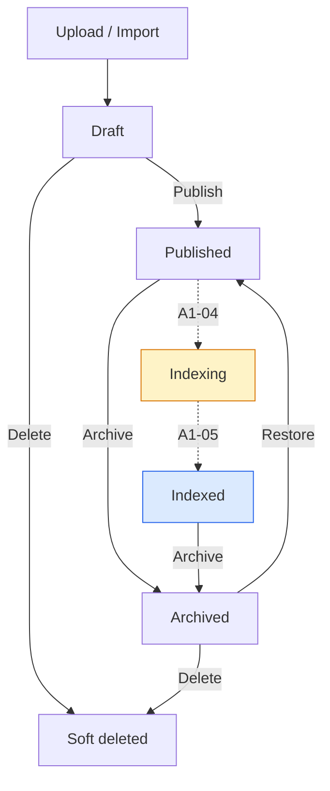

# Sprint A1-03 — Enterprise Knowledge Publish Workflow Completion Report

**Date:** 2026-07-19  
**Project:** `lfbtnskmvibikalsxwsm`  
**Status:** **PASS**

---

## Implementation Summary

Sprint A1-03 delivers a production-ready **Knowledge Publishing Lifecycle** for VaultOS. Documents now move through managed states from import through publish, with reserved slots for future embedding/indexing sprints and explicit archive/restore semantics.

### Architecture decisions

| Decision | Rationale |
|----------|-----------|
| **`KnowledgePublishingService` as orchestrator** | Single reusable entry point for publish / archive / restore / delete that A1-04 embedding workers can call without duplicating business rules |
| **Reuse `KnowledgeVersionService.publishVersion`** | Preserves immutable version semantics; never overwrites published content |
| **Metadata-driven lifecycle** | `metadata.lifecycle` and `metadata.publishing` track archive provenance, retrieval availability, and embedding pipeline readiness without schema redesign |
| **Publish stops at `published`** | Sets `metadata.publishing.embedding_status: "pending"`; does **not** enqueue or execute embeddings (A1-04+) |
| **`indexing` / `indexed` reserved in schema + UI** | Status check extended now; automatic transitions deferred to A1-04 / A1-05 |
| **Archive ≠ soft delete** | Archive sets `status: archived` + `retrieval_available: false`; delete remains soft-delete for draft/archived only |
| **Idempotent publish** | Republishing an already-published document returns existing version with `idempotent: true` — no duplicate published rows |
| **Edit lock on non-draft** | `KnowledgeDocumentService.updateDocument` throws `DocumentLockedError` when status ≠ draft |

Tenant isolation, RLS, RBAC, and audit logging are preserved. No breaking API or schema changes beyond additive status values and permission grants.

### Document lifecycle



**Active in A1-03:** Draft → Published → Archived (with restore).  
**Reserved:** Indexing, Indexed, Re-index (UI placeholder disabled until A1-05).

### Service layer updates

- **`KnowledgePublishingService`** — validates integrity (checksum + chunks), publishes via version service, writes lifecycle/publishing metadata, enforces RBAC (`knowledge.publish` / `knowledge.manage`)
- **`KnowledgeVersionService.publishVersion`** — idempotent return when version already immutable + published
- **`KnowledgeDocumentService`** — blocks edits on locked documents
- **`document-lifecycle.ts`** — helpers for metadata merge, retrieval availability, status allow-lists
- **`createKnowledgePlatformServices()`** — exposes `services.publishing`

### UI updates

- **`KnowledgeDocumentStatusBadge`** — distinct badge per lifecycle state (Draft, Published, Indexing, Indexed, Archived)
- **`knowledge-documents-page.tsx`** — status column, RBAC-gated action buttons per state
- **`use-knowledge-document-lifecycle.ts`** — React Query mutations for publish / archive / restore / delete
- **`canPublishKnowledge()`** — permission helper for `knowledge.publish`
- **i18n** — EN + AR status labels, action strings, re-index placeholder message

---

## Files Changed

| File | Change |
|------|--------|
| `supabase/migrations/128_knowledge_publishing_lifecycle.sql` | Extended status check; audit events; `knowledge.publish` grants |
| `lib/knowledge-platform/src/constants.ts` | `indexing` / `indexed` statuses; audit event names |
| `lib/knowledge-platform/src/errors.ts` | `DocumentLockedError`; restored `KnowledgeParseError` |
| `lib/knowledge-platform/src/utils/document-lifecycle.ts` | **New** lifecycle/publishing metadata helpers |
| `lib/knowledge-platform/src/services/knowledge-publishing-service.ts` | **New** publishing orchestrator |
| `lib/knowledge-platform/src/services/knowledge-version-service.ts` | Idempotent republish of immutable versions |
| `lib/knowledge-platform/src/services/knowledge-document-service.ts` | Edit lock on non-draft documents |
| `lib/knowledge-platform/src/repositories/supabase-knowledge-repositories.ts` | Normalize new document statuses |
| `lib/knowledge-platform/src/index.ts` | Wire + export `services.publishing` |
| `lib/knowledge-platform/src/services/knowledge-platform.test.ts` | 6 publishing unit tests + version republish fix |
| `artifacts/login-app/src/components/knowledge/knowledge-document-status-badge.tsx` | **New** status badge component |
| `artifacts/login-app/src/hooks/knowledge/use-knowledge-document-lifecycle.ts` | **New** lifecycle mutations |
| `artifacts/login-app/src/lib/knowledge/knowledge-permissions.ts` | `canPublishKnowledge()` |
| `artifacts/login-app/src/pages/dashboard/knowledge/knowledge-documents-page.tsx` | Badges, actions, RBAC gating |
| `artifacts/login-app/src/locales/en/common.json` | Lifecycle status + action strings |
| `artifacts/login-app/src/locales/ar/common.json` | Arabic lifecycle strings |
| `scripts/knowledge-publishing-validation.mts` | **New** acceptance scenarios 1–6 |

---

## Database Changes

### Migration 128 — `128_knowledge_publishing_lifecycle.sql`

| Change | Detail |
|--------|--------|
| `knowledge_documents_status_check` | Extended to `draft`, `published`, `indexing`, `indexed`, `archived` |
| `knowledge_document_audit_events()` | Added `document_restored`, `document_indexing`, `document_indexed` |
| Permission grants | `knowledge.publish` on admin template + existing tenant admin roles |

**Applied to production:** yes (`lfbtnskmvibikalsxwsm`)

No new tables. No column additions — lifecycle state carried in existing `status` + `metadata` JSONB.

---

## Tests

### Unit tests (`lib/knowledge-platform`)

```
KnowledgePublishingService
  ✔ publishes draft documents and prepares embedding pipeline metadata
  ✔ is idempotent when publishing an already published document
  ✔ archives published documents and excludes them from retrieval
  ✔ restores archived documents to their previous publish state
  ✔ blocks editing published documents
  ✔ enforces RBAC on publish operations

Total: 20/20 PASS
```

### Integration / acceptance (`scripts/knowledge-publishing-validation.mts`)

| Scenario | Expected | Result |
|----------|----------|--------|
| 1 — Upload → Draft → Publish | Published, audit log, status updated | **PASS** |
| 2 — Publish again | No duplicate published version | **PASS** |
| 3 — Archive | Status archived, retrieval unavailable | **PASS** |
| 4 — Restore | Previous publish state restored | **PASS** |
| 5 — Tenant isolation | Cross-tenant access blocked | **PASS** |
| 6 — RBAC | Publish denied without `knowledge.publish` | **PASS** |

**Summary: 8/8 PASS** (includes sub-checks for audit log and idempotent flag)

---

## Acceptance Scenario Evidence

**Scenario 1:** Draft import → publish → `status: published`, `embedding_status: pending`, audit rows ≥ 1.

**Scenario 2:** Second publish → `idempotent: true`, published version count remains 1.

**Scenario 3:** Archive → `status: archived`, `isDocumentRetrievalAvailable() === false`.

**Scenario 4:** Restore → `status: published`, `restoredStatus: published`, retrieval re-enabled.

**Scenario 5:** Tenant B context cannot publish Tenant A document (exception thrown).

**Scenario 6:** Context without `knowledge.publish` blocked on publish.

---

## Risks

| Risk | Severity | Notes |
|------|----------|-------|
| Legacy `KnowledgeDocumentService.archiveDocument()` still soft-deletes | Low | UI uses `services.publishing.archiveDocument`; legacy path should be deprecated in a follow-up |
| `indexing` / `indexed` have no automatic transitions yet | Expected | Reserved for A1-04 / A1-05; UI badges ready |
| Version table RLS not gated on `knowledge.publish` | Low | Pre-existing; publish path uses service-layer RBAC |
| Acceptance script requires linked Supabase + service role | Low | Documented command below |
| Re-index action is UI placeholder only | Expected | Disabled until A1-05 |

---

## Recommendation

**READY FOR A1-04** (Embedding Queue — transition `published` → `indexing` and enqueue workers).

---

## Verification Commands

```bash
# Unit tests
pnpm --dir lib/knowledge-platform test

# Acceptance scenarios (requires linked Supabase + service role)
pnpm --dir lib/knowledge-platform exec node --import tsx/esm ../../scripts/knowledge-publishing-validation.mts
```
