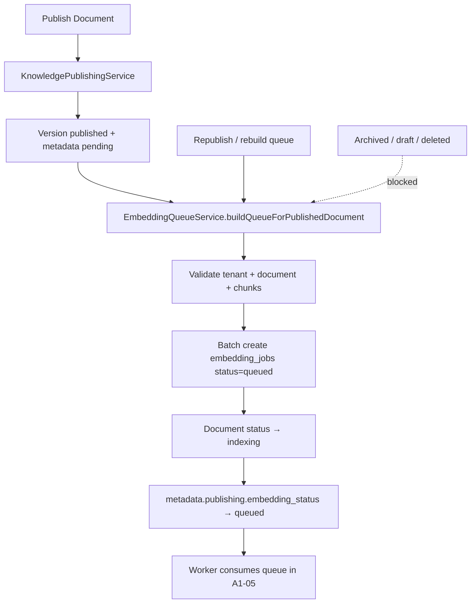

# Sprint A1-04 — Enterprise Embedding Queue Pipeline Completion Report

**Date:** 2026-07-19  
**Project:** `lfbtnskmvibikalsxwsm`  
**Status:** **PASS**

---

## Architecture Summary

Sprint A1-04 connects the Knowledge Publishing Workflow (A1-03) to the Embedding Platform by automatically building an embedding job queue whenever a published document is ready for indexing.

### Queue pipeline



### Queue service

**`EmbeddingQueueService`** (`lib/embedding-platform/src/services/embedding-queue-service.ts`):

- Discovers published-version chunks in one query (`listByVersion`)
- Loads existing jobs in batched chunk-ID queries (`listByChunkIds`, 200 IDs per batch)
- Validates chunk eligibility (tenant, content, checksum, published version)
- Creates jobs via batch insert (`createMany`, 100 jobs per batch)
- Skips duplicates (existing queued/running/completed jobs + DB partial unique index)
- Updates document metadata and transitions status to `indexing`
- Implements `KnowledgeEmbeddingQueuePort` for publishing integration

### Metadata updates

| Field | Value after queue build |
|-------|-------------------------|
| `document.status` | `indexing` |
| `metadata.publishing.embedding_status` | `queued` |
| `metadata.publishing.queued_at` | ISO timestamp |
| `metadata.publishing.queue.started_at` | Queue build start |
| `metadata.publishing.queue.completed_at` | Queue build end |
| `metadata.publishing.queue.jobs_created` | New jobs inserted |
| `metadata.publishing.queue.jobs_skipped` | Skipped (existing embedding) |
| `metadata.publishing.queue.jobs_duplicate` | Skipped (existing active job) |
| `metadata.publishing.queue.invalid_chunks_skipped` | Invalid chunks skipped |
| `metadata.publishing.queue.queued_job_count` | Total queued + running jobs |

Reserved UI/worker states: `processing`, `completed`, `failed` (A1-05+).

### Audit integration

Migration 129 extends `knowledge_document_audit_events()` to emit:

- `embedding_queue_started`
- `embedding_jobs_created`
- `embedding_jobs_skipped`
- `embedding_queue_duplicate_prevented`
- `embedding_queue_completed`

Job row inserts continue to emit `embedding_requested` via existing `embedding_jobs` audit trigger.

---

## Files Changed

| File | Change |
|------|--------|
| `supabase/migrations/129_knowledge_embedding_queue.sql` | Duplicate-prevention index + queue audit events |
| `lib/embedding-platform/package.json` | Added `@workspace/knowledge-platform` dependency |
| `lib/embedding-platform/src/constants.ts` | (unchanged job statuses; queue uses existing `queued`) |
| `lib/embedding-platform/src/types.ts` | `ListEmbeddingJobsByChunkIdsFilter` |
| `lib/embedding-platform/src/repositories/embedding-repositories.ts` | `createMany`, `listByChunkIds` |
| `lib/embedding-platform/src/repositories/supabase-embedding-repositories.ts` | Batch insert + chunk-ID listing |
| `lib/embedding-platform/src/services/embedding-queue-service.ts` | **New** queue orchestrator |
| `lib/embedding-platform/src/services/embedding-queue-service.test.ts` | **New** unit tests |
| `lib/embedding-platform/src/services/embedding-platform.test.ts` | Mock repo batch methods |
| `lib/embedding-platform/src/index.ts` | Exposes `services.queue` |
| `lib/knowledge-platform/src/ports/knowledge-embedding-queue-port.ts` | **New** integration port |
| `lib/knowledge-platform/src/constants.ts` | Queue audit event names |
| `lib/knowledge-platform/src/utils/document-lifecycle.ts` | Queue metadata + `processing` status |
| `lib/knowledge-platform/src/services/knowledge-publishing-service.ts` | Auto-enqueue after publish |
| `lib/knowledge-platform/src/index.ts` | Optional `embeddingQueue` wiring |
| `artifacts/login-app/src/lib/knowledge-platform/index.ts` | Integrated embedding queue factory |
| `artifacts/login-app/src/components/knowledge/knowledge-embedding-status-badge.tsx` | **New** embedding status UI |
| `artifacts/login-app/src/components/knowledge/knowledge-document-status-badge.tsx` | Export `DocumentStatus` type |
| `artifacts/login-app/src/pages/dashboard/knowledge/knowledge-documents-page.tsx` | Embedding status + chunk count |
| `artifacts/login-app/src/locales/en/common.json` | Embedding status i18n |
| `artifacts/login-app/src/locales/ar/common.json` | Embedding status i18n (AR) |
| `scripts/knowledge-embedding-queue-validation.mts` | **New** acceptance scenarios 1–6 |

---

## Database Changes

### Migration 129 — `129_knowledge_embedding_queue.sql`

| Change | Detail |
|--------|--------|
| `idx_embedding_jobs_active_chunk_version` | Partial unique index on `(knowledge_chunk_id, embedding_version, connection_id)` where status ∈ (`queued`, `running`) |
| `knowledge_document_audit_events()` | Queue lifecycle audit events on metadata transitions |

**Applied to production:** yes (`lfbtnskmvibikalsxwsm`)

No new tables. Reuses existing `embedding_jobs` queue model.

---

## Tests

### Unit tests

| Package | Result |
|---------|--------|
| `lib/knowledge-platform` | **20/20 PASS** |
| `lib/embedding-platform` | **27/27 PASS** (includes 6 new `EmbeddingQueueService` tests) |

### Integration / acceptance (`scripts/knowledge-embedding-queue-validation.mts`)

| Scenario | Result |
|----------|--------|
| 1 — Publish → embedding jobs created → queued | **PASS** |
| 2 — Republish → no duplicate jobs | **PASS** |
| 3 — Archive → no new jobs | **PASS** |
| 4 — Tenant isolation | **PASS** |
| 5 — Large document (520 chunks) | **PASS** |
| 6 — Invalid chunks skipped + audit | **PASS** |

**Summary: 7/7 PASS**

---

## Performance Notes

| Strategy | Implementation |
|----------|----------------|
| **Batching** | Chunks loaded in one query; existing jobs loaded in batches of 200 chunk IDs; job inserts in batches of 100 |
| **Duplicate prevention** | Pre-insert skip logic + partial unique DB index on active jobs per chunk/version/connection |
| **Scalability** | Validated with 520-chunk document (~520 queued jobs); acceptance counts jobs via metadata filters (avoids large HTTP `.in()` headers) |
| **N+1 avoidance** | No per-chunk job existence queries; single `listByChunkIds` pass per batch |

---

## Risks

| Risk | Severity | Notes |
|------|----------|-------|
| Publish succeeds but queue fails silently | Low | `enqueueAfterPublish` catches errors to avoid blocking publish; document stays `pending` until manual rebuild |
| Tenants without embedding connection | Low | Queue build throws if no enabled default connection; bootstrap creates one |
| Large `.in()` queries in custom tooling | Low | Use metadata filters (`metadata->>documentId`) for job counts at scale |
| Worker not yet document-aware | Expected | A1-05 worker consumes existing `embedding_jobs` queue unchanged |
| `processing` / `completed` / `failed` UI reserved | Expected | Badges ready; transitions deferred to A1-05 |

---

## Recommendation

**READY FOR A1-05** (Embedding Worker — process queued jobs, generate embeddings, transition to `indexed`).

---

## Verification Commands

```bash
# Unit tests
pnpm --dir lib/knowledge-platform test
pnpm --dir lib/embedding-platform test

# Acceptance scenarios (requires linked Supabase + service role)
pnpm --dir lib/embedding-platform exec node --import tsx/esm ../../scripts/knowledge-embedding-queue-validation.mts
```
