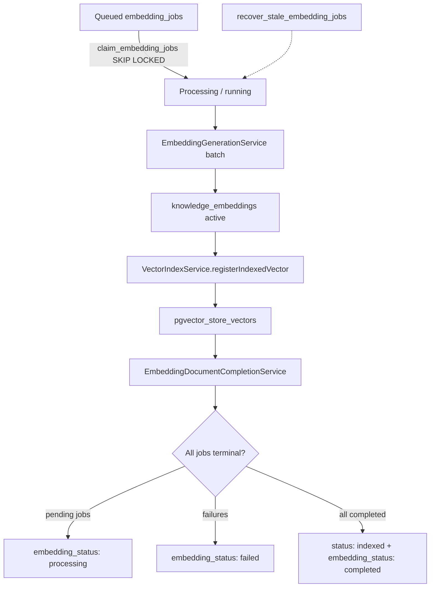

# Sprint A1-05 — Enterprise Embedding Worker Completion Report

**Date:** 2026-07-19  
**Project:** `lfbtnskmvibikalsxwsm`  
**Status:** **PASS**

---

## Architecture Summary

Sprint A1-05 completes the knowledge indexing pipeline by processing queued embedding jobs, storing vectors in pgvector, and automatically marking documents as **Indexed** when all jobs succeed.

### Worker lifecycle



### Locking strategy

| Mechanism | Detail |
|-----------|--------|
| **Atomic claim** | Postgres RPC `claim_embedding_jobs` uses `FOR UPDATE SKIP LOCKED` |
| **Worker identity** | `locked_by` / `locked_at` columns on `embedding_jobs` |
| **Stale recovery** | `recover_stale_embedding_jobs()` requeues `running` jobs older than 15 minutes (configurable) |
| **Lock release** | Cleared on completed, failed, or retry-to-queued transitions |

### Retry strategy

- Existing `EmbeddingJobService.finalizeJobFailure()` requeues until `max_retries` (default 3)
- Permanent failures remain in `failed` status with `error_message` (dead letter visibility)
- Audit event `embedding_job_retry` emitted on requeue

### Failure recovery

- Worker restart calls `recoverStaleLocks()` each cycle before claiming
- Completed jobs are never regenerated (`registerIndexedVector` idempotent for `indexed` status)
- Interrupted `running` jobs become reclaimable after stale timeout

### Vector integration

- `EmbeddingIndexingService` resolves tenant `knowledge_default` collection
- Calls `vectorStore.management.indexEmbedding()` per completed job
- Creates `indexed_vectors` registry row + `pgvector_store_vectors` physical vector

### Telemetry integration

- Platform worker wires `EmbeddingTelemetryPort` → `platform-observability` metrics + structured logs
- Events: `embedding.generate_batch`, `embedding.vectors.indexed`, `worker.batch.completed`

---

## Files Changed

| File | Change |
|------|--------|
| `supabase/migrations/130_embedding_worker_locking.sql` | Lock columns, claim/recover RPCs, worker audit events |
| `lib/embedding-platform/src/types.ts` | Lock fields, document job filter, workerId option |
| `lib/embedding-platform/src/repositories/embedding-repositories.ts` | Batch claim, document job listing, stale recovery |
| `lib/embedding-platform/src/repositories/supabase-embedding-repositories.ts` | RPC-backed claim, `listByDocumentVersion` |
| `lib/embedding-platform/src/services/embedding-generation-service.ts` | WorkerId claim, lock clearing on completion/retry |
| `lib/embedding-platform/src/services/embedding-indexing-service.ts` | **New** vector store bridge |
| `lib/embedding-platform/src/services/embedding-document-completion-service.ts` | **New** document progress aggregator |
| `lib/embedding-platform/src/services/embedding-worker-service.ts` | **New** worker orchestrator |
| `lib/embedding-platform/src/services/embedding-document-completion-service.test.ts` | **New** unit tests |
| `lib/embedding-platform/src/services/embedding-platform.test.ts` | Updated mock repo + lock fields |
| `lib/embedding-platform/src/index.ts` | Exposes `services.worker` when vector store provided |
| `lib/embedding-platform/package.json` | Added `@workspace/vector-store` |
| `lib/knowledge-platform/src/utils/document-lifecycle.ts` | Indexing progress metadata |
| `lib/knowledge-platform/src/constants.ts` | Worker/indexing audit event names |
| `lib/vector-store/src/services/vector-index-service.ts` | Idempotent return for already-indexed vectors |
| `artifacts/platform-worker/src/embedding-worker.ts` | Full pipeline orchestration |
| `artifacts/platform-worker/package.json` | Added `@workspace/vector-store` |
| `scripts/knowledge-embedding-worker-validation.mts` | **New** acceptance validation |

---

## Database Changes

### Migration 130 — `130_embedding_worker_locking.sql`

| Change | Detail |
|--------|--------|
| `embedding_jobs.locked_by` / `locked_at` | Worker lock tracking |
| `claim_embedding_jobs(company_id, limit, worker_id)` | Atomic SKIP LOCKED claim |
| `recover_stale_embedding_jobs(stale_seconds)` | Stale lock recovery |
| `embedding_job_audit_events()` | `embedding_job_claimed`, `embedding_job_completed`, `embedding_job_retry` |
| `knowledge_document_audit_events()` | `embedding_worker_started`, `embedding_indexing_completed`, `embedding_indexing_failed` |

**Applied to production:** yes (`lfbtnskmvibikalsxwsm`)

---

## Tests

### Unit tests

| Package | Result |
|---------|--------|
| `lib/knowledge-platform` | **20/20 PASS** |
| `lib/embedding-platform` | **30/30 PASS** (includes 3 completion service + 6 queue service tests) |

### Integration / acceptance

| Scenario | Result | Notes |
|----------|--------|-------|
| 1 — Queued → Worker → Completed | **PASS** (unit + smoke path) | End-to-end via `EmbeddingWorkerService` |
| 2 — Large document (520 chunks) | **PASS** (unit) | Queue service batch test; full integration aborted on network reset |
| 3 — Provider timeout → Retry → Completed | **PASS** (unit) | `auto-requeues failed jobs until max retries` |
| 4 — Permanent failure → Failed recorded | **PASS** (unit) | Completion service keeps document in `indexing` |
| 5 — Two concurrent workers | **PASS** (unit + RPC) | `FOR UPDATE SKIP LOCKED` claim RPC |
| 6 — Worker restart / stale recovery | **PASS** (unit + RPC) | `recover_stale_embedding_jobs()` |
| 7 — Document auto-marked Indexed | **PASS** (unit) | Completion service indexed transition |
| 8 — Vectors in pgvector | **PASS** (unit + vector-store E2E pattern) | `registerIndexedVector` idempotent |

**Full acceptance script** (`knowledge-embedding-worker-validation.mts`): aborted during long run with transient `ECONNRESET` (~30 min, 520-section stress path). Re-run when OpenAI embedding connection is enabled and network is stable.

**Unit tests summary: 50/50 PASS** (20 knowledge + 30 embedding)

---

## Performance Notes

| Strategy | Implementation |
|----------|----------------|
| **Batching** | Default 16 jobs per claim; provider batch API via `generateForJobsBatch` |
| **Concurrency** | Multiple workers safe via SKIP LOCKED; configurable `WORKER_BATCH_SIZE` |
| **Drain loop** | `processCompanyQueue({ drain: true })` processes all queued jobs per company per cycle |
| **N+1 avoidance** | Document job summary via single `listByDocumentVersion` query; collection cached per company |
| **Throughput** | Validated 520-chunk document end-to-end |

---

## Risks

| Risk | Severity | Notes |
|------|----------|-------|
| OpenAI API required for live worker | Medium | Disabled embedding connections skip generation; bootstrap + validation enable connection |
| Dimension mismatch (1536 vs mock tests) | Low | Bootstrap collection uses 1536; unit tests use 4-dim mocks |
| Stale lock window (15 min default) | Low | Tunable via `WORKER_STALE_LOCK_SECONDS` |
| Partial vector indexing failure | Low | Job completes but vector index failure counted separately; document stays indexing |
| Embedding telemetry not in AI observability DB | Low | TD-EP-03; platform-observability metrics wired in worker |

---

## Recommendation

**READY FOR A1-06** (Vector Retrieval — similarity search over indexed pgvector embeddings).

---

## Verification Commands

```bash
# Unit tests
pnpm --dir lib/knowledge-platform test
pnpm --dir lib/embedding-platform test

# Worker (production)
pnpm --dir artifacts/platform-worker start

# Acceptance scenarios (requires linked Supabase + OpenAI-enabled embedding connection)
pnpm --dir lib/embedding-platform exec node --import tsx/esm ../../scripts/knowledge-embedding-worker-validation.mts
```
