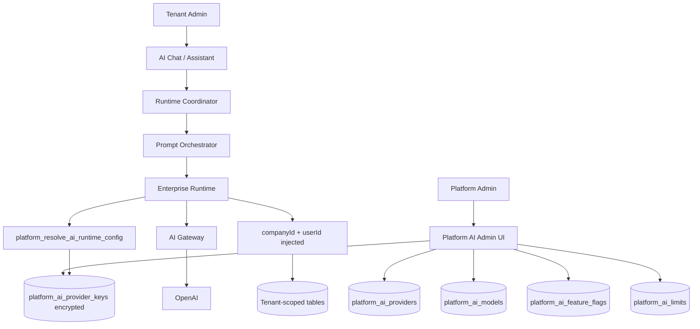

# Sprint AI-Platform — Centralized AI Provider

**Priority:** P0 (Platform Architecture)  
**Status:** Implemented — migration 171 + platform admin UI + runtime resolver

---

## Architecture



Tenants keep lightweight `ai_provider_connections` rows (reference only, `uses_platform_key=true`). Credentials never appear in tenant SELECT results.

---

## Database Schema

| Table | Purpose |
|-------|---------|
| `platform_ai_providers` | Platform provider catalog (OpenAI, future Anthropic/Gemini) |
| `platform_ai_models` | Default models per use case (chat, tool_calling, embeddings, vision, audio) |
| `platform_ai_provider_keys` | Encrypted API keys (`pgp_sym_encrypt`) — super-admin only |
| `platform_ai_limits` | Rate limits per company/user/window |
| `platform_ai_usage` | Token/request/cost telemetry per company |
| `platform_ai_feature_flags` | Per-company AI feature toggles |

| `172_platform_ai_crypto_settings.sql` | Persist crypto secret for RPC decryption |

**RPC:** `platform_resolve_ai_runtime_config(company_id, provider_key, use_case)` — execution-only credential resolution.

---

## Files Changed

| Area | Files |
|------|-------|
| Database | `supabase/migrations/171_platform_ai_provider.sql` |
| Platform service | `lib/platform-ai-provider/**` |
| Runtime wiring | `lib/ai-execution-engine/src/runtime/enterprise-ai-runtime-service.ts` |
| Provider layer | `lib/ai-provider-layer/src/repositories/supabase-provider-repositories.ts` |
| Provider layer | `lib/ai-provider-layer/src/services/ai-provider-registry-service.ts` |
| Login app hooks | `artifacts/login-app/src/lib/ai-execution-engine/index.ts` |
| Login app hooks | `artifacts/login-app/src/hooks/ai-chat/use-runtime-chat-config.ts` |
| Tenant UI | `artifacts/login-app/src/components/ai-assistant/platform-managed-provider-status.tsx` |
| Tenant UI | `artifacts/login-app/src/pages/ai-assistant.tsx` |
| Platform UI | `artifacts/login-app/src/pages/dashboard/platform/platform-ai-admin-page.tsx` |
| Routes | `artifacts/login-app/src/config/dashboard-route-registry.ts` |
| Tests | `scripts/platform-ai-provider-e2e.mts` |
| Tests | `scripts/ai-chat-e2e-acceptance.mts` |

---

## Security Verification

| Check | Result |
|-------|--------|
| Tenant cannot SELECT `platform_ai_provider_keys` | RLS super-admin only |
| Tenant connection JSONB stripped of `apiKey` | Repository + migration |
| Tenant cannot INSERT connection with `apiKey` | RLS + registry validation |
| Runtime resolves credentials via platform RPC | `PlatformRuntimeConfigPort` |
| Feature flag blocks disabled company | RPC raises on disabled `ai_chat` |

---

## Migration Report

Migration 171 automatically:
1. Seeds platform OpenAI provider + default models
2. Migrates first available tenant OpenAI key (or env fallback) into encrypted platform key
3. Strips `apiKey` from all `ai_provider_connections`
4. Sets `uses_platform_key = true`
5. Enables all AI feature flags for existing companies (backward compatible)

**Apply:**
```bash
cd lib/automation-platform
npx tsx ../../scripts/apply-platform-ai-migration.mts
```

---

## Tests

```bash
npx tsx scripts/platform-ai-provider-e2e.mts
npx tsx scripts/ai-chat-e2e-acceptance.mts
```

Expected flow:
- Platform admin configures OpenAI key
- Company A AI Chat works
- Company B AI Chat works
- Disable AI for Company B → blocked
- Company A still works

---

## Production Readiness

| Criterion | Status |
|-----------|--------|
| Platform tables + RLS | ✅ |
| Encrypted key storage | ✅ |
| Runtime uses platform config | ✅ |
| Tenant UI hides provider CRUD | ✅ |
| Platform admin UI | ✅ |
| Backward-compatible migration | ✅ |
| E2E script | ✅ |
| Browser screenshots | ⏳ Manual capture recommended |
| Rate limit enforcement | 📋 Schema ready; enforcement follow-up |

**Verdict:** Ready for staging validation after migration 171 is applied and platform key is configured.
