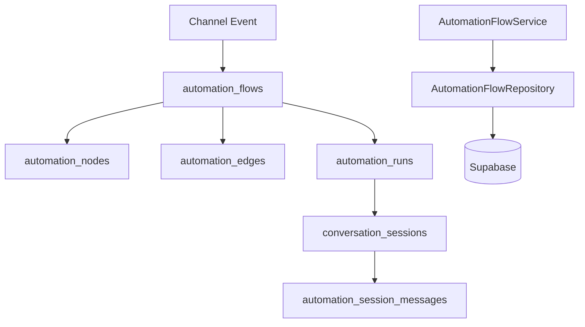

# Sprint B1-01 — Enterprise Automation Platform Foundation

**Date:** 2026-07-19  
**Status:** **COMPLETE**

---

## Objective

Establish the channel-independent Automation Platform foundation for VaultOS: database schema, RLS, RBAC, audit events, TypeScript domain layer, and flow CRUD services — without channel integrations, canvas UI, or AI execution.

---

## Architecture Summary



The engine is **channel-agnostic**. Flows declare a `trigger_type` (`manual`, `webhook`, `inbound_message`, `schedule`, `api_event`) and sessions record a `channel` (`web_chat`, `whatsapp`, `email`, `api`, …) without binding to a specific integration.

---

## Schema Notes

| Spec name | VaultOS implementation | Notes |
|-----------|------------------------|-------|
| `tenant_id` | `company_id` | VaultOS multi-tenancy convention |
| `conversation_messages` | `automation_session_messages` | Avoids conflict with existing `conversation_messages` (AI conversation core, migration 011) |

### Tables

| Table | Purpose |
|-------|---------|
| `automation_flows` | Versioned workflow definitions with lifecycle (`draft` → `active` → `disabled`) |
| `automation_nodes` | Graph nodes (`trigger`, `action`, `condition`, `delay`, `end`) |
| `automation_edges` | Directed edges with JSON `condition` payloads |
| `automation_runs` | Execution records per flow invocation |
| `conversation_sessions` | Channel-independent automation runtime sessions |
| `automation_session_messages` | Session message log (`sender_type`, `message_type`, `payload`) |

**Migration:** `supabase/migrations/131_automation_platform_foundation.sql`

---

## Security

### RLS

All six tables have RLS enabled.

- **Direct tenant tables** (`automation_flows`, `automation_runs`, `conversation_sessions`): `company_has_permission(company_id, 'automation.*')`
- **Child tables** (`automation_nodes`, `automation_edges`, `automation_session_messages`): scoped via parent flow/session join
- **Soft delete:** `automation_flows` SELECT policies exclude `deleted_at is not null`

### RBAC permissions

| Code | Action |
|------|--------|
| `automation.view` | View flows, runs, sessions |
| `automation.create` | Create flows |
| `automation.edit` | Edit draft/disabled flows, disable active flows |
| `automation.delete` | Soft-delete flows |
| `automation.publish` | Activate flows (`draft`/`disabled` → `active`) |
| `automation.execute` | Create runs, sessions, session messages |

Granted to tenant `admin` template via `platform_role_template_permissions` and reconciled into existing admin roles.

---

## Audit Events

Registered in SQL triggers and mirrored in `AUTOMATION_AUDIT_EVENTS`:

| Event | Trigger |
|-------|---------|
| `flow_created` | INSERT on `automation_flows` |
| `flow_updated` | UPDATE metadata/name/trigger/version |
| `flow_published` | status → `active` |
| `flow_disabled` | status → `disabled` |
| `flow_deleted` | soft delete |
| `run_started` | INSERT on `automation_runs` |
| `run_completed` / `run_failed` / `run_cancelled` | run status transitions |

Events are written to `audit_logs` via `write_automation_audit_log()`.

---

## TypeScript Package

**Package:** `@workspace/automation-platform`  
**Path:** `lib/automation-platform/`

| Layer | Files |
|-------|-------|
| Constants | `src/constants.ts` — permissions, statuses, audit catalog |
| Types | `src/types.ts` — records, inputs, `ServiceContext` |
| Errors | `src/errors.ts` |
| Repositories | `src/repositories/automation-repositories.ts`, `supabase-automation-repositories.ts` |
| Service | `src/services/automation-flow-service.ts` |
| Factory | `src/index.ts` → `createAutomationPlatformServices(client)` |

### AutomationFlowService CRUD

| Method | Permission | Behavior |
|--------|------------|----------|
| `createFlow` | `automation.create` | Creates draft flow; enforces unique name per company |
| `updateFlow` | `automation.edit` | Draft/disabled only |
| `getFlow` | `automation.view` | Single flow lookup |
| `listFlows` | `automation.view` | Company-scoped list with filters |
| `publishFlow` | `automation.publish` | `draft`/`disabled` → `active` |
| `disableFlow` | `automation.edit` | `active` → `disabled` |
| `deleteFlow` | `automation.delete` | Soft delete; blocked while `active` |

Repository interfaces also exist for nodes, edges, runs, sessions, and session messages with Supabase implementations ready for B1-02 execution engine work.

---

## Tests

```bash
pnpm --dir lib/automation-platform test
```

Coverage includes create/update/publish/disable/delete/list, permission guards, duplicate names, active-flow edit/delete guards, and lifecycle transitions.

---

## Out of Scope (per sprint)

- WhatsApp / channel adapters
- OpenAI / AI nodes
- Workflow canvas / drag-and-drop UI
- External API execution
- Run engine orchestration (reserved for B1-02)

---

## Recommendation

**READY FOR B1-02** — Automation execution engine (run orchestration, node traversal, session progression).

Apply migration before integration:

```bash
supabase db push
```
