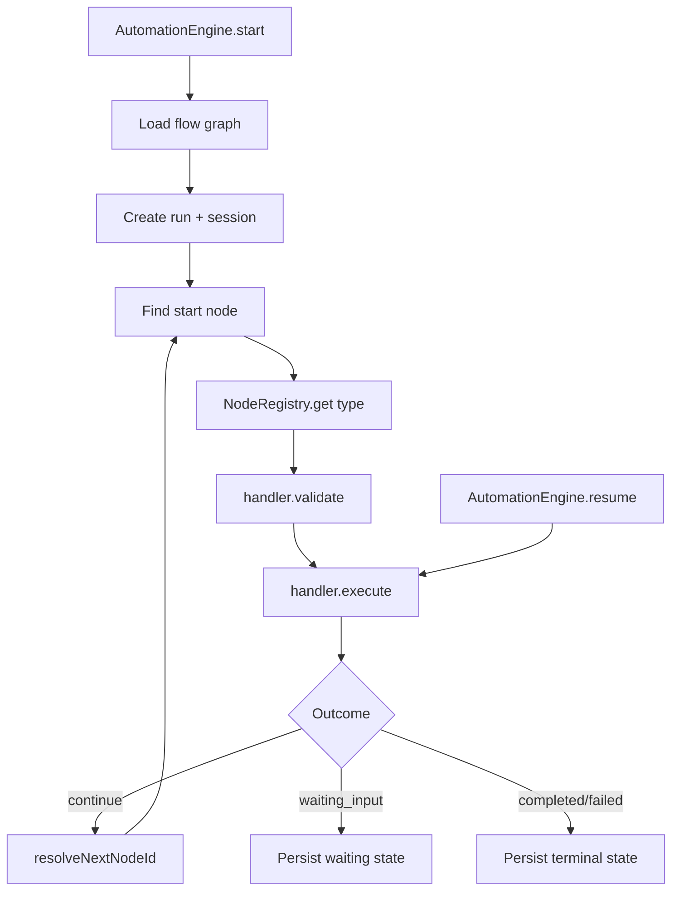

# Sprint B1-02 — Automation Execution Engine

**Date:** 2026-07-19  
**Status:** **COMPLETE**

---

## Objective

Implement the channel-independent runtime execution engine for the VaultOS Automation Platform: node registry, execution context, flow traversal, lifecycle management, and runtime persistence.

---

## Architecture Summary



The engine is **channel-independent**. Channels are recorded on `conversation_sessions.channel` but never hard-coded into traversal logic.

---

## Core Components

| Component | Path | Responsibility |
|-----------|------|----------------|
| `AutomationEngine` | `src/engine/automation-engine.ts` | Start, resume, cancel executions |
| `AutomationNodeRegistry` | `src/engine/node-registry.ts` | Register/resolve node handlers by type |
| `ExecutionContext` | `src/engine/execution-context.ts` | Runtime context + node handler contract |
| `flow-graph` | `src/engine/flow-graph.ts` | Start node discovery, edge resolution |
| `runtime-store` | `src/engine/runtime-store.ts` | Persist run/session state transitions |
| Built-in handlers | `src/engine/built-in-nodes.ts` | `trigger`, `action`, `condition`, `delay`, `end` |

---

## Execution Context

```typescript
ExecutionContext {
  company, flow, run, session,
  variables, customer, currentNode,
  nodes, edges, input?
}
```

### Node handler contract

Every registered handler implements:

- `validate(context)` — config/business validation before execution
- `execute(context)` — returns `{ outcome, variables?, errorMessage?, output? }`

Outcomes: `continue` | `waiting_input` | `completed` | `failed`

---

## Execution Lifecycle

| Lifecycle | Run status | Session status |
|-----------|------------|----------------|
| `pending` | `pending` | `active` |
| `running` | `running` | `running` |
| `waiting_input` | `waiting_input` | `waiting_input` |
| `completed` | `completed` | `completed` |
| `failed` | `failed` | `active` |
| `cancelled` | `cancelled` | `cancelled` |

---

## Flow Traversal

1. Load active flow + nodes + edges
2. Find start node (`trigger` or root without incoming edges)
3. Execute current node via registry
4. Persist `current_node_id` + `variables` after each step
5. Resolve next edge (`condition` nodes use `variables.__branch`)
6. Continue until `end`, `waiting_input`, or `failed`

### Resume path

When a run is `waiting_input`, `AutomationEngine.resume()`:

1. Re-executes the waiting node with supplied `input`
2. Merges captured input into `variables`
3. Advances to the next node and continues traversal

---

## Runtime Persistence

**Migration:** `supabase/migrations/132_automation_execution_runtime.sql`

| Field | Table | Purpose |
|-------|-------|---------|
| `current_node_id` | `automation_runs`, `conversation_sessions` | Active graph position |
| `variables` | `automation_runs`, `conversation_sessions` | Mutable execution state |
| `session_id` / `run_id` | cross-linked | Run ↔ session association |
| `waiting_input` | run + session status | Pause/resume support |

Audit extension: `run_waiting_input` event on run status transition.

---

## Built-in Node Types (no external APIs)

| Type | Behavior |
|------|----------|
| `trigger` | Seeds `initialVariables` |
| `action` | `set_variable`, `wait_for_input`, `fail` |
| `condition` | Sets `__branch` (`yes`/`no`) for edge routing |
| `delay` | Synchronous pass-through marker (no timers yet) |
| `end` | Terminal `completed` outcome |

Custom handlers can be registered via `AutomationNodeRegistry.register()` without modifying the engine.

---

## API Surface

```typescript
const services = createAutomationPlatformServices(supabaseClient);

await services.engine.start(ctx, {
  companyId, flowId, channel, initialVariables,
});

await services.engine.resume(ctx, { runId, input });

await services.engine.cancel(ctx, runId);
```

---

## Tests

```bash
pnpm --dir lib/automation-platform test
```

**18/18 PASS**, including:

- Successful linear execution + persistence
- Waiting for input (`waiting_input`)
- Failure propagation
- Resume after wait
- Permission / inactive flow guards
- Cancel waiting run
- Condition branch resolution

---

## Out of Scope (per sprint)

- WhatsApp / channel adapters
- Canvas UI / drag-and-drop
- OpenAI / AI nodes
- External API calls
- Background schedulers / delayed execution timers

---

## Recommendation

**READY FOR B1-03** — Channel ingress adapters and trigger dispatch (webhook, inbound message, schedule) wired to `AutomationEngine.start()`.

Apply migrations:

```bash
supabase db push
```
