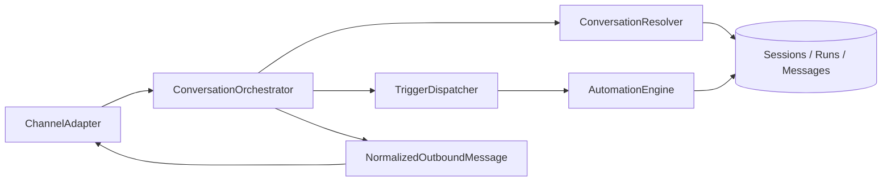

# Sprint B1-03 — Conversation Orchestrator

**Date:** 2026-07-19  
**Status:** **COMPLETE**

---

## Objective

Implement the channel-independent Conversation Orchestrator that sits between all communication channels and the `AutomationEngine`.

---

## Architecture Summary



Channels never talk to the engine directly. All ingress is normalized, resolved, and dispatched through the orchestrator.

---

## Components

| Component | Path | Responsibility |
|-----------|------|----------------|
| `ConversationOrchestrator` | `orchestrator/conversation-orchestrator.ts` | Main ingress/egress coordinator |
| `ConversationResolver` | `orchestrator/conversation-resolver.ts` | Session/customer/company resolution |
| `TriggerDispatcher` | `orchestrator/trigger-dispatcher.ts` | Trigger → flow mapping → `engine.start()` |
| `ChannelAdapter` | `orchestrator/channel-adapter.ts` | `receive()`, `send()`, `normalize()` |
| `SessionPolicy` | `orchestrator/session-policy.ts` | Timeout + resume rules |
| `CustomerResolverPort` | `ports/customer-resolver-port.ts` | Pluggable customer lookup |

---

## Normalized Inbound Message

```typescript
NormalizedInboundMessage {
  channel, companyId, externalUserId,
  customerId?, messageType, text,
  payload, receivedAt, externalMessageId?
}
```

All channel-specific payloads are converted to this model before orchestration.

---

## Trigger Types

| Orchestrator trigger | Flow `trigger_type` | Use case |
|--------------------|---------------------|----------|
| `new_conversation` | `inbound_message` | First message / expired session restart |
| `incoming_message` | `inbound_message` | Continuation when no resume applies |
| `manual_start` | `manual` | Operator-initiated runs |
| `api_trigger` | `api_event` | Programmatic/API starts |

`TriggerDispatcher.resolveFlowId()` selects an explicit `flowId` or the first active flow matching the mapped trigger type.

---

## Session Timeout & Resume Rules

Configured via `SessionPolicyConfig` (default timeout: 30 minutes):

| Rule | Behavior |
|------|----------|
| **Timeout** | Sessions inactive longer than `timeoutMs` are marked `expired` |
| **Resume** | When run + session are `waiting_input`, inbound text resumes via `AutomationEngine.resume()` |
| **New conversation** | Expired/completed/failed/cancelled sessions start a fresh flow |
| **Touch** | Active non-waiting sessions update `last_activity_at` without restarting |

Resume input is mapped using `variables.__waitingFor` from the execution engine.

---

## Orchestrator API

```typescript
const { orchestrator } = createAutomationPlatformServices(client);

await orchestrator.handleInbound(ctx, {
  companyId,
  channel: "web_chat",
  rawMessage: { externalUserId, text },
});

await orchestrator.startManual(ctx, { companyId, channel, flowId, externalUserId });
await orchestrator.triggerApi(ctx, { companyId, channel, flowId, initialVariables });
```

Outbound prompt messages are returned in `OrchestratorHandleResult.outboundMessages` when a flow enters `waiting_input`.

---

## Repository Extensions

- `ConversationSessionRepository.findActiveSession()`
- `AutomationRunRepository.findBySessionId()`
- Session list filter: `externalUserId`, `activeOnly`

No new migration required — B1-02 runtime columns (`variables`, `current_node_id`, `waiting_input` statuses) are reused.

---

## Tests

```bash
pnpm --dir lib/automation-platform test
```

**26/26 PASS**, including:

- New conversation from inbound message
- Resume after `waiting_input`
- Session expiry → new conversation
- Manual + API triggers
- Trigger → flow resolution
- Channel adapter normalization
- Session policy unit coverage

---

## Out of Scope (per sprint)

- WhatsApp Business API
- Webhooks / HTTP ingress
- OpenAI
- Canvas UI / drag-and-drop

---

## Recommendation

**READY FOR B1-04** — Channel transport implementations (web chat, email, API ingress) implementing `ChannelAdapter.send()` and webhook receivers calling `orchestrator.handleInbound()`.
