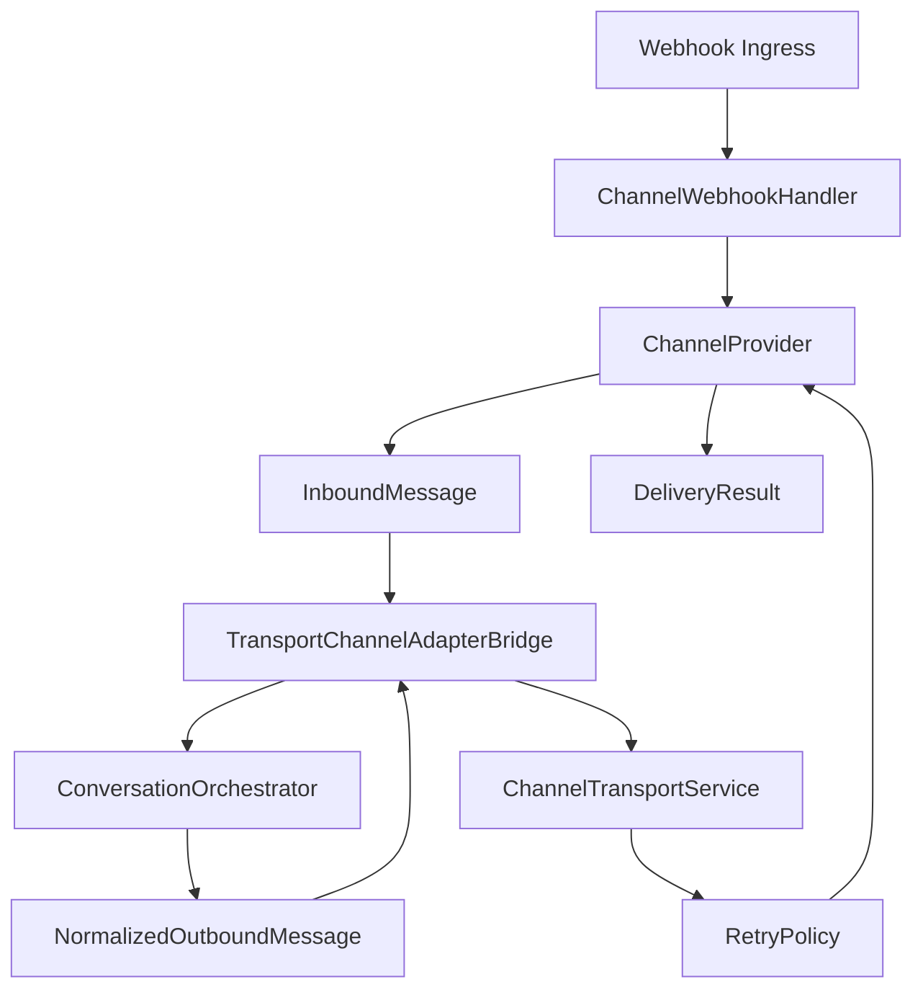

# Sprint B1-04A — Enterprise Channel Transport Layer

**Date:** 2026-07-19  
**Status:** **COMPLETE**

---

## Objective

Implement a provider-independent transport layer for the VaultOS Automation Platform so future communication providers (WhatsApp, Web Chat, Email, Telegram, Slack, etc.) can plug in without changing the Automation Engine or Orchestrator contracts.

---

## Architecture Summary



The transport layer sits **below** channel-specific providers and **above** vendor APIs. Sprint scope includes generic stub providers only — no WhatsApp Cloud API or Meta webhook logic.

---

## Core Components

| Component | Path | Responsibility |
|-----------|------|----------------|
| `ChannelProvider` | `transport/channel-provider.ts` | Provider contract |
| `ChannelProviderRegistry` | `transport/provider-registry.ts` | Register providers by channel |
| Transport models | `transport/models.ts` | Inbound/outbound/delivery types |
| `ChannelTransportService` | `transport/transport-service.ts` | Outbound send + retry orchestration |
| `RetryPolicy` | `transport/retry-policy.ts` | Exponential backoff abstraction |
| `ChannelWebhookHandler` | `transport/webhook.ts` | Provider-neutral webhook ingress |
| `TransportChannelAdapterBridge` | `transport/adapter-bridge.ts` | Bridge to B1-03 orchestrator models |
| Stub providers | `transport/stub-providers.ts` | Generic web_chat / api / email providers |

---

## ChannelProvider Interface

```typescript
interface ChannelProvider {
  send(message: OutboundMessage): Promise<DeliveryResult>
  receive(payload, context): Promise<InboundMessage>
  verifySignature(request): boolean | Promise<boolean>
  normalize(payload, context): InboundMessage
  getCapabilities(): ProviderCapabilities
}
```

---

## OutboundMessage Model

Discriminated union by `kind`:

| Kind | Fields |
|------|--------|
| `text` | `text` |
| `buttons` | `text`, `buttons[]` |
| `list` | `title`, `body`, `buttonLabel`, `sections[]` |
| `media` | `mediaType`, `url`, `caption?`, `mimeType?` |
| `template` | `templateKey`, `language?`, `variables` |

All variants include `companyId`, `channel`, `externalUserId`, optional `sessionId`, and `metadata`.

---

## InboundMessage Model

| Kind | Purpose |
|------|---------|
| `text` | Plain text ingress |
| `interactive_reply` | Button/list selection |
| `media` | Image/audio/video/document payloads |
| `location` | Geo coordinates |
| `contact` | Shared contact card |

---

## Delivery Status Model

`queued` → `sent` → `delivered` → `read` → `failed`

Webhook ingress can emit delivery updates via provider-neutral `deliveryUpdates[]` arrays parsed by `ChannelWebhookHandler`.

---

## Retry Policy

`ExponentialBackoffRetryPolicy` retries transient failures (`408`, `429`, `5xx`) with configurable:

- `maxAttempts`
- `baseDelayMs`
- `maxDelayMs`

`ChannelTransportService.send()` wraps provider delivery with `executeWithRetry()`.

---

## Webhook Abstraction

Provider-neutral `WebhookRequest`:

```typescript
{ channel, companyId, headers, rawBody, payload }
```

`ChannelWebhookHandler`:

1. Resolves provider from registry
2. Verifies signature (`x-webhook-signature` header vs shared secret)
3. Normalizes inbound payload
4. Extracts delivery status updates

`inboundToOrchestratorPayload()` converts transport messages into orchestrator-compatible raw payloads.

---

## Built-in Generic Providers

| Channel | Provider key | Notes |
|---------|--------------|-------|
| `web_chat` | `generic.web_chat` | Full capability surface for tests |
| `api` | `generic.api` | Text-only ingress/egress |
| `email` | `generic.email` | Text + media + templates |

Future sprints replace stubs with real provider implementations without changing engine/orchestrator code.

---

## Tests

```bash
pnpm --dir lib/automation-platform test
```

**36/36 PASS** (includes B1-01/B1-02/B1-03 suites + 10 new transport tests).

Coverage includes:

- Provider registry + capabilities gating
- All inbound/outbound message kinds
- Signature verification
- Retry/backoff success and exhaustion
- Webhook ingress + delivery updates
- Orchestrator adapter bridge

---

## Out of Scope (per sprint)

- WhatsApp Cloud API
- Meta webhooks
- OpenAI
- UI

---

## Recommendation

**READY FOR B1-04B** — Real provider implementations (e.g. Telegram/Slack stubs with HTTP, WhatsApp provider skeleton) registering into `ChannelProviderRegistry` and wiring webhook routes to `ChannelWebhookHandler`.
