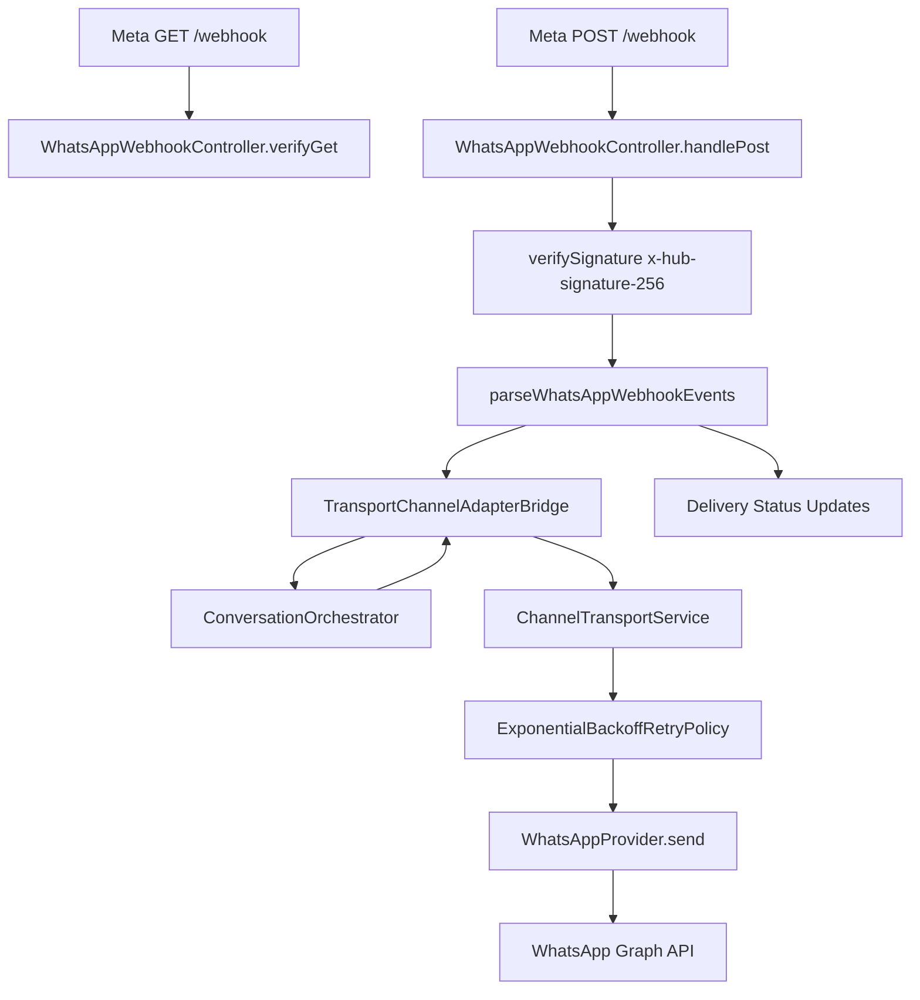

# Sprint B1-04B — WhatsApp Cloud API Provider

**Date:** 2026-07-19  
**Status:** **COMPLETE**

---

## Objective

Implement the official Meta WhatsApp Cloud API provider for the VaultOS Automation Platform, integrated with the B1-04A transport layer and registered in `ChannelProviderRegistry`.

---

## Architecture Summary



The WhatsApp provider is a first-class `ChannelProvider` implementation. Webhook ingress uses Meta-specific verification (hub challenge + HMAC signature) but normalizes into the shared transport models before reaching the orchestrator.

---

## Core Components

| Component | Path | Responsibility |
|-----------|------|----------------|
| `WhatsAppProvider` | `transport/whatsapp/whatsapp-provider.ts` | `ChannelProvider` for Meta Cloud API |
| `WhatsAppApiClient` | `transport/whatsapp/whatsapp-api-client.ts` | Graph API send + webhook parsing |
| `WhatsAppCompanyConfig` | `transport/whatsapp/whatsapp-config.ts` | Per-company credentials |
| `WhatsAppWebhookController` | `transport/whatsapp/whatsapp-webhook-controller.ts` | Meta GET verify + POST handler |
| Registry wiring | `transport/provider-registry.ts` | Registers WhatsApp when config resolver provided |

---

## ChannelProvider Implementation

`WhatsAppProvider` (`providerKey: meta.whatsapp.cloud`) implements all required methods:

| Method | Behavior |
|--------|----------|
| `send()` | Formats outbound messages → Graph API POST → returns `sent` + `providerMessageId` |
| `receive()` | Delegates to `normalize()` |
| `verifySignature()` | Validates `x-hub-signature-256` HMAC using `appSecret` |
| `normalize()` | Maps Meta webhook message objects to transport `InboundMessage` |
| `getCapabilities()` | Full text/buttons/lists/media/templates + delivery/read receipts |

---

## Inbound Message Support

| Meta type | Transport kind |
|-----------|----------------|
| `text` | `text` |
| `button` | `interactive_reply` |
| `interactive` (button_reply) | `interactive_reply` |
| `interactive` (list_reply) | `interactive_reply` |
| `image` | `media` (image) |
| `document` | `media` (document) |
| `audio` | `media` (audio) |
| `video` | `media` (video) |
| `location` | `location` |
| `contacts` | `contact` |

Media inbound stores `whatsappMediaId` in metadata for later URL resolution.

---

## Outbound Message Support

| Transport kind | Meta payload |
|----------------|--------------|
| `text` | `{ type: "text" }` |
| `buttons` | `{ type: "interactive", interactive.type: "button" }` |
| `list` | `{ type: "interactive", interactive.type: "list" }` |
| `template` | `{ type: "template" }` |
| `media` | `{ type: "image" \| "audio" \| "video" \| "document" }` |

---

## Per-Company Configuration

```typescript
type WhatsAppCompanyConfig = {
  companyId: string;
  phoneNumberId: string;        // required
  businessAccountId?: string;
  accessToken: string;          // required
  verifyToken: string;          // required (Meta GET challenge)
  appSecret?: string;           // HMAC signature validation
  apiVersion?: string;          // default v21.0
};
```

Resolved at runtime via `WhatsAppConfigResolver`. Tests use `InMemoryWhatsAppConfigStore`.

Registry registration:

```typescript
createDefaultChannelProviderRegistry({
  whatsappConfigResolver: configStore.resolve.bind(configStore),
});
```

---

## Webhook Handling

**GET verification** — `WhatsAppWebhookController.verifyGet()` validates `hub.mode=subscribe`, `hub.verify_token`, returns `hub.challenge`.

**POST ingress** — `WhatsAppWebhookController.handlePost()`:

1. Loads company config
2. Verifies `x-hub-signature-256` HMAC
3. Parses Meta payload events
4. For messages → `TransportChannelAdapterBridge.receive()` → normalized inbound
5. For statuses → maps to `DeliveryResult` (`sent`, `delivered`, `read`, `failed`)

---

## Retry Policy Integration

Outbound delivery uses `ChannelTransportService` with `ExponentialBackoffRetryPolicy` from B1-04A. Transient Graph API failures (`408`, `429`, `5xx`) are retried automatically; `ChannelProviderError.statusCode` enables status-aware retry decisions.

---

## Tests

```bash
pnpm --dir lib/automation-platform test
```

**47/47 PASS** (36 prior + 11 new WhatsApp tests).

Coverage includes:

- Meta webhook challenge verification
- HMAC signature validation
- Inbound normalization (text, button/list replies, media, location, contact)
- Outbound formatting (text, buttons, lists, templates, media)
- Retry on transient API failures
- Webhook controller bridge forwarding
- Delivery lifecycle status mapping
- Registry registration

---

## Out of Scope (per sprint)

- Workflow Builder UI
- OpenAI / AI nodes
- CRM-specific business logic

---

## Recommendation

**READY FOR B1-05** — Wire `WhatsAppWebhookController` into api-server routes and connect orchestrator inbound handling for end-to-end WhatsApp automation flows. Consider Supabase-backed `WhatsAppConfigResolver` loading from `company_channels.configuration`.
