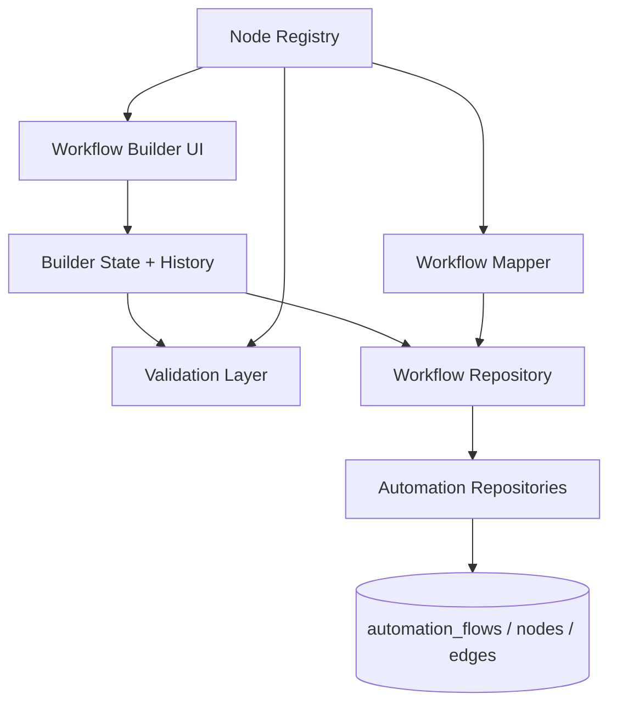

# Sprint B2-01 — Enterprise Workflow Builder Foundation

**Date:** 2026-07-19  
**Status:** **COMPLETE**

---

## Objective

Deliver the first production-ready VaultOS Workflow Builder — a business-user-focused visual designer on top of the existing automation engine (B1-01 through B1-04B) without backend schema changes.

---

## Architecture



| Layer | Path | Responsibility |
|-------|------|----------------|
| Presentation | `artifacts/login-app/src/workflow-builder/components/` | Canvas, palette, properties, toolbar |
| Builder State | `workflow-builder/core/state/` | Reducer, undo/redo history |
| Validation | `workflow-builder/core/validation/` | Business-friendly publish checks |
| Node Registry | `workflow-builder/core/node-registry.ts` | Extensible node definitions |
| Persistence | `workflow-builder/core/persistence/` | Map canvas ↔ Supabase records |
| Pages/Routes | `pages/dashboard/automation/` | List + builder routes |

**No business logic in presentational components.** Forms and canvas dispatch actions to builder state; persistence goes through `WorkflowRepository` only.

---

## Node Registry (Extensibility)

Each node registers:

- `id`, `displayName`, `icon`, `category`
- `defaultConfig`, `PropertyEditor`, `validator`
- `engineType` + `toEngineConfig` / `fromEngineConfig`

Built-in business nodes (10):

**Conversation:** Start, Send Message, Ask Question, Buttons, List, Delay, End  
**CRM:** Create Customer, Update Customer, Create Booking

Future nodes (AI, HTTP, Conditions, Loops) register via `registerWorkflowNode()` without modifying builder core.

---

## Canvas Features

- React Flow infinite canvas with zoom, pan, MiniMap, dotted background
- Snap to grid (20px)
- Fit view + saved viewport in `automation_flows.metadata.builderViewport`
- Animated edges
- Premium card-style custom nodes

---

## Builder Features

| Feature | Implementation |
|---------|----------------|
| Drag & drop | Palette → canvas drop creates UUID node + defaults |
| Undo / redo | History stack (50 states) |
| Delete | Keyboard + React Flow remove |
| Copy / paste | Ctrl+C / Ctrl+V |
| Shortcuts | Ctrl+Z, Ctrl+Y, Ctrl+S, Delete |
| Auto-save | 1.5s debounce → `WorkflowRepository.save()` |
| Save status | Saving… / Saved ✓ / Unsaved changes |
| Publish | Validates → saves → `AutomationFlowService.publishFlow()` |

---

## Persistence

Reuses existing tables (no migration):

- `automation_flows` — name, description, trigger, metadata (viewport)
- `automation_nodes` — engine type + `config.builderType` + positions
- `automation_edges` — visual connections

Save strategy: update flow metadata, delete all nodes/edges for flow, recreate graph (existing repository API).

---

## Validation (Business Language)

- Requires Start + End
- Single Start only
- No isolated steps
- No loops
- Required fields per node (empty messages, missing questions, etc.)

Messages avoid developer terminology and JSON references.

---

## Routes

| Path | Page |
|------|------|
| `/dashboard/automation` | Workflow list + create |
| `/dashboard/automation/:flowId` | Full-screen builder |

Dashboard sidebar: **AI Platform → Workflows** (`automation.view` permission)

---

## Tests

```bash
pnpm --dir artifacts/login-app test:workflow-builder-core
```

Covers: node registry, connection rules, validation, undo/redo, persistence mapping, reducer.

---

## Out of Scope (per sprint)

AI nodes, conditions, loops, email, HTTP, voice, analytics, execution monitor, version history, collaboration, marketplace.

---

## Success Path

A business user can build:

**Start → Send Welcome Message → Buttons (Book / Pricing / Support) → Ask Customer Name → Create Customer → End**

using drag-and-drop and plain-language property forms — no JSON, no code.

**Recommendation:** **READY FOR B2-02** — Wire published workflow configs to orchestrator outbound actions and CRM execution handlers.
