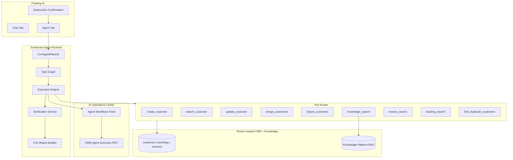

# Sprint CRM-Agent-1 — Enterprise CRM Agent

**Priority:** P0  
**Status:** Implemented (requires migration `176_crm_agent_enterprise.sql`; agent runtime migration `174` still required for workflow persistence)

## Objective

Production-grade **Enterprise CRM Agent** — the first domain-specific agent built on the shared Enterprise Agent Runtime. It plans multi-step CRM workflows, executes tools via the Tool Router, verifies outcomes, and produces structured completion reports in Floating AI.

## Architecture



## Reused Components (no duplication)

| Component | Usage |
|-----------|--------|
| Enterprise Agent Runtime | Planner, task graph, executor, verification, checkpoints |
| Tool Router | All CRM tool execution with RBAC + audit |
| Knowledge Platform | Hybrid RAG via `knowledge_search` (fallback: FTS RPC) |
| Floating AI | Agent tab: plan, graph, timeline, progress, report |
| AI Operations Center | CRM workflow feed + tool usage metrics |

## Supported Goals → Plans

| Goal example | Workflow |
|--------------|----------|
| Create a customer named Ahmed Mohamed | Validate → `create_customer` → report |
| Find duplicate customers | `find_duplicate_customers` → report |
| Merge duplicate customers | Find duplicates → `merge_customers` (confirmation) → report |
| Import customer list | Parse → `import_customers` (confirmation) → report |
| Show customers with overdue invoices | Parallel: `search_customer` + `invoice_search` → report |
| Not contacted in 30 days | `search_customer` → `booking_search` → filter inactive → report |
| Summarize customer activity | Customer + bookings + invoices → report |
| Search knowledge for onboarding | `knowledge_search` (hybrid RAG) → report |

## Tools

Registered in `@workspace/ai-tool-router` and migration `176`:

- `create_customer` (existing)
- `search_customer`, `update_customer`, `merge_customers`, `import_customers`
- `find_duplicate_customers`
- `knowledge_search`, `invoice_search`, `booking_search`

Ports implemented in `artifacts/login-app/src/lib/ai-tool-router/crm-agent-adapter.ts`.

## Safety

Pre-start confirmation in Agent tab for: **merge**, **import**, **bulk update/delete**, **delete**, **refund**.

Tool-level gates: `merge_customers` and `import_customers` require `confirmed: true`.

Workflow pauses with `waiting_user` when confirmation is required mid-flight.

## Verification Rules

| Rule | Checks |
|------|--------|
| `customer_exists` | Customer ID in tool output |
| `lookup_has_results` | Non-empty CRM/search results |
| `knowledge_has_results` | Knowledge hits returned |
| `merge_completed` | Merge succeeded or confirmation pending |
| `import_completed` | Import counts or confirmation pending |

## Context

Automatically passed via Floating AI page context:

- Current customer / module / route / filters
- Selected rows (merge workflows)
- Company + user metadata

## Observability

Migration `176` extends:

- `platform_ai_ops_agent_workflows` — adds `agent_type`, `tools_used`
- `platform_ai_ops_crm_agent_summary` — CRM workflow KPIs + top tools

## Security

- Tenant isolation: all CRM queries scoped by `company_id`
- RBAC: tool definitions declare required permissions (`customers.*`, `invoices.view`, etc.)
- Super-admin ops RPCs gated by `platform_ai_ops_assert_super_admin()`

## Tests

`lib/agent-runtime/src/planner/crm-agent-planner.test.ts`:

- Create customer plan
- Duplicate detection
- Inactive customers (multi-step)
- Knowledge-assisted goal
- Merge confirmation gate
- Verification rules
- CRM completion report format

Run:

```bash
cd lib/agent-runtime && npm test
```

## Migrations

| Migration | Purpose |
|-----------|---------|
| `174_agent_runtime_foundation.sql` | Agent workflow tables (required) |
| `175_knowledge_platform_rag_production.sql` | Hybrid RAG (recommended) |
| `176_crm_agent_enterprise.sql` | CRM tool definitions + ops RPCs |

## Key Files

| Area | Path |
|------|------|
| CRM planner | `lib/agent-runtime/src/planner/crm-agent-planner.ts` |
| CRM report | `lib/agent-runtime/src/planner/crm-report-builder.ts` |
| CRM tools | `lib/ai-tool-router/src/tools/crm-agent-tools.ts` |
| CRM adapter | `artifacts/login-app/src/lib/ai-tool-router/crm-agent-adapter.ts` |
| Agent UI | `artifacts/login-app/src/components/floating-ai/agent-workflow-panel.tsx` |
| Goal detection | `artifacts/login-app/src/lib/floating-ai/agent-goals.ts` |

## Production Readiness Checklist

- [x] CRM-specific planner templates
- [x] Real CRM tool implementations (not mocks)
- [x] Verification + structured reports
- [x] Destructive action confirmation
- [x] Knowledge auto-RAG on policy/FAQ goals
- [x] Ops Center CRM metrics
- [x] Unit/scenario tests
- [ ] Apply migrations 174 + 176 to live Supabase
- [ ] Browser E2E screenshots (Floating AI Agent tab + Ops Center)
- [ ] Arabic locale strings for CRM agent badge

## Browser Verification

1. Log in as company admin with `runtime.execute` permission
2. Open Floating AI → **Agent** tab
3. Run: `Create a customer named Ahmed Mohamed with phone +966501234567`
4. Observe: plan graph → tool execution → verification → completion report
5. Super-admin: `/dashboard/platform/ai-operations` → Agent Workflows shows CRM badge + tools
