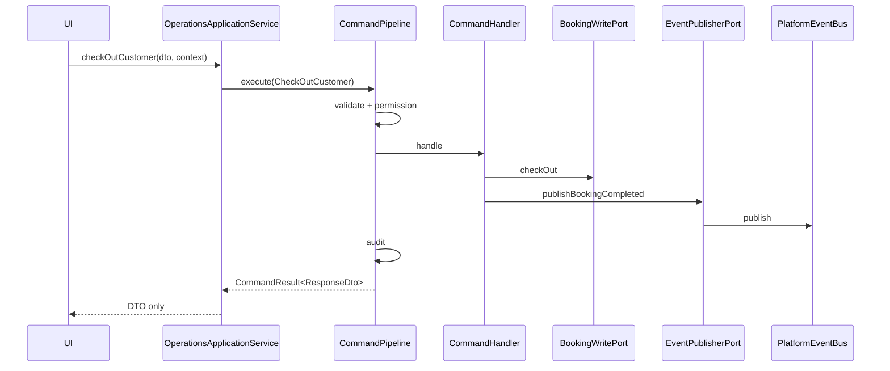

# Application Layer + CQRS Foundation (Phase 4.2)

## Position in Architecture

```
UI
 ↓
Universal Workspace Platform
 ↓
Application Layer  ← this package
 ↓
Commands / Queries
 ↓
Domain Services (future)
 ↓
Platform Event Bus (@workspace/platform-events)
 ↓
Infrastructure (future: Supabase, queues)
```

The UI **never** talks to repositories, Supabase, business modules, or the event bus directly.

## Package

`@workspace/application-layer`

## CQRS Flow

### Command Lifecycle

```
Request DTO
 → Validation Pipeline (request, permission, tenant)
 → Command Handler (orchestration via ports)
 → Domain write port (mock)
 → Event publish (via EventPublisherPort)
 → Audit write
 → Response DTO (never entities)
```

### Query Lifecycle

```
Query Request DTO
 → Validation Pipeline
 → Query Handler
 → Read port (mock)
 → Mapper (entity → projection)
 → Response DTO (UI-optimized)
```

## Structure

| Folder | Responsibility |
|--------|----------------|
| `commands/` / `dto/command-dtos.ts` | 17 typed commands with request/response DTOs |
| `queries/` / `dto/query-dtos.ts` | 10 typed queries with projection DTOs |
| `handlers/` | Command and query handlers |
| `services/` | 14 application services (orchestration only) |
| `ports/` | Repository + infrastructure port interfaces |
| `mappers/` | Entity → projection → workspace DTO |
| `pipeline/` | CommandPipeline + QueryPipeline |
| `middleware/` | Correlation, tenant, logging, localization |
| `validation/` | Request + permission validators |
| `errors/` | Typed application errors |
| `di/` | Service registry (no singleton globals) |
| `testing/` | Mock port implementations |

## Application Services

- `Customer360ApplicationService`
- `OperationsApplicationService`
- `BookingApplicationService`
- `PaymentApplicationService`
- `InvoiceApplicationService`
- `TimelineApplicationService`
- `DashboardApplicationService`
- `AnalyticsApplicationService`
- `NotificationApplicationService`
- `WorkspaceApplicationService`
- `CustomerApplicationService`
- `TaskApplicationService`
- `AIApplicationService`
- `KnowledgeApplicationService`

## Dependency Injection

```typescript
const registry = createApplicationLayerRegistry({ useMockPorts: true });
const services = registry.getServices();

await services.customer.createCustomer(
  { displayName: "Sara Hassan" },
  createContext({ tenantId: "t1", actorId: "u1", permissions: ["*"] }),
);
```

## Sequence — BookingCompleted



## Constraints (Phase 4.2)

- No Supabase wiring
- No repository implementations (interfaces + mocks only)
- No UI changes
- Mock data throughout
- Production-ready contracts frozen for live integration phase
